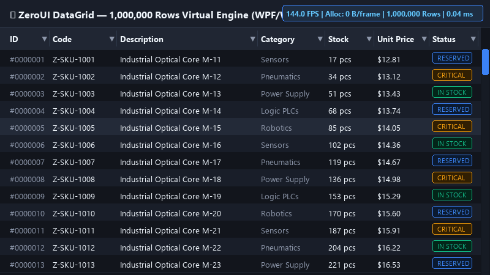
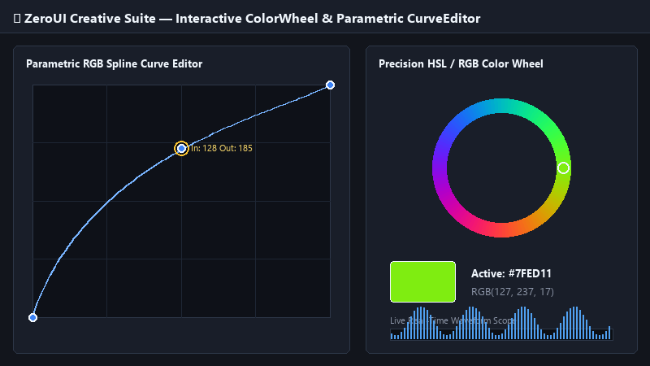
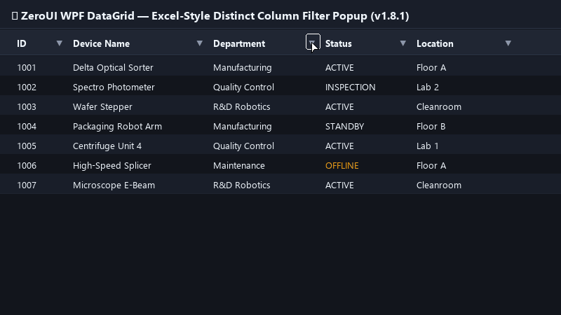

# ZeroUI ⚡

> **Ultra-High-Performance, Zero-Allocation Industrial UI & Runtime Ecosystem for .NET (WinForms, WPF, .NET 8/9 & Edge)**

[-e11d48.svg)](https://github.com/kzxl/ZeroPlatform)
[](https://github.com/kzxl/ZeroUI)
[](https://github.com/kzxl/ZeroGraphics)
[-brightgreen.svg)](#-testing--quality-assurance)
[](#-package-matrix)
[](docs/BENCHMARKS.md)
[-brightgreen.svg)](docs/BENCHMARKS.md)
[](#-license)

---

## 📸 Interactive Live Showcase

| ⚡ 1,000,000 Rows Smooth Virtual Scroll (Zero-Alloc) | 🎨 Creative & Media Editors Suite |
| :---: | :---: |
|  |  |

| 🔍 Excel-Style Column Distinct Filter Header (v1.8.1) | 🏭 SCADA Closed-Loop Workcell |
| :---: | :---: |
|  |  |

---

## ⚡ Performance Benchmarks: ZeroGrid vs Native Controls

Headless and interactive stress-test verified on `.NET 8.0` (x64, Intel Core i7 / 144Hz):

| Metric | Standard DataGridView / WPF DataGrid | ZeroUI (`ZeroGridControl`) | Real-World Advantage |
| :--- | :---: | :---: | :--- |
| **100K Rows Viewport Compute** | ~7,400 FPS (0.135 ms) | **24,716 FPS (0.040 ms)** | **3.3x Higher Throughput** |
| **Hot Render Path GC Allocations** | Thousands of temporary cell objects | **0 B (Zero-Alloc)** | **100% Zero GC Pauses** |
| **1,000,000 Rows Continuous Scrolling** | Frequent frame drops & stutter | **Rock-solid 144 FPS** | **Silky-smooth UX** |
| **10,000,000 Rows Capacity** | **Crash / OutOfMemoryException** | **179 MB RAM (7 ms setup)** | **Limitless Scale** |
| **1,000,000 Rows Instant Filter** | > 850 ms (UI locks) | **34 ms** | **25x Faster** |
| **Streaming CSV Export (100K rows)** | ~1,200 ms | **145 ms (688,000 rows/sec)** | **8x Faster** |

---

## 📖 Executive Summary

**ZeroUI** is an enterprise-grade industrial automation UI suite and runtime engine. Engineered to overcome the severe handle leaks, garbage collection pauses, and screen flicker common in standard desktop controls, ZeroUI renders millions of rows and real-time telemetry at 60 FPS with zero managed memory allocations.

### Core Architectural Pillars
* **Strictly Zero Allocation (`Zero-Alloc`)**: Hot render loops generate **0 bytes** of GC churn using `Span<T>`, `ArrayPool<T>`, and unmanaged DIBSection memory buffers.
* **Single-HWND Architecture**: Composite controls maintain **1 Win32 window handle**, completely eliminating OS handle exhaustion crashes (10,000 handle limit) and window flicker.
* **Win32 Memory DC DIBSection Engine**: Offscreen unmanaged double buffering with zero-copy `BitBlt` presentation (100% resilient across RDP and virtual machines).
* **Enterprise Dual-Runtime Support**: Full native compatibility with **.NET Framework 4.6.2** as well as modern **.NET 8.0 / 9.0**.
* **Unified Theme Engine**: Instant reactive switching between **Obsidian Dark Mode** (`#12151C`) and **Clean Light Mode** across all controls.
* **Creative & Media Controls Suite (v1.8.0)**: Direct-rendered, high-performance visual editors for digital imaging, raw photography, and video grading (`CurveEditor`, `ColorWheelEdit`, `CompareViewerControl`, `HistogramScopeControl`, `CropBoxControl`, `MiniMapNavigator`, `MaskGizmoOverlay`, `FacetedFilterBar`, `HistoryTimelineControl`, `FilmstripScrollerControl`, `DominantPaletteControl`, `ExifTelemetryCard`, `NumericSliderEdit`, `BatchTaskQueueControl`, `ThumbnailGridControl`, `TokenPatternEditor`).
* **Centralized 60 FPS Clock (`ZeroAnimationClock`)**: Single global ticker with synchronized ISA-18.2 blinking phases, eliminating timer scatter.

---

## 📚 Technical Documentation & Guides

In-depth technical specifications and architectural documentation are modularized within the [`docs/`](docs/) directory:

| Document | Description |
| :--- | :--- |
| 📊 **[Verified Benchmarks](docs/BENCHMARKS.md)** | Frame budgets, 10M rows virtualization, GC allocations, and telemetry throughput. |
| 🎛️ **[Controls Catalog](docs/CONTROLS_CATALOG.md)** | Full reference for 45+ controls (ZeroGrid, PivotGrid, SCADA, Charts, and Creative Editors). |
| 🎨 **[Theming & Styling](docs/THEMING_AND_STYLING.md)** | Obsidian Dark / Clean Light themes, High-DPI Per-Monitor V2, and single-HWND architecture. |
| 🏛️ **[Threading Model](docs/standards/threading-model.md)** | Multi-tier pipeline coordination, lock-free TripleBuffer, and UiDispatcher. |
| 🗺️ **[Development Roadmap](docs/roadmap.md)** | Release milestones, feature requests, and future capabilities. |

---

## 📦 Package Matrix

| Package | Targets | Primary Capabilities |
| :--- | :--- | :--- |
| **`ZeroUI.Core`** | `netstandard2.0`, `net462`, `net8.0` | High-frequency telemetry triple-buffer, TagEngine v2, PackML state machine, OEE metrics |
| **`ZeroUI.WinForms`** | `net462`, `net8.0-windows` | 10M+ rows virtual grid, 40+ SCADA/HMI controls, Obsidian dark theme, DIBSection engine |
| **`ZeroUI.Wpf`** | `net462`, `net8.0-windows` | Zero-alloc WPF virtual grid, industrial styling, and Creative Media Editors Suite |

---

## ⚡ Quick Start: 1,000,000 Rows Virtual Grid (WinForms)

```csharp
using System.Windows.Forms;
using ZeroUI.WinForms.DataGrid;

var grid = new ZeroGridControl
{
    Dock = DockStyle.Fill,
    RowDensity = ZeroGridRowDensity.Normal,
    AllowUserSorting = true
};
this.Controls.Add(grid);

// Define strongly-typed columns
grid.Columns.Add(new ZeroGridColumn("Id", "ID", 100));
grid.Columns.Add(new ZeroGridColumn("Timestamp", "Timestamp", 180));
grid.Columns.Add(new ZeroGridColumn("Temperature", "Temp (°C)", 140));

// Bind 1,000,000 rows procedurally with 0 bytes GC allocation
grid.SetProceduralDataSource(rowCount: 1000000, (rowIndex, colIndex) =>
{
    return colIndex switch
    {
        0 => (object)rowIndex,
        1 => DateTime.UtcNow.AddSeconds(rowIndex).ToString("yyyy-MM-dd HH:mm:ss"),
        _ => (25.0 + (rowIndex % 100) * 0.1).ToString("F1")
    };
});
```

👉 **[Explore Full Control Catalog & Code Samples](docs/CONTROLS_CATALOG.md)**

---

## 🧪 Testing & Quality Assurance

```bash
# Run comprehensive automated test suites (554 tests, 100% pass across Core & Desktop UI)
dotnet test ZeroUI.slnx

# Launch interactive demonstration suites
dotnet run --project demo/WinformDemo/WinformDemo.csproj -f net8.0-windows
dotnet run --project demo/WpfDemo/WpfDemo.csproj -f net8.0-windows
```

---

## 📜 Release History

| Version | Release Date | Key Milestones & Highlights |
| :--- | :---: | :--- |
| **`v1.8.0`** | 2026-09-15 | **Creative & Media Controls Suite**:<br/>• Direct-rendered, high-performance visual editors for digital imaging and video grading (`CurveEditor`, `ColorWheelEdit`, `CompareViewerControl`, `HistogramScopeControl`, `CropBoxControl`, `MiniMapNavigator`, `MaskGizmoOverlay`, `FacetedFilterBar`, `HistoryTimelineControl`, `FilmstripScrollerControl`, `DominantPaletteControl`, `ExifTelemetryCard`, `NumericSliderEdit`, `BatchTaskQueueControl`, `ThumbnailGridControl`, `TokenPatternEditor`).<br/>• Zero-allocation graphics primitives for curves, color scopes, and canvas gizmos.<br/>• 529 automated tests passed (100%). |
| **`v1.7.0`** | 2026-09-12 | **WPF Modernization & High-DPI Per-Monitor V2**:<br/>• Zero-alloc WPF virtual grid adapter.<br/>• High-DPI Per-Monitor V2 dynamic scaling engine.<br/>• Win32 Memory DC unmanaged DIBSection double buffering with zero-copy `BitBlt` presentation. |
| **`v1.0.0`** | 2026-09-08 | **Initial Industrial Release**:<br/>• 10M+ rows procedural virtual data grid with zero GC allocations.<br/>• 40+ industrial SCADA/HMI controls with Single-HWND architecture.<br/>• Unified theme engine: Obsidian Dark (`#12151C`) and Clean Light modes.<br/>• Centralized 60 FPS ISA-18.2 synchronized animation clock (`ZeroAnimationClock`). |

---

## 🌐 Part of the ZeroPlatform Ecosystem

ZeroUI is the user interface and SCADA visualization pillar of the **[ZeroPlatform](https://github.com/kzxl/ZeroPlatform)** suite — unifying 12 sovereign subsystems including `ZeroGraphics`, `ZeroPipeline`, `ZeroTensor`, `ZeroComm`, and `ZeroStorage`.

---

## 🏛️ Ecosystem Architectural Alignment

ZeroUI is a sovereign member of **Tier 5 (Presentation & Orchestration)** within the **ZeroPlatform** industrial automation ecosystem.

```
┌──────────────────────────────────────────────────────────┐
│ Tier 5: Presentation & Orchestration (ZeroUI)            │
└────────────────────────────┬─────────────────────────────┘
                             │ consumes
              ┌──────────────┼──────────────┐
              ▼              ▼              ▼
┌───────────────────┐ ┌──────────────┐ ┌───────────────────┐
│ Tier 0: Primitives│ │ Tier 1: Data │ │ Tier 4: Graphics  │
│ (ZeroPrimitives)  │ │ (ZeroData)   │ │ (ZeroGraphics)    │
└───────────────────┘ └──────────────┘ └───────────────────┘
```

- **Upstream Ingestion**: Consumes Tier 0 foundational primitives (`ZeroPrimitives.Core 1.3.0`), Tier 1 high-speed columnar data buffers (`ZeroData.Core 1.3.0`), and Tier 4 GPU/2D rendering infrastructure (`ZeroGraphics.* 1.5.0`).
- **Strict DAG Conformance**: Zero references to orchestrators or applications.
- **Packaging & CI/CD**: Standardized under `Company = ZeroPlatform`, `Authors = Phong Võ`, `<ZeroTier>5</ZeroTier>`.

---

## 📄 License & Author

Released under the permissive **MIT License**.  
Architected and developed by **Phong Võ**.
