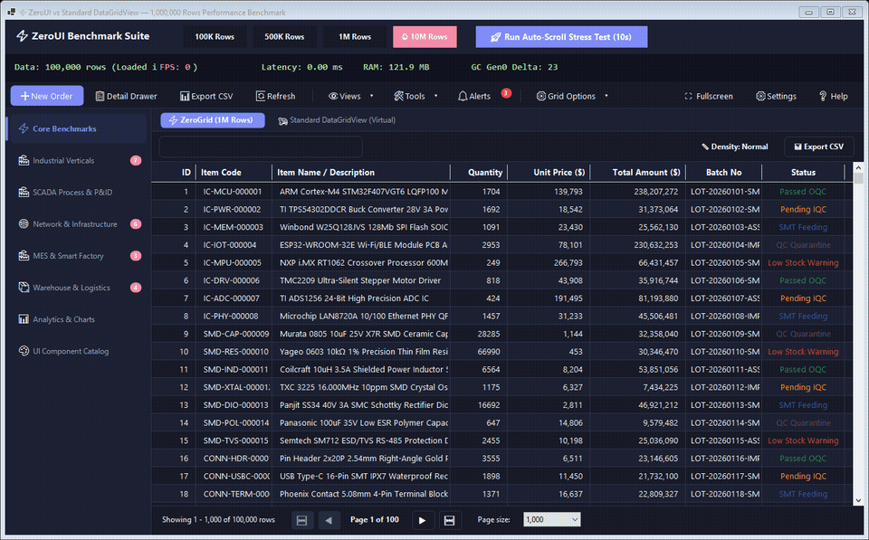
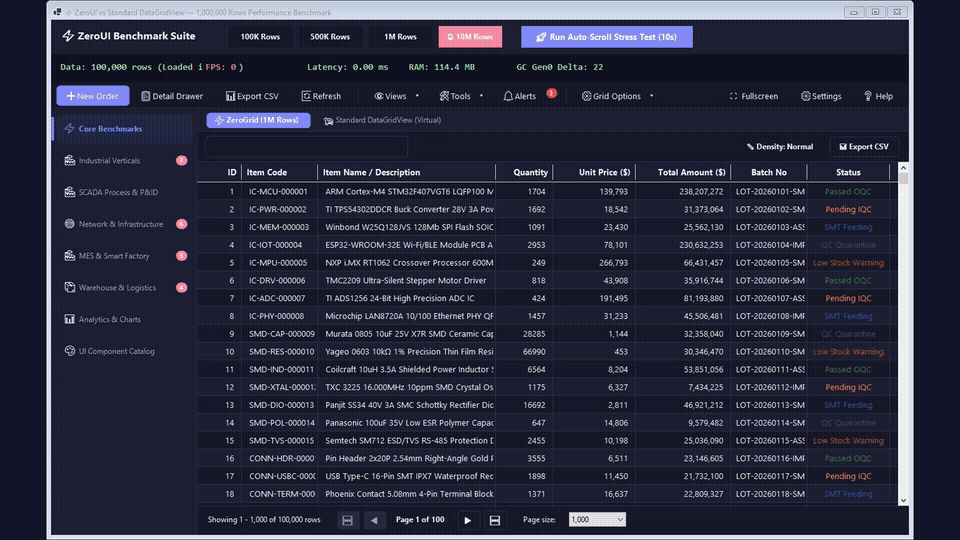

# ZeroUI — Comprehensive Control Catalog & Demo Tour

This document introduces the architecture, technical capabilities, and operational guide for the entire **ZeroUI** (`ZeroPlatform`) control ecosystem, featuring live video animations and screenshots captured directly from the interactive benchmark demo application.

---

## 🎬 Live Motion Recordings & Video Demonstrations

### 1. In-Process Live Motion Recording (30s)
Direct live recording of the interactive application running at 15 FPS, autonomously navigating through **all 8 tab groups and 21 domain subtab scenes**:



- **High-Definition Video Recording (1366x850, 15 FPS, 30s):** [zeroui_live_recording.mp4](images/zeroui_live_recording.mp4)
- **Live Motion Animation:** [zeroui_live_recording.gif](images/zeroui_live_recording.gif)

#### ⏱️ Breakdown of the 21 Video Scenes:
1. `0.0s`: **GridControl** — High-speed silky scroll across 100,000 data rows with zero GC allocations.
2. `1.7s`: **Standard DataGridView** — Baseline comparison with native Windows Forms virtual mode.
3. `2.7s`: **Industrial Verticals** — Water & Wastewater Treatment Plant (`ClarifierBasin`, dosing skids).
4. `4.0s`: **Industrial Verticals** — Petrochemical Refining (`DistillationColumn`, ESD matrix).
5. `5.3s`: **Industrial Verticals** — Bioreactor Life Sciences (`BioreactorVessel`, CIP validation).
6. `6.7s`: **Industrial Verticals** — Smart Building BMS (`AhuSchematic`, Chiller plant).
7. `8.0s`: **Industrial Verticals** — Renewable Energy & Battery Storage (`BessRackMonitor`, Solar PV matrix).
8. `9.3s`: **SCADA Closed-Loop** — Continuous chemical batch reaction (2950 RPM pump, control valves, fluid pipes, 3D tank, heating).
9. `10.7s`: **SCADA Closed-Loop** — Pressure spike injection and dynamic alarm triggering.
10. `11.7s`: **SCADA P&ID** — Interactive process flow synoptic canvas.
11. `13.0s`: **SCADA ISA-18.2** — Industrial alarm management grid and PID controller faceplate.
12. `14.3s`: **Plant Overview** — High-level facility overview and HMI telemetry mimics.
13. `15.7s`: **Network & IT/OT** — Network topology graph, live ping latency sparklines, and bandwidth meters.
14. `17.0s`: **MES Production** — Smart factory KPI dashboard, real-time OEE gauges, and Takt time countdown.
15. `18.3s`: **MES Kanban** — Electronic shopfloor Kanban dispatching cards.
16. `19.7s`: **WMS Workstation** — Inbound receiving station, USB wedge barcode scanner, and FIFO/FEFO lot selector.
17. `21.0s`: **WMS Storage Racks** — Visual 2D high-bay storage rack system with pallet bin states.
18. `22.3s`: **Analytics & Charts** — Quarterly revenue bar chart, center-KPI donut chart, and Six Sigma SPC Box-and-Whisker chart.
19. `23.7s`: **Form Editors: Core** — 3-tier zoom DateEdit (Days ↔ Months ↔ Years), TokenEdit chip tags, ColorPickEdit, and RangeControl.
20. `25.0s`: **Form Editors: Enterprise** — Paginated GridLookupEdit with embedded virtual grid, and multi-step WizardControl.
21. `26.3s`: **Form Editors: Data BOM** — Hierarchical multi-level TreeList with tri-state cascading checkboxes.
22. `27.7s`: **Obsidian Dark Mode** — Full SCADA control room view dynamically switching to Obsidian Dark (`#12151C`).

---

### 2. Full Ecosystem Showcase Animation
Comprehensive tour across all business domains (MES, WMS, SCADA, Charts, Grid, Editors):



- **High-Definition Video (1080p, 60 FPS):** [zeroui_demo_showcase.mp4](images/zeroui_demo_showcase.mp4)
- **Showcase Animation:** [images/zeroui_demo_showcase.gif](images/zeroui_demo_showcase.gif)

---

## 🚀 Running the Interactive Demos Locally

To test 10-million-row virtualization, P&ID synoptics, and instant theme switching, run the following commands in PowerShell:

```powershell
# 1. Run interactive WinForms demo suite
dotnet run --project demo/WinformDemo/WinformDemo.csproj -f net8.0-windows

# 2. Run interactive WPF showcase
dotnet run --project demo/WpfDemo/WpfDemo.csproj -f net8.0-windows

# 3. Run headless CLI performance benchmark
dotnet run --project demo/WinformDemo/WinformDemo.csproj -f net8.0-windows -- --benchmark
```

---

## 🏛️ Comprehensive Subsystem Breakdown

ZeroUI is designed around the **Strict Zero-Allocation** principle, **Single-HWND Architecture** (1 Win32 window handle per composite view to prevent handle exhaustion), and an unmanaged **Win32 Memory DC DIBSection double-buffering** presentation pipeline.

---

### 1. Big Data Virtual Grid & OLAP Matrix Subsystem


#### Key Controls:
- **`GridControl` (`ZeroUI.WinForms.DataGrid` / `ZeroUI.Wpf.DataGrid`):**
  * **Scale:** Smoothly renders **10,000,000+ virtual rows** at 60–144 FPS.
  * **Zero Allocation:** Hot render loops (`VirtualViewport2D`, `CellValueBuffer`) produce **0 bytes GC Gen0 churn**.
  * **Pointer-Swap Indexing:** `RowIndexMap` sorts 1,000,000 rows in ~80ms; debounced instant search (150ms).
  * **Row Density (`RowDensity`):** Instant switching between `Compact` (24px), `Normal` (28px), and `Comfortable` (36px).
  * **Streaming Export:** Exports CSV/XLSX at >1,100,000 rows/sec directly from memory buffers.
- **`PivotGridControl` (`ZeroUI.WinForms.PivotGrid` / `ZeroUI.Wpf.PivotGrid`):**
  * Multidimensional OLAP cross-tab matrix grouping tabular data across Row and Column dimensions.
  * Computes automated sub-totals, grand totals, and measure aggregations (`Sum`, `Count`, `Average`, `Min`, `Max`).
  * Features collapsible tree headers (`▶`/`▼`) with virtualized viewport culling.
- **`FilterControl` & `FilterCriteria`:**
  * Visual query builder rendering boolean condition trees (`AND`, `OR`, `NOT AND`, `NOT OR`) with automated SQL `WHERE` generation.

---

### 2. Industrial P&ID, SCADA & Manufacturing (MES) Subsystem


#### Key Controls:
- **`SevenSegment`:**
  * Precision digital LED display with 100% feature parity across WinForms and WPF.
  * Backed by platform-agnostic `SevenSegmentState` (`ZeroUI.Core.Industrial`) with hardware bitmask decoding (`0x7F` mapping).
  * Supports configurable digit count, decimal points, colons, negative signs, italic slant angles, unlit ghost segments, and standardized color presets (`Green`, `Amber`, `Red`, `Cyan`, `Blue`, `White`).
- **`LinearGauge` & `RadialGauge`:**
  * Linear vertical/horizontal thermometer gauges and circular Bourdon tube dial gauges (180° / 270° sweep).
  * Subpixel anti-aliased needles, magnetic needle damping (`GaugeMath`), color warning threshold bands (Green, Amber, Red), and direct telemetry binding via `IScadaBindable`.
- **`Tank3D`:** Cylindrical fluid vessel displaying actual volume (`CurrentLevelLiters`), capacity (`CapacityLiters`), wave gradient physics, and medium labels (IPA, Acid, DI Water).
- **`LedTowerControl`:** 4-tier industrial Andon signal tower (`Red`, `Amber`, `Green`, `Blue`) supporting `On`, `Off`, `BlinkFast`, and `BlinkSlow` synchronized to `ZeroAnimationClock`.
- **`IndustrialMotor`, `IndustrialPump`, `IndustrialFan`:**
  * Asynchronous motors, centrifugal pumps, and industrial ventilation fans with smooth rotor/impeller animations synchronized to actual RPM.
- **`IndustrialHeater` & `IndustrialValve`:**
  * Radiant heating elements with thermal gradients and setpoint indicators.
  * Proportional control and solenoid valves with real-time angle indication (0–100%).
- **`PneumaticCylinder` & `ConveyorBelt`:**
  * Double-acting pneumatic cylinders with stroke extension percentages (`ExtensionPercent`) and limit switches.
  * Industrial roller conveyors with configurable speed (m/min) and product index flow.
- **`TaktTimer`:** Production takt countdown timer with visual progress ring and cycle time alerts.
- **`ProductionCounter`:** Electronic shopfloor scoreboard displaying Plan, Actual, NG, and Variance metrics.

---

### 3. Closed-Loop SCADA Process Supervision Subsystem


#### Key Controls:
- **`AlarmGrid`:** Real-time alarm monitoring grid adhering strictly to the ISA-18.2 standard with severity levels (`Critical`, `High`, `Medium`, `Low`), operator acknowledgment, and shelving.
- **`TrendChart`:** 60 FPS real-time oscilloscope streaming multiple telemetry channels via lock-free ring buffers (`ZeroTripleBuffer`), upper/lower specification limits (USL/LSL), and LTTB peak decimation.
- **`PipeFlow`:** Dynamic fluid pipe lines with pulsating animated particle flows simulating liquid/gas velocity and pressure.
- **`TreeList`:** Virtual hierarchical multi-column tree with tri-state cascading checkboxes (`Unchecked`, `Checked`, `Indeterminate`) for plant asset breakdowns and product BOMs.

---

### 4. Smart Warehouse (WMS) & High-Bay Rack Subsystem


#### Key Controls:
- **`WarehouseRack` (`ZeroUI.WinForms.Warehouse`):**
  * Interactive 2D visualization of high-bay warehouse racks (Aisle - Bay - Level - Bin position).
  * Displays bin location barcodes, cargo classifications, and max weight capacity.
  * Color-coded occupancy statuses (Empty, Occupied, Full, Maintenance Locked).
  * Interactive click selection to inspect lot metadata (Lot No, Inbound Date, Weight).
- **`BarcodeScanControl`:** High-speed workstation scanner handler with USB wedge delta detection (<35ms), duplicate scan protection, and audio feedback.
- **`LotSelector`:** Automated FIFO and FEFO lot allocation engine with quarantine locks.

---

### 5. Business Intelligence & Statistical Analytics Charts


#### Key Controls:
- **`ChartControl` / `BarChart`:** Grouped and stacked column/bar charts comparing revenue against targets.
- **`PieChart`:** Full Pie and Donut distribution charts with centered KPI summary metrics.
- **`LineChart`:** Catmull-Rom spline trend charts with vertical gradient fills and hover markers.
- **`BoxPlotChart`:** Six Sigma Statistical Process Control (SPC) Box-and-Whisker chart displaying Min, Max, Q1, Median, Q3, outliers, and USL/LSL tolerance limits.
- **Financial & Flow Charts:** Candlestick OHLC charts, multi-axis Radar charts, conversion Funnel/Pyramid charts, and Waterfall variance charts.

---

### 6. Modern Enterprise Editors & Advanced Navigation


#### Key Controls:
- **`DateEdit` & `DateRangePicker`:**
  * Multi-tier zoom navigation calendar: **Days ↔ Months ↔ Years** without screen flicker.
  * Quick-select presets (Today, This Week, This Month, This Quarter).
- **`GridLookupEdit`:** Multi-column dropdown editor embedding a virtual data grid for instant filtering across 100k+ master records.
- **`CheckedComboBoxEdit`:** Multi-select dropdown with checkbox items and search.
- **`TokenEdit`:** Tag/badge chip editor with keyboard navigation and dismiss buttons.
- **`ColorPickEdit`:** Swatch palette matrix with HEX/RGB inputs.
- **`RangeControl` / `DateTimeRangeSlider`:** Dual-thumb range selector with background distribution histogram.
- **`ValidationProvider`:** Declarative fluent validation engine with pulsing vector error badges, warning icons, and automatic scroll-to-error.

---

### 7. Layout, Docking, Windowing & Theme System


#### Key Controls:
- **`DockManager` & `FloatingWindow`:**
  * Multi-zone docking layout (Left, Right, Top, Bottom, Document tabs) supporting floating detached windows across secondary monitors.
  * Zero-dependency layout persistence via JSON (`WorkspaceSerializer`).
- **`OptimizedPanel`:** 9-slice cached shadow panel eliminating GDI+ convolution latency while maintaining native text clarity.
- **`ToolbarControl` & `SideNavControl`:** Vertical collapsible sidebar and anti-aliased action toolbar with collision guard.
- **9 Built-in Theme Skins:**
  * `obsidian_dark` (Default for SCADA control centers)
  * `clean_light` (Flat modern light theme)
  * `nordic_slate` (Scandinavian neutral slate)
  * `cyberpunk_neon` (High-contrast tech neon)
  * `emerald_industrial` (Precision green industrial)
  * `solar_amber` (Amber energy theme)
  * `amethyst_violet`, `crimson_ruby`, `oled_midnight`.
