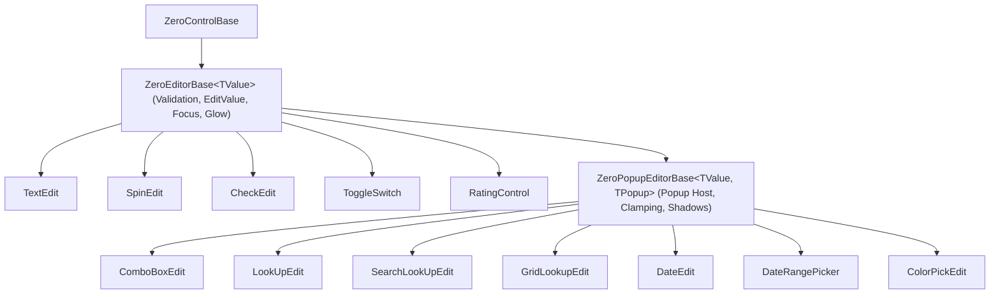
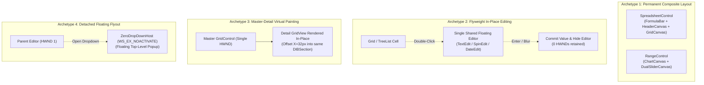
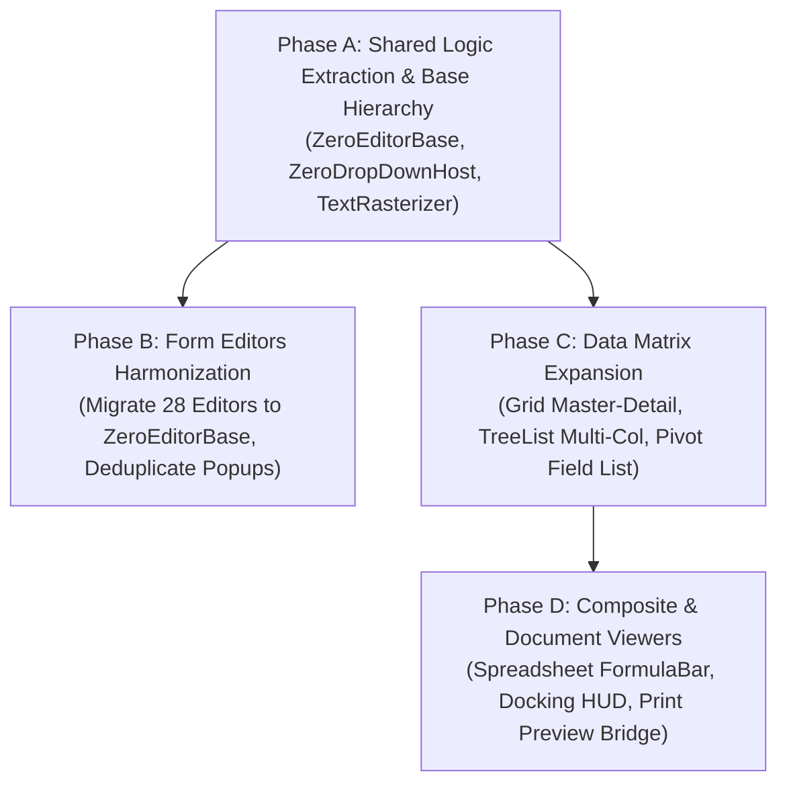

# Comprehensive Control Ecosystem Audit, Shared Logic Extraction & Composite Architecture

This document establishes the architectural audit of all existing controls in **ZeroUI**, defines the feature expansion roadmap for each control family, extracts shared logic into reusable base engines, and formalizes the composite/nested control patterns under the **Strict Single-HWND Constraint**.

---

## 1. Architectural Principles & Governing Constraints

1. **Strict Single-HWND Constraint:** WinForms controls must maintain exactly **1 top-level Win32 HWND per composite view**. Child control proliferation (e.g. creating an HWND per cell, node, or port) is strictly prohibited.
2. **Flyweight In-Place Editing:** When editing tabular data, all cells are rendered as pure GDI/Direct2D vector graphics. Entering edit mode repositions and focuses a **single shared floating editor instance**, which is hidden and detached upon commit or cancellation.
3. **Zero Allocation on Hot Rendering Paths:** Viewport slicing, text measurement, glyph caching, coordinate mapping, and dirty region updates must execute at **0 B/frame GC allocation**.
4. **Decoupled Architecture:** Core models and data structures (`IZeroVirtualSource`, `ZeroAnimationClock`, `TagStorage`) remain purely decoupled from platform-specific UI frameworks.

---

## 2. Comprehensive Audit & Expansion Roadmap by Control Family

### 2.1 Data Matrix Controls

```text
┌─────────────────────────────────────────────────────────────────────────┐
│                           Data Matrix Family                            │
├─────────────────────┬───────────────────────┬───────────────────────────┤
│     GridControl     │   PivotGridControl    │         TreeList          │
│ (Tabular & Bands)   │ (Cross-Tab & OLAP)    │ (Hierarchical Multi-Col)  │
└─────────────────────┴───────────────────────┴───────────────────────────┘
```

| Control | Current Architecture | Identified Deficiencies / Gaps | Proposed Feature Expansions | Shared Logic / Composite Handling |
| :--- | :--- | :--- | :--- | :--- |
| **`GridControl`** | Single-HWND virtual grid with Table/Card/Tile views, bands, grouping, auto-filter. | Lacks master-detail expansion, Excel column popup, runtime layout persistence, column chooser. | • Master-Detail Engine (`GridLevelTree`)<br>• Layout Persistence (`SaveLayout`/`RestoreLayout` in JSON/XML)<br>• Excel-Style Column Filter Popup<br>• Runtime Column Chooser Dialog<br>• Auto BestFitColumns<br>• Rectangular Range TSV Copy/Paste<br>• Decoupled `IRepositoryItem` & `CustomRowCellEdit`<br>• One-Click Vector Print Preview<br>• `AdvBandedGridView` (Multi-row records)<br>• `IAsyncVirtualSource` (Async Server Mode) | • In-Place Virtual Detail Painting (0 child HWNDs).<br>• Flyweight in-place editor pool.<br>• Shared TSV clipboard parser.<br>• Shared `ZeroDropDownHost` for filter popup. |
| **`PivotGridControl`** | Cross-tab OLAP grid with row/column header grouping, measure aggregations, grand totals. | Fixed field layout defined via code only; synchronous calculation freezes UI on 1M rows; lacks visual customization. | • **Visual Drag-and-Drop Field List** (floating customization window to drag fields between Rows, Columns, Filters, and Values).<br>• **Top N / Bottom N Filtering** per dimension.<br>• **Conditional Formatting** (gradient color scales, data bars in OLAP cells).<br>• **Async Aggregation Engine** (background worker evaluation with shimmer progress).<br>• **Streaming OpenXML `.xlsx` Export**. | • Shared floating tool window (`ZeroFieldChooserDialog`).<br>• Shared cell formatting and vector text rasterizer.<br>• Flyweight in-place drill-down detail grid. |
| **`TreeList`** | Hierarchical node tree currently residing in `Industrial/`. | Single text/badge column only; lacks tabular multi-column headers, sorting, in-place editing, and virtual scrolling for 100k+ nodes. | • **Relocate to `DataGrid/`** (universal data matrix control).<br>• **Multi-Column Hierarchical Grid** (expandable tree nodes in column 0, standard data columns with sorting and formatters in columns 1..N).<br>• **Virtual Tree Engine (`IVirtualTreeSource`)** with on-demand child node expansion.<br>• **In-Place Cell Editing** via `IRepositoryItem`.<br>• **Drag-and-Drop Node Re-parenting** with visual drop-line insertion glyphs. | • Reuses `ZeroColumn` schema and header rendering.<br>• Shares in-place editor dispatch.<br>• Shares keyboard navigation state machine. |

---

### 2.2 Form Editors & Input Controls (28 Controls)



| Control Group | Controls Included | Current State | Identified Technical Gaps | Proposed Feature Expansions | Shared Logic Action |
| :--- | :--- | :--- | :--- | :--- | :--- |
| **Text & Masking** | `TextEdit`<br>`MemoEdit`<br>`MaskBox` | Basic text box and multi-line editor with themed borders. | Masking engines are hardcoded; lacks custom action buttons, leading/trailing glyphs, clear icon, and word wrap metrics. | • **Unified RegEx & Mask Provider** (DateTime, Numeric, Phone, CreditCard, Custom Regex).<br>• **Embedded Custom Buttons** (e.g. eye icon for password show/hide, search icon, clear `[x]` button).<br>• **Character Counter HUD** for `MemoEdit` with auto-growing height mode. | Inherit from `ZeroEditorBase<string>`. Share `DrawStandardEditorFrame()` and inner `TextBox` message forwarding. |
| **Numeric & Steppers** | `SpinEdit`<br>`TrackBarControl` | Numeric stepper with up/down buttons and unit prefixes. | Fixed increment steps; uses scattered `Timer` for hold-to-repeat; no math expression evaluation. | • **Acceleration Curve on Long Press** (increments $\times 10, \times 100$ smoothly via `ZeroAnimationClock`).<br>• **In-Place Math Expression Evaluator** (typing `25*4` &rarr; commits `100`).<br>• **Multi-Unit Selector Attachment** (e.g. `[ 150 ] [ mm ▾ ]`). | Replace per-control `Timer` with `ZeroAnimationClock` ticks. Inherit from `ZeroEditorBase<decimal>`. |
| **Date & Time** | `DateEdit`<br>`TimeEdit`<br>`DateRangePicker` | Custom-drawn calendar popup with preset pills and year/month nav. | Duplicated `ToolStripDropDown` instantiation; no embedded time selector in `DateEdit`; no fiscal quarter presets. | • **Integrated DateTime Mode** (calendar + spinner time picker in single popup).<br>• **Fiscal & ISO Week Numbers** column in calendar.<br>• **Relative Date Presets** (Today, Yesterday, Last 7 Days, MTD, QTD, YTD) in `DateRangePicker`. | Inherit from `ZeroPopupEditorBase<DateTime, ZeroCalendarPopupControl>`. Share popup clamping and shadow host. |
| **Lookups & Dropdowns** | `ComboBoxEdit`<br>`CheckedComboBoxEdit`<br>`LookUpEdit`<br>`SearchLookUpEdit`<br>`GridLookupEdit` | Dropdown editors with virtual lists and embedded grids for large datasets. | **Severe logic duplication**: Each control manages its own `ToolStripDropDown`, open/close states, screen clamping, search debounce, and focus transfer. | • **Unified Dropdown Host Engine (`ZeroDropDownHost`)**.<br>• **Token / Chip Multi-Selection Mode** (`CheckedComboBoxEdit`).<br>• **"Add New Record" Footer Action Button** (`+ New Item` triggers `ProcessNewValue` event).<br>• **Remote Query Async Streaming** for 100k+ catalogs. | Inherit from `ZeroPopupEditorBase<T, TPopup>`. Centralize 100% of popup positioning, drop shadow, and outside click logic. |
| **Toggles & Choices** | `CheckEdit`<br>`ToggleSwitch`<br>`RadioButtonControl`<br>`RadioGroup`<br>`SegmentedControl` | Toggle switches, checkboxes, and segmented pill bars. | Lacks intermediate indeterminate state visualizer; hardcoded animation physics; no auto-wrapping on narrow forms. | • **Smooth Spring Physics & Inertia** on toggle switches.<br>• **Tristate Checkbox** with distinct indeterminate icon.<br>• **Icon + Subtitle Support** on SegmentedControl pills with responsive wrap. | Inherit from `ZeroEditorBase<bool>` / `ZeroEditorBase<TKey>`. Share keyboard spacebar/arrow navigation. |
| **Media & Specialized** | `PictureEdit`<br>`BarcodeBox`<br>`RatingControl`<br>`ColorPickEdit`<br>`TagControl`<br>`StatisticCard` | Vector barcode rendering, star ratings, and picture box. | PictureEdit lacks zoom/pan and cropping; ColorPickEdit has no eyedropper screen magnifier; BarcodeBox has no direct print format. | • **PictureEdit Interactive Canvas** (mouse wheel zoom, drag pan, crop marquee, clipboard paste).<br>• **ColorPickEdit Eyedropper** (magnifier tool picking hex color from any desktop pixel).<br>• **ZPL / ESC-POS Thermal Label Code Generator** in `BarcodeBox`. | Integrate vector rendering pipeline. Share color palette dialog across controls. |

---

### 2.3 Layout, Navigation & Overlay Controls

| Control | Current Architecture | Gaps & Limitations | Proposed Feature Expansions | Shared Logic / Composite Handling |
| :--- | :--- | :--- | :--- | :--- |
| **`ZeroDockPanel`** | Docking container with basic SplitterPanel layouts. | Lacks visual dock guides HUD, floating detachable windows, auto-hide tab drawers, and layout persistence. | • **Visual Dock Guides Diamond HUD** (Left, Top, Right, Bottom, Center tab drop indicators).<br>• **Detachable Floating Tool Windows** (torn off into independent top-level forms).<br>• **Auto-Hide Tab Pin Drawers** (slide-out flyouts pinned to screen edges).<br>• **Dock Layout Serialization** (`SaveDockLayout` / `RestoreDockLayout` to XML/JSON). | Composite container managing multiple child viewports. Event routing for drag-and-drop dock targets. |
| **`BreadcrumbControl`** | Hierarchical asset path navigator (`Enterprise > Plant > Cell`). | Read-only static segments; clicking segment does not show sibling dropdown menu; no editable path box. | • **Dropdown Sibling Menu on Segment Click** (displays popover menu of sibling folders/nodes).<br>• **Editable URL Address Mode** (clicking empty space converts breadcrumb into an editable `TextEdit` with auto-complete).<br>• **History Back/Forward Navigation Stack**. | Integrates `ZeroDropDownHost` for segment popup menus. Composite text editor swap. |
| **`ZeroAccordion`** | Multi-level collapsible navigation menu. | Rendered as separate child controls; lacks search filtering and virtualization for large hierarchies. | • **Virtualized Node Rendering** (supports 10,000 items with 0 allocation).<br>• **In-Header Instant Filter Search Box**.<br>• **Accordion Modes** (Single Expanded Accordion vs. Multi-Expanded Tree). | Single-HWND rendering; flyweight item hit-testing. |
| **`FlowLayoutControl`** | Responsive card flow panel with tile reordering. | Basic wrap layout; lacks smooth animated tile swapping and spring physics. | • **Animated Tile Drag-and-Drop** (tiles glide smoothly into new positions).<br>• **Persistence of Tile Arrangement** per user profile. | Integrates `ZeroAnimationClock` for transition physics. |
| **`ZeroModal` & `ZeroDrawer` & `ZeroToast`** | Dialog forms and notification toasts. | Fixed opacity; no acrylic backdrop blur; toast notifications overlap instead of stacking. | • **Acrylic Glassmorphism Backdrop Overlay** for modals.<br>• **ZeroToast Stacking Manager** (smoothly slides down when previous toasts expire).<br>• **Non-Blocking In-App Banner HUD**. | Shared overlay coordinator managing z-index and mouse click-through layers. |

---

### 2.4 Charts & Visual Analytics Controls

| Control | Current Architecture | Gaps & Limitations | Proposed Feature Expansions | Shared Logic / Composite Handling |
| :--- | :--- | :--- | :--- | :--- |
| **`ZeroChart`** (Bar, Line, Pie, Candlestick, Radar, Waterfall, Funnel, Pyramid, BoxPlot, Spc, Gantt) | Vector rendering engine with series collections and LTTB decimation. | Lacks interactive crosshair HUD, pinch/box zoom, real-time rolling strip chart mode, and export dialog. | • **Interactive Crosshair HUD** (tracks mouse cursor across all series, displaying synchronized tooltips and X/Y coordinate lines).<br>• **Interactive Pan & Rectangular Box Zoom** with mouse drag.<br>• **Continuous Rolling Strip Chart Mode** (lock-free circular ring buffer updates at 60 Hz).<br>• **Out-of-Spec Warning Bands** (Upper/Lower control limits with amber/crimson shaded regions). | Single-HWND GDI/Direct2D blit. Shared coordinate transform matrix (`ViewportTransform2D`). |
| **`RangeControl`** | Dual-thumb visual range selector. | Standalone slider; not natively bonded as the interactive scrollbar of `ZeroChart` or `GridControl`. | • **Native Chart Bonding (`rangeControl.Client = chartControl`)**: Displays miniaturized sparkline/area thumbnail inside the range slider.<br>• **Range Snapping** (snap to days, hours, months, or discrete tag sample buckets). | Composite control hosting thumbnail canvas + interactive slider handles on a single HWND. |

---

### 2.5 Document & Reporting Controls

| Control | Current Architecture | Gaps & Limitations | Proposed Feature Expansions | Shared Logic / Composite Handling |
| :--- | :--- | :--- | :--- | :--- |
| **`SpreadsheetControl`** | Tabular vector calculation sheet with core formulas (`SUM`, `AVERAGE`, `IF`). | Lacks formula bar synchronization, cell formatting dialog, freeze panes, and streaming Excel export. | • **Integrated Formula Bar Component** (Name box + `fx` cancel/commit buttons + formula editor).<br>• **Cell Range Formatting Engine** (borders, font styles, background fill, numeric format strings `#,##0.00`).<br>• **Freeze Panes** (lock top rows and left columns during scrolling).<br>• **Streaming OpenXML `.xlsx` / CSV Exporter & Importer**. | **Permanent Composite Architecture**: Formula Bar + Row/Col Header Bars + Viewport Canvas. Single-HWND for canvas, single flyweight editor for cell input. |
| **`PdfViewerControl`** | Embedded multi-page vector CAD & SOP PDF reader. | Basic continuous scroll; lacks text search, bookmarks outline sidebar, and vector printing integration. | • **Text Search Engine (`Ctrl+F`)** with visual highlighted match rects.<br>• **Document Outline / Bookmarks Sidebar Panel**.<br>• **Vector Printing Integration** via standard Windows Print Spooler. | Composite layout hosting sidebar navigation panel + main PDF viewport canvas. |
| **`DocumentPreviewControl`** | Print preview container for reports and grids. | Rudimentary page rendering; lacks multi-page grid layout (2-up, 4-up), zoom presets, and printer setup. | • **Multi-Page Layout Grid** (Continuous, 2-Page facing, 4-Page thumbnail overview).<br>• **Direct Vector Export** to PDF, SVG, and high-DPI TIFF. | Single-HWND virtual page layout with smooth pinch/wheel zoom. |

---

### 2.6 Industrial SCADA & Mimic Controls

| Control | Current Architecture | Gaps & Limitations | Proposed Feature Expansions | Shared Logic / Composite Handling |
| :--- | :--- | :--- | :--- | :--- |
| **`RadialGauge` & `LinearGauge`** | Vector dials with direct `TagStorage` binding. | Single needle only; fixed threshold colors; no digital odometer display. | • **Multi-Needle & Setpoint Target Pegs** (Actual Value + Setpoint + High Limit).<br>• **ISA-18.2 Alarm Arc Bands** (Normal green, Warning amber, Alarm crimson).<br>• **Rolling Digital Odometer Display** embedded in gauge dial. | Implements `ITagBoundControl` and `ZeroVisualControlBase`. Subscribes to `ZeroAnimationClock`. |
| **`ZeroPlantMimicCanvas`** | Vector plant canvas with `GridSpatialIndex` frustum culling. | Static predefined node types; manual coordinate placement; no vector CAD DXF/SVG import. | • **Vector CAD DXF / SVG Floor Plan Importer**.<br>• **Animated Flow Paths** (piping with animated dashed directional pulses bound to clock phases).<br>• **Dynamic Zoom-to-Node & Frustum Culling** for 50,000+ equipment symbols. | Single-HWND rendering surface. Spatial culling via R-Tree / Grid Spatial Index. |
| **Industrial Equipment** (`Fan`, `Motor`, `Pump`, `Valve`, `Tank3D`, `ConveyorBelt`, `PidFaceplate`) | Individual vector equipment components. | Scattered drawing parameters; varying animation phase bindings; lacks interlock badges. | • **Standardized `IScadaDrawable` Implementation** across all components.<br>• **Interlock & Maintenance Lockout Badges** (LOTO lock icon, E-stop active ring).<br>• **Dynamic Faceplate Flyout on Click** (compact PID tuning popup with real-time trend). | Inherit from `ZeroVisualControlBase`. All animations bound to `ZeroAnimationClock.SharedPhases`. |

---

## 3. Shared Logic Extraction & Base Engine Architecture

### 3.1 The Three Common Failure Modes in Control Libraries
1. **Scattered Dropdown Management:** Each editor (`ComboBox`, `LookUp`, `DateEdit`, `ColorPicker`) manually builds a `ToolStripDropDown`, computes screen offsets, clamps to screen borders, handles window deactivation, and catches outside clicks.
2. **Inconsistent Editor Traits:** Properties like `EditValue`, `IsModified`, `IsReadOnly`, error providers, focus glowing rings, and placeholder texts are re-implemented across 20+ separate classes with slight behavioral discrepancies.
3. **Redundant Text & Font Syscalls:** Repeated GDI calls (`CreateFontIndirect`, `GetTextExtentPoint32`, `SetTextColor`) on every cell or control repaint cause kernel mode transitions and GC thrashing.

---

### 3.2 Unified Base Class Hierarchy

```text
                                 System.Windows.Forms.Control
                                              │
                                     ZeroControlBase
               (Skin Lifecycle, Double Buffering, Palette Resolution, DPI Scale)
                                              │
                     ┌────────────────────────┴────────────────────────┐
                     │                                                 │
          ZeroVisualControlBase                                ZeroEditorBase<TValue>
     (Animation Clock, 60Hz Vector Canvas)             (EditValue, Validation, Focus Frame,
                     │                                       Inner TextBox Lifecycle)
       ┌─────────────┴─────────────┐                                   │
       │                           │                         ZeroPopupEditorBase<T, TPopup>
  SCADA Dials              Mimic Canvases &          (ZeroDropDownHost, Auto-Flip Up/Down,
 & Gauges                   Network Topology             Screen Clamping, Drop Shadow)
                                                                       │
                                                       ┌───────────────┴───────────────┐
                                                       │                               │
                                                  LookUpEdit /                  DateEdit /
                                                SearchLookUpEdit               DateRangePicker
```

---

### 3.3 Core Shared Engines Specification

#### Engine 1: `ZeroEditorBase<TValue>` (Universal Editor Foundation)
* **Responsibilities:**
  - Encapsulates `TValue EditValue` with strongly-typed change notification (`EditValueChanged`, `ValueChanging` with cancellation).
  - Standardizes `bool IsReadOnly`, `bool IsModified`, and `string Placeholder`.
  - Provides standard GDI vector frame rendering:
    - Normal border (Obsidian Slate / Clean Gray).
    - Hover border (Accent Glow).
    - Focused border (Active High-Contrast Primary Ring + 1px Inner Outline).
    - Validation Error border (Crimson Red + error glyph tooltip integration).
  - Manages the lifecycle of an optional embedded `TextBox` (for editable text inputs) ensuring correct sizing, transparent margins, and message forwarding.

#### Engine 2: `ZeroDropDownHost` & `ZeroPopupEditorBase<TValue, TPopup>`
* **Responsibilities:**
  - Provides a single, unified, lightweight drop-down host window configured with `WS_POPUP | WS_CLIPSIBLINGS` and `WS_EX_NOACTIVATE`.
  - **Screen Boundary Clamping & Auto-Flip Math:**
    ```csharp
    Point screenPt = PointToScreen(new Point(0, Height));
    Rectangle screenBounds = Screen.FromControl(this).WorkingArea;

    int popupY = screenPt.Y;
    if (popupY + popupHeight > screenBounds.Bottom && screenPt.Y - popupHeight - Height >= screenBounds.Top)
    {
        // Auto-flip upward (DropUp mode)
        popupY = screenPt.Y - popupHeight - Height;
    }
    int popupX = Math.Max(screenBounds.Left, Math.Min(screenPt.X, screenBounds.Right - popupWidth));
    ```
  - **Drop Shadow & Border:** Custom-drawn 1px anti-aliased border with 4px soft ambient shadow (GDI+ / DWM shadow).
  - **Outside Click & Focus Transfer:** Low-overhead mouse hook / message filter automatically closing the popup when clicking outside, restoring focus cleanly without parent window titlebar flicker.
  - **Keyboard Routing:** Intercepts `Up`, `Down`, `PageUp`, `PageDown`, `Enter`, `Escape` from the parent editor and dispatches them directly into the popup list/grid.

#### Engine 3: `ZeroTextRasterizer` (Zero-Allocation GDI Text Engine)
* **Responsibilities:**
  - Centralizes unmanaged Win32 `ExtTextOutW` and `GetTextExtentPoint32W` calls.
  - Caches ASCII & Unicode Latin character widths in a flat 256-element integer table per font.
  - Eliminates redundant GDI `SetTextColor` and `SetBkMode` syscalls by caching the active DC state in `MemoryDIBSection`.
  - Accepts `ReadOnlySpan<char>` directly from pooled buffers, completely bypassing string allocations.

#### Engine 4: `ZeroClipboardHelper` (Tabular Data Exchange Engine)
* **Responsibilities:**
  - Standardizes rectangular matrix serialization to Windows Clipboard (`CF_UNICODETEXT`).
  - Writes Tab-Separated Values (`\t`) and CRLF (`\r\n`) using `ArrayPool<char>` pooled memory buffers.
  - Parses incoming clipboard TSV streams with zero heap allocations, splitting lines and tab tokens as `ReadOnlySpan<char>` slices.
  - Reused across `GridControl`, `TreeList`, `SpreadsheetControl`, and `PivotGridControl`.

---

## 4. Composite & Nested Control Architecture (Single-HWND Enforcement)

### 4.1 The Four Composite Archetypes



---

### 4.2 Archetype 1: Permanent Composite Layouts
* **Example:** `SpreadsheetControl` (Formula Bar + Row/Col Headers + Sheet Canvas).
* **Architecture Rules:**
  1. The row header, column header, and sheet cells **must NOT be separate controls**. They reside on the **exact same drawing canvas** within a single HWND.
  2. The Formula Bar at the top may host an embedded `TextBox` for input, but its buttons (`fx`, `Check`, `Cancel`) and Name Box are drawn directly onto the top panel without child button HWNDs.
  3. Hit-testing is performed mathematically via bounding rectangles:
     $$Y < H_{\text{formula}} \implies \text{FormulaBarHit}$$
     $$Y \in [H_{\text{formula}}, H_{\text{formula}} + H_{\text{colHeader}}] \implies \text{ColumnHeaderHit}$$
     $$\text{Otherwise} \implies \text{CellViewportHit}$$

---

### 4.3 Archetype 2: Flyweight In-Place Editing (Dynamic Cellular Editing)
* **Problem:** If a 100,000-row `GridControl` or `TreeList` created a WinForms control for each cell, the OS would exhaust USER/GDI objects, causing total system crash.
* **Architecture Rules:**
  1. **Display Mode (Default):** 100% vector painting via `MemoryDIBSection` and `ExtTextOutW`. Zero child controls or HWNDs exist.
  2. **Edit Mode Activation:**
     - When the user presses F2, Enter, or double-clicks cell $(R, C)$:
     - Query `IRepositoryItem` or column editor type.
     - Retrieve or lazily create a **single flyweight editor instance** of that type (e.g. `TextEdit` or `DateEdit`).
     - Set editor bounds:
       $$\text{Editor.Bounds} = \text{CellRect}(R, C)$$
     - Set `Editor.Parent = this`, assign `Editor.EditValue = cellValue`, and call `Editor.Show()` and `Editor.Focus()`.
  3. **Commit & Tear-Down:**
     - On Enter, Tab, or clicking outside the cell:
     - Read `Editor.EditValue`, validate, and commit to data source.
     - Call `Editor.Hide()`.
     - Invalidate cell rectangle.
     - The parent control retains focus. At no point are multiple cell editors ever instantiated.

---

### 4.4 Archetype 3: Master-Detail Hierarchical Virtual Painting
* **Problem:** In ERP forms (Sales Order &rarr; Order Items), developers want expandable detail rows. Creating a child `GridControl` inside each expanded row degrades performance exponentially.
* **Architecture Rules:**
  1. Detail rows are represented by a **logical `GridView` template**, not a physical WinForms control.
  2. In `RowIndexMap`, expanding a master row increases its visual row height:
     $$H_{\text{masterVisual}} = H_{\text{masterRow}} + (\text{DetailRowCount} \times H_{\text{detailRow}}) + H_{\text{detailHeader}} + H_{\text{padding}}$$
  3. During `OnPaint`, the rendering loop renders the master row, and if expanded, immediately renders the detail header and detail rows **in-place into the same Memory DIBSection** indented by $32\text{px}$.
  4. **Mouse & Scroll Message Routing:**
     - When the mouse moves or clicks within the detail region $(X \ge 32\text{px}, Y \in \text{DetailBounds})$:
     - The master control's `OnMouseDown` translates coordinates to local detail coordinates:
       $$Y_{\text{local}} = Y - Y_{\text{detailTop}} - H_{\text{detailHeader}}$$
       $$\text{DetailRowIndex} = \lfloor Y_{\text{local}} / H_{\text{detailRow}} \rfloor$$
     - All selection, hover, and sorting actions are handled directly within the master grid's message loop, preserving **exactly 1 Win32 HWND** regardless of how many detail levels are expanded.

---

### 4.5 Archetype 4: Detached Floating Flyouts & Dropdowns
* **Problem:** Dropdowns that steal window focus cause the main form's title bar to deactivate (gray out), resulting in visual flicker and broken keyboard tab orders.
* **Architecture Rules:**
  1. All dropdown popups (`SearchLookUpEdit`, `DateEdit`, `ExcelColumnFilterPopup`, `ColumnChooserDialog`) must inherit from `ZeroDropDownHost`.
  2. `ZeroDropDownHost` enforces Win32 window styles:
     ```csharp
     protected override CreateParams CreateParams
     {
         get
         {
             var cp = base.CreateParams;
             cp.Style |= unchecked((int)(WS_POPUP | WS_CLIPSIBLINGS));
             cp.ExStyle |= unchecked((int)(WS_EX_TOPMOST | WS_EX_TOOLWINDOW | WS_EX_NOACTIVATE));
             return cp;
         }
     }
     ```
  3. `WS_EX_NOACTIVATE` ensures that opening a dropdown does **not deactivate the main application form**. Focus remains logically bound to the active editor.
  4. Keyboard events (`WM_KEYDOWN`) received by the parent editor are manually forwarded to the dropdown list, allowing arrow navigation and search typing simultaneously.

---

## 5. Strategic Execution & Refactoring Roadmap



| Execution Milestone | Target Components | Key Architectural Deliverables | Verification Mechanism |
| :--- | :--- | :--- | :--- |
| **Phase A: Shared Engines** | `ZeroUI.Core`<br>`ZeroUI.WinForms.Base` | • `ZeroEditorBase<TValue>`<br>• `ZeroPopupEditorBase<T, TPopup>` & `ZeroDropDownHost`<br>• `ZeroTextRasterizer` & font metrics cache<br>• `ZeroClipboardHelper` (TSV/CSV 0-alloc parser) | Unit tests verifying 0 B heap allocation during text measurement and popup positioning math. |
| **Phase B: Editors Harmonization** | `ZeroUI.WinForms.Editors`<br>`ZeroUI.Wpf.Editors` | • Migrate 28 editors to inherit from `ZeroEditorBase`<br>• Eliminate duplicated `ToolStripDropDown` instances across all 7 lookup controls<br>• Add unified RegEx mask provider & custom button glyphs | Visual verification in demo forms; 100% theme synchronization under Light and Dark skins. |
| **Phase C: Data Matrix Expansion** | `DataGrid/`<br>`TreeList/`<br>`PivotGrid/` | • Master-Detail in-place rendering in `GridControl`<br>• Multi-column hierarchical `TreeList` with column sorting and editing<br>• Drag-and-drop Pivot Field List dialog & async aggregation | Virtualization benchmarks: 100M rows with 1,000 expanded master-detail rows maintaining < 5ms render time. |
| **Phase D: Composite Viewers** | `Reporting/`<br>`Docking/`<br>`Range/` | • `SpreadsheetControl` formula bar synchronization<br>• `ZeroDockPanel` dock guides diamond HUD and floating tools<br>• One-click vector print preview bridge across all data controls | Full integration demo with print preview, Excel export, and dock layout serialization. |

---

## 6. Summary & Recommendations

1. **Immediate High-Yield Action:** Extract `ZeroEditorBase<TValue>` and `ZeroDropDownHost`. This single refactoring immediately eliminates >1,500 lines of duplicated dropdown and frame-drawing code across 7 editors.
2. **Strict HWND Discipline:** Uphold the Flyweight Singleton In-Place Editor and In-Place Virtual Master-Detail rendering to guarantee world-class 120 FPS performance and zero GDI handle leaks.
3. **Enterprise Parity:** Move forward with Tier P0 of the Grid Expansion (`SaveLayout`/`RestoreLayout`, `ExcelColumnFilterPopup`, `GridLevelTree`) adhering to these shared base engines.
