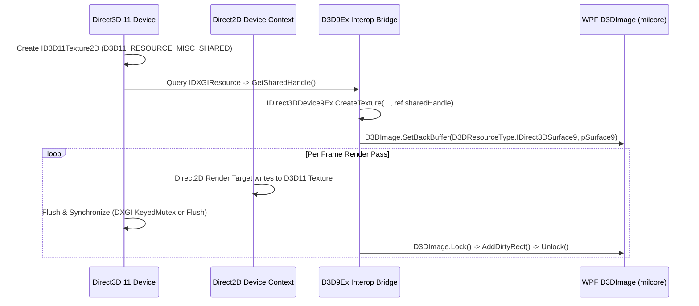

# ZeroUI Rendering Pipeline

## 1. Overview

ZeroUI implements a dual-mode rendering pipeline designed to extract the maximum performance from available hardware while maintaining compatibility with enterprise remote virtualization:

1. **Fast GDI Pipeline (CPU + Unmanaged Blit):** Optimized for low-spec office PCs, Terminal Services, Remote Desktop (RDP), and Citrix environments.
2. **Direct2D GPU Pipeline (DirectX 11):** Optimized for high-framerate rendering (60–120 FPS), rich vector graphics, and real-time data streaming.

```mermaid
graph TD
    subgraph InputProcessing["1. Input & Viewport Pass"]
        Scroll["User Scroll / Resize Event"]
        Viewport["Calculate Visible Range (RowStart..RowEnd)"]
    end

    subgraph PipelineSelection{"2. Pipeline Selector"}
        FastGdi["Fast GDI Mode (Unmanaged Memory + BitBlt)"]
        Direct2D["Direct2D Mode (Hardware Accelerated)"]
    end

    subgraph FastGdiPath["Fast GDI Engine"]
        Buffer["Acquire Unmanaged Back-Buffer (Marshal.AllocHGlobal)"]
        ParallelDraw["Multi-Threaded Pixel Fill (Parallel.For + Span)"]
        NativeBlit["Win32 SetDIBitsToDevice / BitBlt to HDC"]
    end

    subgraph D2DPath["Direct2D GPU Engine"]
        CmdList["Build Draw Command Buffer"]
        D2DDraw["GPU Rasterization (Direct2D + DirectWrite)"]
        Present["Present to HWND (WinForms) or D3DImage (WPF)"]
    end

    InputProcessing --> PipelineSelection
    PipelineSelection -->|Default / Remote Desktop| FastGdi
    PipelineSelection -->|High GPU Mode| Direct2D
    FastGdi --> FastGdiPath
    Direct2D --> D2DPath
```

---

## 2. Fast GDI Pipeline (CPU + Zero-Copy Blit)

Standard GDI+ (`System.Drawing.Graphics`) allocates intermediate managed bitmaps and executes software rasterization on the UI thread, causing high CPU load and UI freezing. 

ZeroUI bypasses GDI+ entirely in hot paths using **Win32 Memory DC & Direct DIB Section Framebuffers**:

### Implementation Mechanism:
1. **DIB Section & Memory DC Allocation:**
   A Win32 Device-Independent Bitmap (DIB) section is created once per viewport dimension change:
   ```csharp
   BITMAPINFO bmi = new BITMAPINFO();
   bmi.bmiHeader.biSize = (uint)Marshal.SizeOf(typeof(BITMAPINFOHEADER));
   bmi.bmiHeader.biWidth = physicalWidth;
   bmi.bmiHeader.biHeight = -physicalHeight; // Top-down DIB
   bmi.bmiHeader.biPlanes = 1;
   bmi.bmiHeader.biBitCount = 32;
   bmi.bmiHeader.biCompression = BI_RGB;

   IntPtr hMemDC = NativeMethods.CreateCompatibleDC(hScreenDC);
   IntPtr hBitmap = NativeMethods.CreateDIBSection(
       hMemDC, ref bmi, DIB_RGB_COLORS, out IntPtr pBits, IntPtr.Zero, 0);
   IntPtr hOldBmp = NativeMethods.SelectObject(hMemDC, hBitmap);
   ```

2. **Hybrid Parallel Fill & Native ClearType Text:**
   * **Background & Grid Lines (SIMD / Multi-core):** The raw unmanaged pointer `pBits` is partitioned across worker threads via `Parallel.For` to fill cell backgrounds, zebra stripes, and selection highlights in <0.2ms.
   * **ClearType Text Rasterization (`ExtTextOutW`):** Text is drawn directly into `hMemDC` using native Win32 `ExtTextOutW` with font clipping rectangles (`ETO_CLIPPED | ETO_OPAQUE`). This provides 100% native Windows subpixel ClearType antialiasing, complete Unicode/diacritic font fallback, and sub-millisecond execution without external software font engines.

3. **Sub-Millisecond Zero-Copy Blit (`BitBlt`):**
   In the control's `OnPaint`, the completed Memory DC is blitted to the screen DC in a single GPU/GDI kernel call:
   ```csharp
   NativeMethods.BitBlt(
       hdc, 0, 0, physicalWidth, physicalHeight,
       hMemDC, 0, 0, NativeMethods.SRCCOPY);
   ```
   **Typical latency:** 0.2ms – 0.6ms for a 1920x1080 viewport.

---

## 3. Direct2D GPU Pipeline (DirectX 11)

For applications demanding continuous 60–120 FPS data feeds (real-time charts or 10,000 telemetry updates per second), ZeroUI provides a Direct2D hardware pipeline.

### A. WinForms Direct2D Hosting
* An `ID2D1HwndRenderTarget` is bound directly to the control's `Handle`.
* Direct drawing commands (`DrawLine`, `FillRectangle`, `DrawTextLayout`) execute directly on the GPU VRAM.
* VSync is managed via `DXGI_PRESENT` flags.

### B. WPF Direct2D Hosting (`D3DImage` Shared Surface Bridge)
WPF's `D3DImage` requires a Direct3D 9 surface (`IDirect3DSurface9`). To achieve zero-copy GPU compositing from modern Direct2D 1.1 / DirectX 11, ZeroUI implements the **D3D11-to-D3D9Ex Shared Handle Bridge**:



**Result:** Zero CPU memory bandwidth used for texture upload; 100% hardware composited by the WPF `milcore` composition engine.

---

## 4. Text Rendering Optimization (DirectWrite & ClearType)

Text rendering is traditionally the most expensive operation in desktop data tables:
* **Glyph Caching:** ZeroUI pre-caches measured character bounding boxes and DirectWrite text layouts for frequently repeated values (numbers, status codes, dates).
* **DirectWrite Antialiasing:** Uses subpixel ClearType rendering with gamma correction matching Windows OS user preferences.
* **Truncation & Ellipsis:** Truncation is computed mathematically via binary search over font character advance widths rather than string allocations.

---

## 5. Dirty Rectangle Tracking

Full-control repaints are strictly minimized. ZeroUI tracks dirty regions:
* **Cell Invalidation:** Editing or highlighting a cell calls `Invalidate(Rectangle.FromLTRB(x1, y1, x2, y2))`.
* **Scroll Translation:** When scrolling vertically by $\Delta y$, existing pixels are scrolled using `ScrollWindowEx`, and only the newly exposed header/footer strip is drawn.

---

## 6. GPU Device-Loss Resilience & Recovery

In enterprise environments, GPU hardware devices can reset or be removed dynamically (e.g. system sleep/resume, docking station changes, RDP disconnect/reconnect, graphics driver updates).

### Recovery State Machine:
1. **Error Detection:** When calling `ID2D1RenderTarget.EndDraw()` or `Present()`, check for:
   * `D2DERR_RECREATE_TARGET` (`0x8899000C`)
   * `DXGI_ERROR_DEVICE_REMOVED` (`0x887A0005`)
   * `DXGI_ERROR_DEVICE_RESET` (`0x887A0007`)
2. **Resource Invalidation:** Immediately release all device-dependent resources:
   * Direct2D render targets, brushes, and bitmap layers.
   * Direct3D 11 device, context, and shared texture handles.
3. **Graceful Fallback & Re-creation:**
   * If hardware device re-creation fails, seamlessly fallback to the **Fast GDI Pipeline** to guarantee zero application downtime.
   * When the GPU becomes available again, reinitialize the Direct2D factory and swapchain on the next layout pass.

