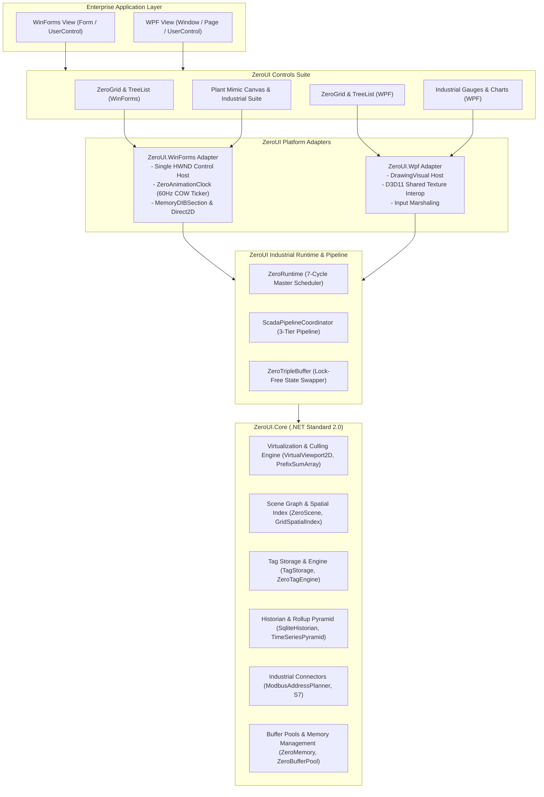
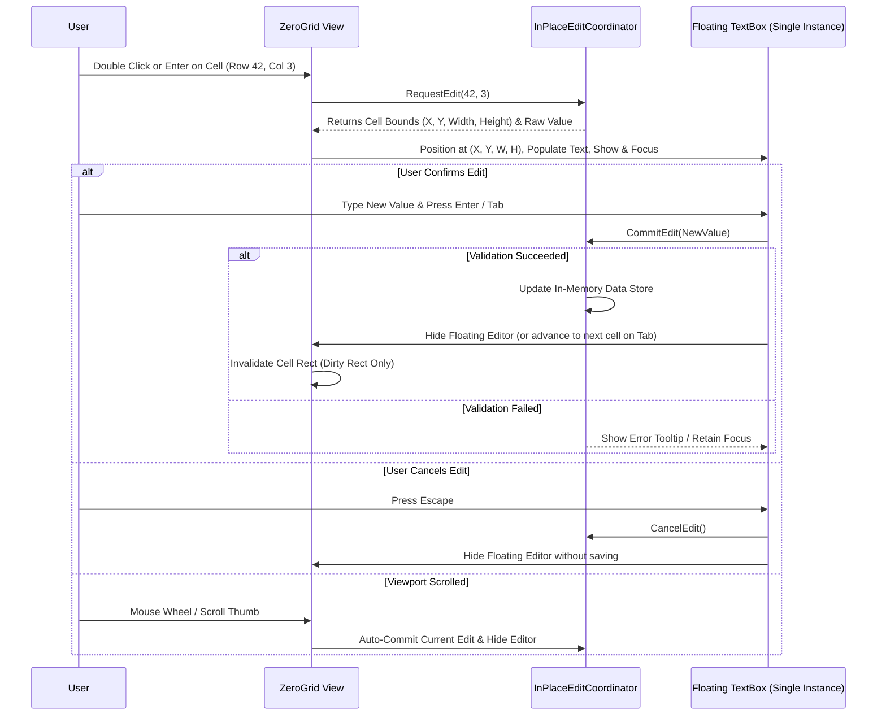

# ZeroUI System Architecture

## 1. Overview & Architectural Goals

The fundamental design goal of **ZeroUI** is to decouple data processing and spatial virtualization from platform-specific UI frameworks (WinForms and WPF). This allows a unified, highly optimized C# core engine to drive UI rendering at native hardware speeds while preventing framework-level bottlenecks.



---

## 2. Layer Breakdown

### Layer 1: ZeroUI.Core (.NET Standard 2.0)
The Core layer contains **zero references** to `System.Windows.Forms` or `PresentationFramework`. It is 100% portable across .NET Framework 4.6.2, modern .NET 8/9, Linux edge containers, and headless console daemons.

Key Subsystems & Components:
* **`VirtualViewport2D` & `PrefixSumArray`**: Computes visible row and column ranges with $O(\log N)$ binary search lookup without generating heap allocations.
* **`ZeroMemory` & `ZeroBufferPool`**: Portable unmanaged memory abstractions (`NativeMemory` vs `Marshal.AllocHGlobal`) and rented `ArrayPool<T>` wrappers.
* **`ZeroRuntime`**: Deterministic master scheduler coordinating PLC (10ms), Logic (10ms), Telemetry (16ms), UI (16ms), Historian (100ms), Cleanup (1s), and Health (5s) cycles.
* **`ScadaPipelineCoordinator` & `ZeroTripleBuffer<T>`**: 3-Tier decoupled pipeline isolating high-frequency (10kHz) field ingestion and calculations from UI frame rendering.
* **`TagStorage` & `ZeroTagEngine`**: Contiguous unboxed array tag registry with atomic dirty bitmasking and inverted index listeners (>48M writes/s, >244M reads/s).
* **`TimeSeriesPyramid` & `LttbDecimation`**: Continuous multi-resolution rollups (L0: raw, L1: 100ms, L2: 1s, L3: 10s, L4: 1min, L5: 10min) powering instant $O(\text{screen pixels})$ chart zoom.
* **`ZeroScene` & `GridSpatialIndex`**: Platform-agnostic 2D scene graph enabling hierarchical mimic topologies and viewport culling.
* **`WorkerQueue<T>`**: Lock-free channel and ring-buffer worker queue featuring `QueueBackpressureMode.LatestPerKey` for telemetry conflation.
* **`ModbusAddressPlanner`**: Industrial address optimizer coalescing disjoint register tags into contiguous MBAP block reads (up to 98.3% network packet reduction).

---

### Layer 2: Platform Adapters

#### A. WinForms Adapter (`ZeroUI.WinForms`)
* **Single-HWND Policy:** Composite controls (`ZeroGridControl`, `ZeroPlantMimicCanvas`, `ZeroToolbar`, `ZeroAccordion`) render within **exactly one `HWND`**, eliminating child control handle leaks.
* **`ZeroAnimationClock`:** Centralized 60 FPS ticker driving all visual animations, pulses, and ISA-18.2 compliant alarm blinks via lock-free Copy-On-Write snapshot arrays, completely eliminating distributed timers.
* **Direct Render Dispatch:** Employs Win32 `MemoryDIBSection` double-buffered GDI rasterization with `ExtTextOutW` subpixel ClearType rendering and sub-millisecond `BitBlt` (or Direct2D GPU acceleration).
* **Flicker-Free Window Styles:** Intercepts `WM_ERASEBKGND` and enforces `WS_CLIPCHILDREN | WS_CLIPSIBLINGS`.

#### B. WPF Adapter (`ZeroUI.Wpf`)
* **Visual Tree Bypass:** Avoids WPF layout panel instantiation and object trees.
* **`DrawingVisual` Presentation:** Hosts low-level visual collections with frozen drawing brushes and pens.
* **Hardware Interop via `D3DImage`:** Bridges DirectX 11 textures into WPF's `milcore` composition pipeline via shared texture handles without CPU copying.

---

### Layer 3: Controls Suite

1. **`ZeroGrid` & `ZeroTreeList`:**
   * Virtualized data grids handling 100M+ rows with $O(1)$ cell lookups, multi-column sorting (`RowIndexMap`), filtering, and floating flyweight editing.
2. **`ZeroPlantMimicCanvas` & `ZeroScene`:**
   * Single-HWND P&ID synoptic mimic canvas supporting infinite pan/zoom (25%–400%) and spatial culling for thousands of industrial vector nodes (`TankNode`, `PumpNode`, `PipeNode`, `ValveNode`, etc.).
3. **`ZeroTrendChart` & `ZeroPlot`:**
   * Real-time 60 FPS multi-channel oscilloscope streaming millions of telemetry data points using `TimeSeriesPyramid` and zero-alloc `LttbDecimation`.
4. **`ZeroAlarmGrid`:**
   * ISA-18.2 compliant industrial alarm monitor with state-synchronized visual blinking driven by `ZeroAnimationClock`.


---

## 3. High-DPI (PerMonitorV2) Scaling Subsystem

ZeroUI enforces strict resolution independence without relying on blurry OS bitmap scaling (DPI virtualization).

### Two-Tier Coordinate Model:
1. **Logical Units (Layout Space):** Defined at 96 DPI. All column widths, row heights, and layout positions exposed to the public API are logical values.
2. **Physical Pixels (Framebuffer Space):** The unmanaged back-buffer and Direct2D targets are allocated at actual physical device pixels:
   $$\text{DevicePixels} = \lceil \text{LogicalUnits} \times \text{ScaleFactor} \rceil, \quad \text{ScaleFactor} = \frac{\text{CurrentDpi}}{96.0f}$$

### WinForms & WPF DPI Synchronization:
* **WinForms:** Listens to `WM_DPICHANGED` (or `DpiChangedAfterParent` in modern .NET). On DPI change, fonts are re-instantiated at device point sizes, layout caches are recomputed, and framebuffer sizes are re-quantized.
* **WPF:** Automatically integrates with `VisualTreeHelper.GetDpi(this)`. `DrawingVisual` and `D3DImage` surfaces adapt to monitor DPI shifts without text blurring.

---

## 4. Public Data Model & Column Descriptor Contracts

To guarantee zero heap allocations during the rendering loop, data is exposed to `ZeroGrid` via a flyweight virtual provider rather than heavy data-binding objects.

### A. Virtual Data Source Contracts
```csharp
public interface IZeroVirtualSource
{
    int TotalRowCount { get; }
    int TotalColumnCount { get; }
    void GetCellValue(int rowIndex, int columnIndex, ref CellValueBuffer buffer);
}

public interface IZeroPagedSource : IZeroVirtualSource
{
    bool IsRowLoaded(int rowIndex);
    ValueTask PrefetchRowsAsync(int startRow, int count, CancellationToken cancellationToken);
}

public ref struct CellValueBuffer
{
    public ReadOnlySpan<char> Text;
    public CellAlignment Alignment;
    public uint ForegroundColor;
    public uint BackgroundColor;
    public bool IsBold;
}
```

### B. Column Descriptor Model (`ZeroColumn`)
```csharp
public sealed class ZeroColumn
{
    public string HeaderText { get; set; }
    public int Width { get; set; } = 100;
    public int MinWidth { get; set; } = 30;
    public int MaxWidth { get; set; } = 1000;
    public bool IsVisible { get; set; } = true;
    public bool IsFrozen { get; set; } = false;
    public CellAlignment TextAlignment { get; set; } = CellAlignment.Left;
    public string FormatString { get; set; }
    public SortDirection SortOrder { get; set; } = SortDirection.None;
}
```

---

## 5. Single-HWND Input & Spatial Hit-Testing

Because the entire composite control is rendered inside a single Win32 `HWND`, mouse and keyboard events must be dispatched via an internal spatial engine.

### A. Spatial Hit-Test Regions (`SpatialHitTester`)
Incoming mouse coordinates $(X, Y)$ are mapped against the visible viewport:
* **`Header` Region ($Y < \text{HeaderHeight}$):**
  * Clicking triggers column sorting.
  * Dragging column boundaries triggers live resizing.
  * Dragging column body initiates drag-and-drop column reordering.
* **`ColumnResizeGrip`:** 4-pixel hit boundary between columns. Switches cursor to `Cursors.VSplit`.
* **`RowIndicator` Region ($X < \text{IndicatorWidth}$):** Handles full-row selection and multi-row drag selection.
* **`DataCells` Region:**
  * Single Click: Sets active cell and selection anchor.
  * Ctrl + Click / Shift + Click: Range and disjoint cell selection.
  * Double Click: Initiates in-place editing.
* **`ScrollBar` Region:** Handles thumb drag, track paging, and arrow clicks if custom themed scrollbars are rendered.

### B. Keyboard Navigation State Machine
* **Arrow Keys ($\leftarrow, \uparrow, \rightarrow, \downarrow$):** Move active cell focus; automatically scroll viewport if cell is out of bounds.
* **PageUp / PageDown:** Scroll viewport vertically by `VisibleRowCount`.
* **Home / End:** Jump to first/last column or row.
* **Ctrl + A:** Select all cells.
* **Ctrl + C:** Copy selected cells to clipboard in tab-delimited (TSV) format without string concatenations.

---

## 6. In-Place Editing Architecture

Standard grids create or maintain individual editing controls for every visible cell, creating massive memory overhead. ZeroUI employs the **Floating Flyweight Editor Pattern**:



**Key Advantages:**
* Maximum 1 editing control allocated per grid instance.
* Native OS keyboard shortcuts, IME composition, and clipboard actions work seamlessly inside the active editor.
* Smooth Tab/Shift+Tab navigation advances editing across cells without re-creating editor controls.
* Zero overhead when the grid is in read-only or viewing mode.

