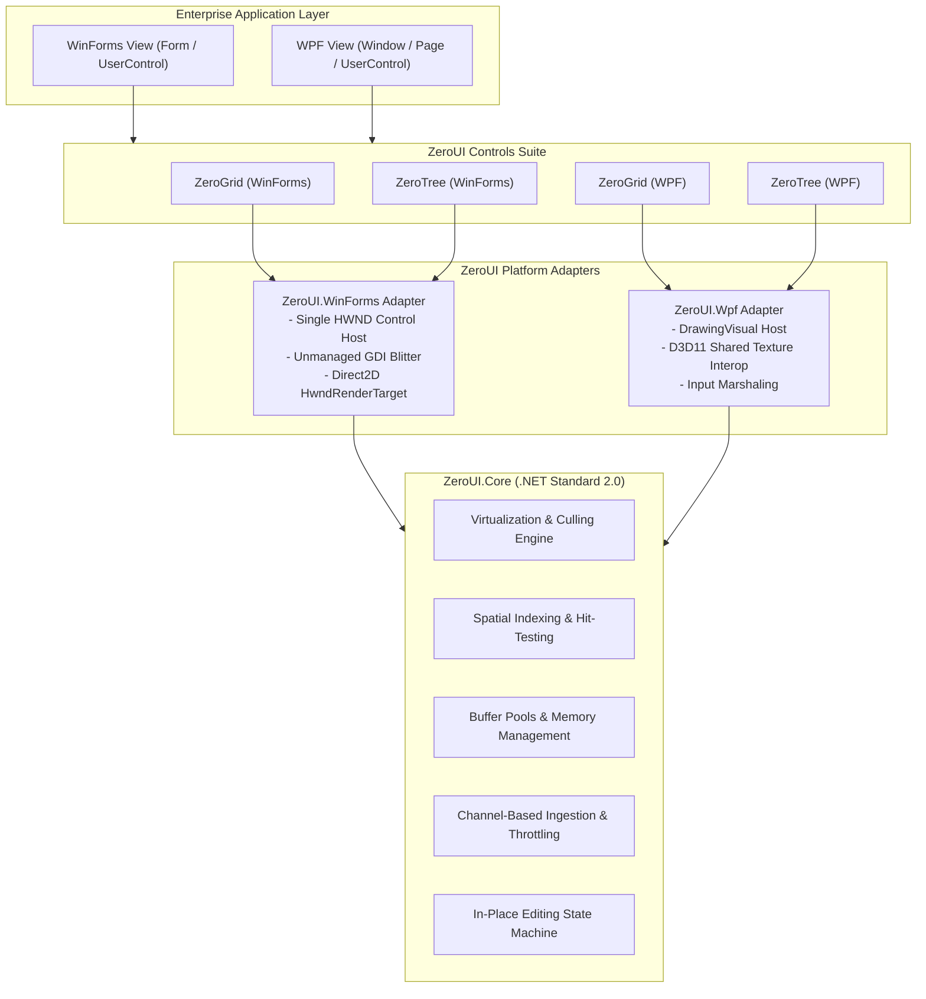
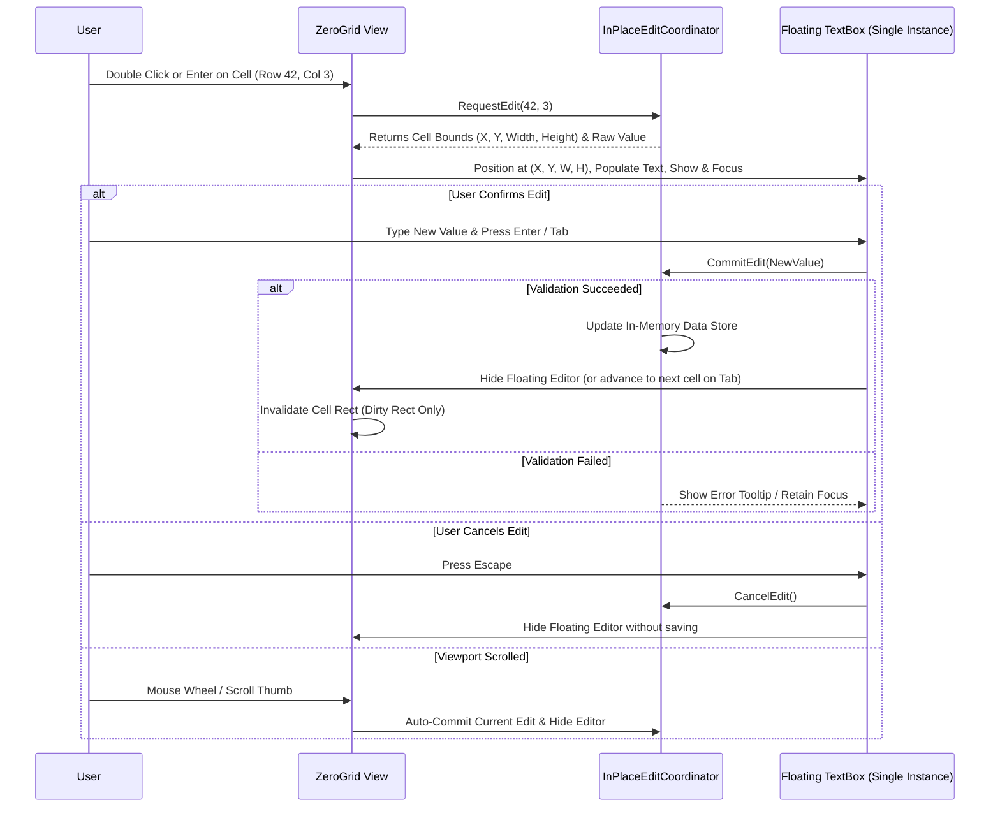

# ZeroUI System Architecture

## 1. Overview & Architectural Goals

The fundamental design goal of **ZeroUI** is to decouple data processing and spatial virtualization from platform-specific UI frameworks (WinForms and WPF). This allows a unified, highly optimized C# core engine to drive UI rendering at native hardware speeds while preventing framework-level bottlenecks.



---

## 2. Layer Breakdown

### Layer 1: ZeroUI.Core (.NET Standard 2.0)
The Core layer contains **zero references** to `System.Windows.Forms` or `PresentationFramework`. It is 100% portable across .NET Framework 4.6.2 and .NET 8+.

Key Components:
* **`VirtualViewport2D`**: Calculates the visible row and column range based on scroll offsets, total content dimensions, and container viewport size.
* **`PrefixSumArray`**: Stores dynamic row heights / column widths in a contiguous array of prefix sums, enabling $O(\log N)$ binary search for row lookup by pixel Y coordinate.
* **`ZeroBufferPool`**: Wrapper around `System.Buffers.ArrayPool<T>` and unmanaged memory (`NativeMemory` / `Marshal.AllocHGlobal`) to eliminate GC allocations during rendering passes.
* **`InPlaceEditCoordinator`**: Manages focus, commit, cancel, and coordinate synchronization for a single shared floating editor.
* **`BatchDataQueue<T>`**: High-throughput producer-consumer queue backed by `System.Threading.Channels.Channel<T>` for background stream processing.

---

### Layer 2: Platform Adapters

#### A. WinForms Adapter (`ZeroUI.WinForms`)
* **Single-HWND Policy:** The entire composite control (grid header, rows, status bar, scroll indicators) is rendered inside **exactly one `HWND`**. Child controls are strictly prohibited except for the temporary floating editor.
* **Direct Render Dispatch:** Implements a custom `OnPaint` override using either:
  1. `SetDIBitsToDevice` / `BitBlt` directly to the device context (`HDC`).
  2. Direct2D `HwndRenderTarget` for GPU acceleration.
* **Flicker-Free Window Styles:** Configures `WS_CLIPCHILDREN`, `WS_CLIPSIBLINGS`, and intercepts `WM_ERASEBKGND` to return non-zero without calling default GDI background clearing.

#### B. WPF Adapter (`ZeroUI.Wpf`)
* **Visual Tree Bypass:** Avoids standard XAML layout panels (`Grid`, `StackPanel`, `ItemsControl`) and `DataTemplate` element generation.
* **`DrawingVisual` Presentation:** Utilizes a lightweight `FrameworkElement` hosting a single `DrawingVisual` or low-level `VisualCollection`.
* **Hardware Interop via `D3DImage`:** For GPU mode, hooks DirectX 11 textures directly into WPF's composition pipeline via shared texture handles, eliminating CPU-to-GPU copies.

---

### Layer 3: Controls Suite

1. **`ZeroGrid` (High-Performance DataGrid):**
   * Handles 1,000,000+ rows with sorting, multi-column freezing, row selection, and variable column widths.
   * Renders only visible cells ($M \times N$ cells, typically $< 100$ cells rendered per frame).
2. **`ZeroTree` (Virtualized TreeList):**
   * Fast hierarchical tree representation using a flattened visible-node index array. Expanding/collapsing nodes updates index offsets in $O(K)$ time without reconstructing the tree.
3. **`ZeroPlot` (Real-Time TimeSeries Plotter):**
   * High-frequency telemetry and signal plotter (100k–1M points/sec) with automated downsampling (LTTB - Largest-Triangle-Three-Buckets algorithm).
4. **`ZeroLog` (Infinite Log & Text Viewer):**
   * Memory-mapped file viewer capable of browsing multi-gigabyte logs with instantaneous keyword search.

---

## 3. High-DPI (PerMonitorV2) Scaling Subsystem

ZeroUI enforces strict resolution independence without relying on blurry OS bitmap scaling (DPI virtualization).

### Two-Tier Coordinate Model:
1. **Logical Units (Layout Space):** Defined at 96 DPI. All column widths, row heights, and layout positions exposed to the public API are logical values.
2. **Physical Pixels (Framebuffer Space):** The unmanaged back-buffer and Direct2D targets are allocated at actual physical device pixels:
   $$\text{DevicePixels} = \lceil \text{LogicalUnits} \times \text{ScaleFactor} \rceil, \quad \text{ScaleFactor} = \frac{\text{CurrentDpi}}{96.0f}$$

### WinForms & WPF DPI Synchronization:
* **WinForms:** Listens to `WM_DPICHANGED` (or `DpiChangedAfterParent` in modern .NET). On DPI change, fonts are re-instantiated at device point sizes, layout caches are recomputed, and framebuffer sizes are re-quantized.
* **WPF:** Automatically integrates with `VisualTreeHelper.GetDpi(this)`. `DrawingVisual` and `D3DImage` surfaces adapt to monitor DPI shifts without text blurring.

---

## 4. Public Data Model & Column Descriptor Contracts

To guarantee zero heap allocations during the rendering loop, data is exposed to `ZeroGrid` via a flyweight virtual provider rather than heavy data-binding objects.

### A. Virtual Data Source Contracts
```csharp
public interface IZeroVirtualSource
{
    int TotalRowCount { get; }
    int TotalColumnCount { get; }
    void GetCellValue(int rowIndex, int columnIndex, ref CellValueBuffer buffer);
}

public interface IZeroPagedSource : IZeroVirtualSource
{
    bool IsRowLoaded(int rowIndex);
    ValueTask PrefetchRowsAsync(int startRow, int count, CancellationToken cancellationToken);
}

public ref struct CellValueBuffer
{
    public ReadOnlySpan<char> Text;
    public CellAlignment Alignment;
    public uint ForegroundColor;
    public uint BackgroundColor;
    public bool IsBold;
}
```

### B. Column Descriptor Model (`ZeroColumn`)
```csharp
public sealed class ZeroColumn
{
    public string HeaderText { get; set; }
    public int Width { get; set; } = 100;
    public int MinWidth { get; set; } = 30;
    public int MaxWidth { get; set; } = 1000;
    public bool IsVisible { get; set; } = true;
    public bool IsFrozen { get; set; } = false;
    public CellAlignment TextAlignment { get; set; } = CellAlignment.Left;
    public string FormatString { get; set; }
    public SortDirection SortOrder { get; set; } = SortDirection.None;
}
```

---

## 5. Single-HWND Input & Spatial Hit-Testing

Because the entire composite control is rendered inside a single Win32 `HWND`, mouse and keyboard events must be dispatched via an internal spatial engine.

### A. Spatial Hit-Test Regions (`SpatialHitTester`)
Incoming mouse coordinates $(X, Y)$ are mapped against the visible viewport:
* **`Header` Region ($Y < \text{HeaderHeight}$):**
  * Clicking triggers column sorting.
  * Dragging column boundaries triggers live resizing.
  * Dragging column body initiates drag-and-drop column reordering.
* **`ColumnResizeGrip`:** 4-pixel hit boundary between columns. Switches cursor to `Cursors.VSplit`.
* **`RowIndicator` Region ($X < \text{IndicatorWidth}$):** Handles full-row selection and multi-row drag selection.
* **`DataCells` Region:**
  * Single Click: Sets active cell and selection anchor.
  * Ctrl + Click / Shift + Click: Range and disjoint cell selection.
  * Double Click: Initiates in-place editing.
* **`ScrollBar` Region:** Handles thumb drag, track paging, and arrow clicks if custom themed scrollbars are rendered.

### B. Keyboard Navigation State Machine
* **Arrow Keys ($\leftarrow, \uparrow, \rightarrow, \downarrow$):** Move active cell focus; automatically scroll viewport if cell is out of bounds.
* **PageUp / PageDown:** Scroll viewport vertically by `VisibleRowCount`.
* **Home / End:** Jump to first/last column or row.
* **Ctrl + A:** Select all cells.
* **Ctrl + C:** Copy selected cells to clipboard in tab-delimited (TSV) format without string concatenations.

---

## 6. In-Place Editing Architecture

Standard grids create or maintain individual editing controls for every visible cell, creating massive memory overhead. ZeroUI employs the **Floating Flyweight Editor Pattern**:



**Key Advantages:**
* Maximum 1 editing control allocated per grid instance.
* Native OS keyboard shortcuts, IME composition, and clipboard actions work seamlessly inside the active editor.
* Smooth Tab/Shift+Tab navigation advances editing across cells without re-creating editor controls.
* Zero overhead when the grid is in read-only or viewing mode.

