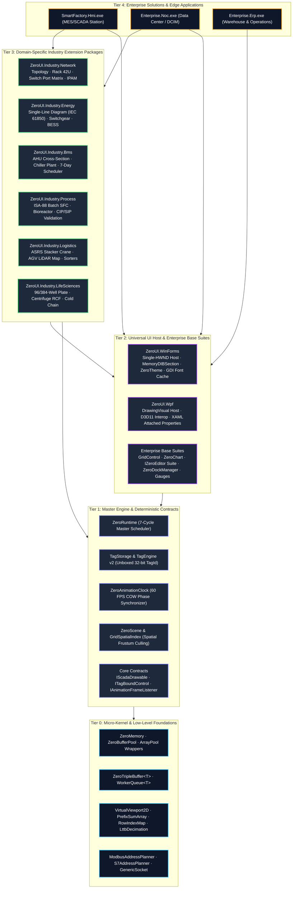
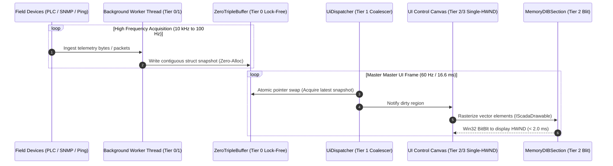

# ZeroUI Multi-Tiered Ecosystem Architecture

**Document Version:** 1.0.0  
**Status:** Approved Architectural Standard  
**Framework Alignment:** Universe Architecture v4.0 & High-Performance Compute Standards  
**Applies To:** `ZeroUI.Core`, `ZeroUI.WinForms`, `ZeroUI.Wpf`, `ZeroUI.Industry.*`  

---

## 1. Executive Vision & The Core Problem

As **ZeroUI** expands from a high-performance DataGrid and basic SCADA suite into an enterprise-wide industrial and facility ecosystem, it faces the classic architectural dilemma of UI frameworks:

```text
┌─────────────────────────────────────────────────────────────────────────────┐
│                    THE EXTENSION ARCHITECTURAL DILEMMA                      │
├──────────────────────────────────────┬──────────────────────────────────────┤
│ ❌ The Monolithic Trap               │ ❌ The Spaghetti Micro-Library Trap  │
├──────────────────────────────────────┼──────────────────────────────────────┤
│ • Bundling 200+ specialized domain   │ • Fragmenting every single button or │
│   controls into 1 giant DLL.         │   label into separate NuGet packages.│
│ • Massive memory footprint for basic │ • Dependency hell, version mismatch, │
│   business forms; slow JIT compilation│   and conflicting runtime binaries.  │
│ • Toolbox clutter and cognitive load │ • Inconsistent rendering engines and │
│   for general enterprise developers. │   broken theme synchronization.      │
└──────────────────────────────────────┴──────────────────────────────────────┘
```

### The Solution: 4-Tier Layered Decoupled Architecture
ZeroUI resolves this dilemma through a strict **4-Tier Layered Architecture** with **Modular Domain Extension Assemblies**:
1. **The Core is Universal and Invariant:** Fundamental memory management, thread-safe buffering, deterministic scheduling, and spatial indexing live in `ZeroUI.Core` (.NET Standard 2.0) with zero UI framework dependencies.
2. **The Base UI Hosts are Lean:** General enterprise components (Grid, Charts, Editors, Layout, Overlays) live in `ZeroUI.WinForms` and `ZeroUI.Wpf` (< 1.5 MB).
3. **Specialized Verticals are Opt-In:** Industry-specific controls (Network, Energy, BMS, Logistics, Pharma, Petrochem) live in autonomous, pluggable extension packages (`ZeroUI.Industry.*`).
4. **All Tiers Obey the Same Laws:** Every control across every industry tier obeys the **Single-HWND Constraint**, **Zero-Alloc Hot Paths**, **Sub-4ms Frame Budgets**, and **Synchronized 60 FPS Clocking**.

---

## 2. The 4-Tier Architectural Hierarchy



---

## 3. Tier Responsibilities & Technical Invariants

### Tier 0: Micro-Kernel & Low-Level Foundations (`ZeroUI.Core.Memory`, `Native`, `Collections`, `Math`)
* **Primary Scope:** Pure algorithms, unmanaged memory safety, lock-free concurrency structures, and high-performance collection primitives.
* **Strict Invariants:**
  1. **Zero UI Dependencies:** Strictly forbidden to import `System.Windows.Forms`, `System.Drawing`, `WindowsBase`, or `PresentationCore`.
  2. **Zero GC on Hot Paths:** All core structures must operate via `Span<T>`, `ReadOnlySpan<T>`, `ArrayPool<T>`, and `ref struct`.
  3. **Target Portability:** 100% portable `.NET Standard 2.0` assembly, running identically on .NET Framework 4.6.2, modern .NET 8/9, Linux edge containers, and headless worker daemons.

### Tier 1: Master Engine & Deterministic Contracts (`ZeroUI.Core.Runtime`, `Scada`, `Scene`, `Layout`)
* **Primary Scope:** Master system scheduling, telemetry data pipelines, spatial scene graphs, and system-wide extensibility contracts.
* **Key Components:**
  * **`ZeroRuntime`:** Deterministic 7-cycle scheduler coordinating Field Comms (10ms), Logic (10ms), Telemetry (16ms), UI Render (16ms), Historian (100ms), Memory Cleanup (1s), and Health Watchdog (5s).
  * **`TagStorage` & `ZeroTagEngine` v2:** Flat unboxed contiguous struct storage addressed by 32-bit integer `TagId` (>48M writes/s, >244M reads/s).
  * **`ZeroAnimationClock`:** Centralized 60 FPS master animation clock broadcasting synchronized phase ticks (`BlinkFast`, `BlinkSlow`, `PulsePhase`, `FluidPhase`).
  * **`ZeroScene` & `GridSpatialIndex`:** Industrial scene graph providing $O(1)$ spatial bounding-box culling.
* **Strict Invariants:**
  1. **Contract-Only UI Coupling:** Tier 1 defines *contracts* (`IScadaDrawable`, `ITagBoundControl`, `IAnimationFrameListener`) and mathematical coordinates (`SceneRect`, `SceneTransform`), but never creates operating system window handles.

### Tier 2: Universal UI Host & Enterprise Base Suites (`ZeroUI.WinForms` & `ZeroUI.Wpf`)
* **Primary Scope:** Native desktop presentation hosts, hardware-accelerated rendering surfaces, and universal business controls.
* **Key Components:**
  * **Rendering Surface:** Win32 `MemoryDIBSection` with double-buffered `BitBlt` and ClearType GDI rasterization for WinForms; `DrawingVisual` and Direct3D 11 shared texture pipeline for WPF.
  * **Enterprise Data & Grid:** `GridControl` (virtualized 10M+ rows), `TreeList`, `PivotGridControl`, `FilterControl`.
  * **Analytics & Charts:** Universal `ZeroChart` (Cartesian Bar/Line/Area, Polar Pie/Donut, Candlestick, BoxPlot, Radar).
  * **Form Editors:** Standardized `IZeroEditor` suite (`TextEdit`, `SpinEdit`, `DateEdit`, `ZeroLookup`, `ZeroSwitch`, `TokenEdit`).
  * **Layout & Windowing:** `ZeroDockManager`, `ZeroSplitContainer`, `ZeroTabControl`, `WizardControl`.
  * **Theme Engine:** `ZeroTheme` reactive tokens (Obsidian Dark and Clean Light Mode) and Fluent corner radius scaling.
* **Strict Invariants:**
  1. **Single-HWND Architecture:** Any composite control in WinForms must maintain exactly 1 top-level `HWND`. Nested OS child handles are strictly prohibited.
  2. **General Enterprise Scope:** Contains only controls applicable to any business or factory domain. No niche industry-specific logic allowed in Tier 2.

### Tier 3: Domain-Specific Industry Extension Packages (`ZeroUI.Industry.*`)
* **Primary Scope:** Specialized, vertical-specific visual controls and equipment mimics.
* **Key Packages:**
  * `ZeroUI.Industry.Network`: Topology maps, 42U server racks, physical switch port matrices, IPAM subnet heatmaps.
  * `ZeroUI.Industry.Energy`: Single-Line Diagrams (SLD), high-voltage switchgear faceplates, BESS rack balancers, Solar PV string arrays.
  * `ZeroUI.Industry.Bms`: Air Handling Unit (AHU) mechanical cross-sections, central chiller plant COP monitors, 7-day multi-zone occupancy schedulers.
  * `ZeroUI.Industry.Process`: ISA-88 batch recipe SFC trackers, 3D sanitary bioreactors, Clean-in-Place (CIP/SIP) 4-TACT validation matrix, ISO cleanroom HUDs.
  * `ZeroUI.Industry.Logistics`: Automated Storage & Retrieval System (ASRS) stacker cranes, 2D LiDAR SLAM AGV/AMR fleet maps, high-speed sorting matrices.
  * `ZeroUI.Industry.Petrochem`: Fractional distillation column profiles, SIL-rated SIS/ESD Cause & Effect matrices, pipeline PIG inspection monitors.
  * `ZeroUI.Industry.LifeSciences`: 96/384-well microplate absorbance heatmaps, centrifuge rotor balance/RCF monitors, ultra-low temperature cold chain ribbons.
* **Strict Invariants:**
  1. **Package Autonomy & Isolation:** An industry package may reference Tier 1 (`ZeroUI.Core`) and Tier 2 (`ZeroUI.WinForms` / `ZeroUI.Wpf`). **Industry Package A must NEVER reference Industry Package B.**
  2. **Shared Protocol Independence:** Cross-industry coordination must occur exclusively via Tier 1 `TagEngine` or `EventBus`.

### Tier 4: Enterprise Solution & Edge Application Layer
* **Primary Scope:** Final deliverable customer applications (SCADA Client, MES Terminal, Data Center NOC, Laboratory Analyzer).
* **Responsibilities:** Composes Tier 2 and select Tier 3 packages, configures communication drivers (Modbus TCP, S7, OPC UA, MQTT), and persists user workspace layouts via `ZeroWorkspaceSerializer`.

---

## 4. The 4 Universal Uniformity Contracts

Any control created in any Tier 3 extension package automatically achieves enterprise-grade stability and zero-alloc performance by adhering to the four universal contracts:

```
┌─────────────────────────────────────────────────────────────────────────────┐
│                       ZEROUI UNIFORMITY CONTRACTS                           │
├──────────────────────┬──────────────────────────────────────────────────────┤
│ Contract Interface   │ Architectural Guarantee & Behavior                   │
├──────────────────────┼──────────────────────────────────────────────────────┤
│ `IScadaDrawable`     │ Enforces vector rendering onto offscreen             │
│                      │ `MemoryDIBSection`. Prohibits child `HWND` creation. │
├──────────────────────┼──────────────────────────────────────────────────────┤
│ `ITagBoundControl`   │ Subscribes to `TagStorage` using primitive `TagId`.  │
│                      │ Updates in < 20 ns with 0 GC allocations.            │
├──────────────────────┼──────────────────────────────────────────────────────┤
│ `IAnimationClock...` │ Binds animations to master 60 FPS phase pulses       │
│                      │ (`BlinkFast`, `PulsePhase`). Zero scattered timers.  │
├──────────────────────┼──────────────────────────────────────────────────────┤
│ `IZeroIndustryPlugin`│ Exposes metadata, toolbox registration, icon bitmap, │
│                      │ and serialization schemas for Visual Studio designer.│
└──────────────────────┴──────────────────────────────────────────────────────┘
```

### 4.1 Vector Drawing Contract (`IScadaDrawable`)
```csharp
public interface IScadaDrawable
{
    string ElementId { get; }
    SceneRect Bounds { get; }
    bool IsVisible { get; set; }
    bool IsSelected { get; set; }
    bool IsHovered { get; set; }
    void Render(RenderContext context);
    bool HitTest(float x, float y);
}
```
* Ensures that complex domain equipment (such as a 48-port switch, an electrical breaker, or a bioreactor vessel) is treated as a flyweight vector node rendered within a single-HWND canvas rather than spawning Win32 child handles.

### 4.2 Declarative Tag-Binding Contract (`ITagBoundControl`)
```csharp
public interface ITagBoundControl
{
    int BoundTagId { get; set; }
    void OnTagValueChanged(int tagId, ref ScadaValue value);
    void OnTagQualityChanged(int tagId, ScadaQuality quality);
}
```
* Bypasses reflection, string-based dictionary lookups, and boxing. When a PLC or network sensor updates, the inverted index notifies the control directly in $O(1)$ time.

### 4.3 Unified Animation Listener (`IAnimationFrameListener`)
```csharp
public interface IAnimationFrameListener
{
    void OnAnimationTick(long tickCount, float blinkFastPhase, float pulsePhase);
}
```
* Completely eliminates `System.Windows.Forms.Timer` leaks. Port LED blinking, packet flows, AHU airflow vectors, and breaker flash alerts all share the master 60 Hz ticker.

---

## 5. Concurrency Pipeline: High-Frequency Field to 60 FPS UI

A critical architectural feature of the tiered design is the **complete thread decoupling** between high-frequency field acquisition and UI rendering:



---

## 6. Project & Directory Organization

To enforce the architecture physically in the solution file (`ZeroUI.slnx`), projects are structured into strictly partitioned folder trees:

```text
ZeroUI/
├── src/
│   ├── ZeroUI.Core/                           # Tier 0 & Tier 1 (Universal Engine)
│   │   ├── Memory/                            # ZeroMemory, BufferPools
│   │   ├── Runtime/                           # ZeroRuntime, TripleBuffer
│   │   ├── Scada/                             # TagStorage, AlarmEngine
│   │   ├── Scene/                             # ZeroScene, GridSpatialIndex
│   │   └── Communication/                     # Protocol planners (Modbus/S7)
│   │
│   ├── ZeroUI.WinForms/                       # Tier 2 (Universal WinForms Suite)
│   │   ├── DataGrid/                          # GridControl, PivotGridControl
│   │   ├── Charts/                            # ZeroChart, TrendChart
│   │   ├── Editors/                           # TextEdit, DateEdit, Lookup
│   │   ├── Layout/                            # ZeroDockManager, SplitContainer
│   │   ├── Industrial/                        # PlantMimicCanvas, Gauges, Actuators
│   │   └── Icons/                             # Standardized 16x16 BMP Toolbox Icons
│   │
│   ├── ZeroUI.Wpf/                            # Tier 2 (Universal WPF Suite)
│   │   ├── DataGrid/                          # WPF Virtual GridControl
│   │   ├── Charts/                            # Direct2D / D3D11 Charting
│   │   └── Editors/                           # Standard XAML Editors
│   │
│   └── Extensions/                            # Tier 3 (Modular Industry Packages)
│       ├── ZeroUI.Industry.Network/           # Network Topology, Racks, Switches, IPAM
│       ├── ZeroUI.Industry.Energy/            # SLD, Switchgear, BESS, Solar
│       ├── ZeroUI.Industry.Bms/               # AHU, Chiller, 7-Day Scheduler
│       ├── ZeroUI.Industry.Process/           # ISA-88 Batch, Bioreactor, CIP/SIP
│       ├── ZeroUI.Industry.Logistics/         # ASRS Crane, AGV SLAM Map, Sorters
│       ├── ZeroUI.Industry.Petrochem/         # Distillation, ESD Matrix, Pigging
│       └── ZeroUI.Industry.LifeSciences/      # Microplate, Centrifuge, ColdChain
│
├── tests/
│   ├── ZeroUI.Core.Tests/                     # Core Unit Tests
│   └── ZeroUI.Benchmarks/                     # Automated Headless Performance Benchmarks
│
└── docs/
    ├── architecture/                          # Technical Specifications
    └── standards/                             # Design & Code Standards
```

---

## 7. Packaging, Versioning & NuGet Distribution Strategy

To maintain long-term binary stability across enterprise deployments, ZeroUI implements a decoupled SemVer 2.0 release model:

| Package Identity | Target Frameworks | Dependency Profile | Distribution Purpose |
| :--- | :--- | :--- | :--- |
| **`ZeroUI.Core`** | `netstandard2.0`, `net462`, `net8.0` | **Zero External Dependencies** | Standalone runtime engine for edge daemons, background pollers, or custom UI hosts. |
| **`ZeroUI.WinForms`** | `net462`, `net8.0-windows` | `ZeroUI.Core` | Flagship WinForms enterprise controls suite for standard desktop applications. |
| **`ZeroUI.Wpf`** | `net462`, `net8.0-windows` | `ZeroUI.Core` | Modern hardware-accelerated WPF controls suite. |
| **`ZeroUI.Industry.*`** | `net462`, `net8.0-windows` | `ZeroUI.Core`, `ZeroUI.WinForms` | Optional, plug-and-play domain packages installed on-demand by solution engineers. |

### Dependency Rules:
1. `ZeroUI.Core` maintains **100% backward compatibility** across minor versions.
2. An industry extension package compiled against `ZeroUI.Core v1.2.0` is binary-compatible with `ZeroUI.Core v1.5.0` without recompilation.
3. Applications install only the packages they need:
   ```bash
   # Enterprise ERP Form App
   dotnet add package ZeroUI.WinForms

   # Data Center Infrastructure (DCIM) Monitoring Application
   dotnet add package ZeroUI.WinForms
   dotnet add package ZeroUI.Industry.Network

   # Smart Grid Energy Substation Automation System
   dotnet add package ZeroUI.WinForms
   dotnet add package ZeroUI.Industry.Energy
   ```

---

## 8. Anti-Patterns & Architectural Guardrails

To prevent architectural entropy over time, developers and AI agents must adhere to the following guardrails:

| ❌ Forbidden Anti-Pattern | Severity | Architectural Hazard | ✅ Mandatory Solution |
| :--- | :---: | :--- | :--- |
| **Cross-Industry Package Coupling**<br/>(`Industry.Logistics` references `Industry.Network`) | **CRITICAL** | Creates circular dependencies and breaks modularity. | Route cross-domain signals exclusively through `ZeroUI.Core.TagEngine` or `EventBus`. |
| **Leaking UI Types into `ZeroUI.Core`**<br/>(`System.Drawing.Bitmap` or `HWND` in Core) | **CRITICAL** | Destroys cross-platform edge portability. | Represent geometry using pure mathematical structs (`SceneRect`, `PointF`, `Vector2`). |
| **Win32 Handle Explosion**<br/>(Instantiating `UserControl` per switch port or valve) | **HIGH** | Exceeds OS 10,000 HWND limit; causes severe lag and flicker. | Implement `IScadaDrawable` vector rendering on single-HWND canvas. |
| **Timer Proliferation**<br/>(Instantiating `System.Windows.Forms.Timer` per control) | **HIGH** | Saturates UI message pump and triggers frame stutter. | Subscribe to central `ZeroAnimationClock` phases. |
| **Hot-Path String Formatting in Render Loop** | **HIGH** | Triggers frequent Gen 0 GC collections. | Render numbers and telemetry via `Span<char>` and `ZeroFontCache`. |

---

## 9. Conclusion

The ZeroUI Multi-Tiered Ecosystem Architecture provides a **mathematically rigorous, modular, and unconstrained framework for limitless growth**. By isolating invariant runtime mechanics in Tier 0/1, universal desktop UI in Tier 2, and specialized industrial knowledge in Tier 3, ZeroUI ensures:
- **Zero Bloat:** General enterprise applications remain ultra-compact (< 1.5 MB).
- **Infinite Scalability:** Any industry vertical can be onboarded without touching core source code.
- **Uncompromised Performance:** Every single component, from a standard data grid to an automated stacker crane or 48-port core switch, delivers verified **Zero GC Allocation** and **Sub-4ms P95 Frame Latency**.
