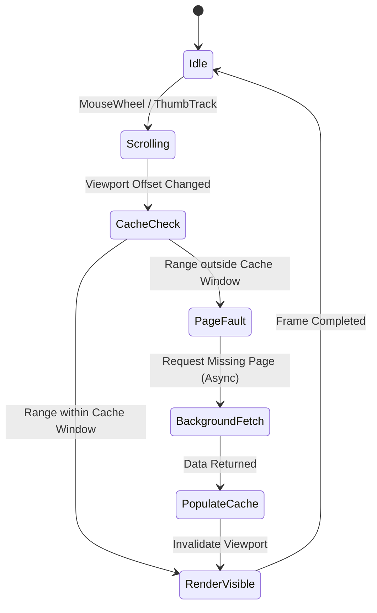

# ZeroUI Virtualization Engine

## 1. Core Virtualization Philosophy

ZeroUI distinguishes between two distinct layers of virtualization:
1. **UI / Visual Virtualization:** Only generating draw commands for cells intersecting the current visible viewport window $(X, Y, W, H)$.
2. **Data Virtualization:** Keeping only a memory-bounded working set (flyweight cache) in RAM, lazily paging remote/database records on demand.

```text
Total Dataset (1,000,000 Rows x 50 Columns)
┌────────────────────────────────────────────────────────┐
│                                                        │
│   Pre-fetched Buffer (Top: 20 Rows)                    │
│  ┌──────────────────────────────────────────────────┐  │
│  │                                                  │  │
│  │  Visible Viewport Window (e.g. Rows 4,500-4,560) │  │
│  │  Columns: 3 - 12                                 │  │
│  │  [ONLY THIS RECTANGLE IS RENDERED BY THE GPU]    │  │
│  │                                                  │  │
│  └──────────────────────────────────────────────────┘  │
│   Pre-fetched Buffer (Bottom: 20 Rows)                 │
│                                                        │
└────────────────────────────────────────────────────────┘
```

---

## 2. Spatial Layout & $O(\log N)$ Coordinate Search

### Fixed Height vs. Variable Height Rows

1. **Fixed Height ($O(1)$ lookup):**
   $$\text{RowIndex} = \left\lfloor \frac{\text{ScrollY}}{\text{RowHeight}} \right\rfloor$$
   Viewport calculation is instantaneous with zero memory overhead.

2. **Sparse Variable Height Model (Recommended for 95% of Enterprise Grids):**
   In enterprise business grids, the vast majority of rows share a standard default height (e.g. 24px), with only a few expanded rows (e.g., multiline notes or expanded master-detail hierarchies).
   * **Base Offset:** Computed directly via $Y = \text{rowIndex} \times \text{DefaultHeight}$.
   * **Sparse Deltas:** Maintained in a sorted sparse array or unmanaged hash map `Dictionary<int, int> _expandedRowDeltas`.
   * **Lookup & Mutation:** Both reading and updating dynamic row heights execute in $O(K)$ time where $K \ll N$ (number of expanded rows, typically $<50$).

3. **Dense Variable Heights (Chunked / Block Prefix Sums):**
   When every single row has an unpredictable height, a flat `PrefixSumArray` incurs an unacceptable $O(N)$ penalty upon row resizing or insertion (1,000,000 array elements must be shifted and recalculated).
   ZeroUI resolves this with **Block Prefix Sums**:
   * Rows are partitioned into contiguous blocks of $B = 1024$ items.
   * **Block Summary Array:** Stores cumulative Y offsets at each 1024-row boundary ($N / B$ entries).
   * **Local Block Array:** Stores relative offsets within the local block ($B$ entries).
   * **Search:** Binary search the Block Summary ($O(\log(N/B))$), then binary search the local block ($O(\log B)$) $\rightarrow$ total read time remains $O(\log N)$.
   * **Mutation:** Modifying row $i$ only recomputes elements within its local block ($B = 1024$ operations) and shifts the small Block Summary array ($N/B \approx 976$ operations for 1M rows), achieving **$< 2,000$ operations ($O(\sqrt{N})$)** instead of 1,000,000!

```csharp
public readonly struct PrefixSumArray
{
    private readonly int[] _prefixSums;

    public int FindRowIndexAtY(int y)
    {
        int index = Array.BinarySearch(_prefixSums, y);
        return index >= 0 ? index : ~index - 1;
    }

    public int GetRowY(int rowIndex) => rowIndex == 0 ? 0 : _prefixSums[rowIndex - 1];
    public int GetRowHeight(int rowIndex) => _prefixSums[rowIndex] - GetRowY(rowIndex);
}
```

---

## 3. Win32 32-Bit Scrollbar Synchronization

Standard WinForms and Win32 controls rely on 16-bit scroll messages (`WM_VSCROLL` with `SB_THUMBTRACK` capped at 32,767). When handling 1,000,000 rows, standard controls wrap around or stop scrolling.

ZeroUI implements full 32-bit scrolling using **Win32 `SetScrollInfo` / `GetScrollInfo`**:

```csharp
[StructLayout(LayoutKind.Sequential)]
public struct SCROLLINFO
{
    public uint cbSize;
    public uint fMask; // SIF_RANGE | SIF_PAGE | SIF_POS | SIF_TRACKPOS
    public int nMin;
    public int nMax;   // Supports int.MaxValue
    public uint nPage;
    public int nPos;
    public int nTrackPos;
}
```

By handling `WM_VSCROLL` and extracting `SIF_TRACKPOS`, ZeroUI maintains smooth pixel-precision tracking across millions of virtual pixels.

---

## 4. Data Virtualization & Memory Cache Window

To prevent Out-Of-Memory (OOM) errors when dealing with huge datasets, ZeroUI employs the **Sliding Cache Window**:



### Cache Retention Policy:
* **Window Size:** Viewport Rows + (Buffer Multiplier $\times$ Visible Rows). Default is 3 screens of data (1 screen visible, 1 above, 1 below).
* **Flyweight Records:** Records are stored as flat unmanaged memory structs or compact records rather than heavy OOP models, keeping working RAM consumption below 50 MB regardless of total row count.

---

## 5. View-to-Model Index Mapping (Sorting & Filtering)

Physically reordering or copying large datasets during multi-column sorting or search filtering causes severe GC spikes and CPU freezes. ZeroUI solves this with the **Zero-Alloc Index Redirection Layer (`RowIndexMap`)**:

```text
Visual Row Index (Viewport)  ──>  [ RowIndexMap int[] ]  ──>  Model Data Store
      Row 0                  ──>         #842,109        ──>  DataRecord[842109]
      Row 1                  ──>         #12,504         ──>  DataRecord[12504]
      Row 2                  ──>         #901,432        ──>  DataRecord[901432]
```

### Sorting Mechanics:
* An unmanaged or pooled integer buffer `int[] _viewToModelMap` of size $N$ is allocated once ($4\text{ MB}$ for 1,000,000 rows).
* Multi-column sorting sorts **only this integer index array** using an introspective non-allocating quicksort (`Span<int>.Sort()` with a custom value comparator).
* Execution time for 1,000,000 rows is typically **< 15ms**.

### Filtering Mechanics:
* When applying a search filter or query predicate, matching source row indices are compacted into a contiguous prefix of `_viewToModelMap`.
* The control simply updates its `ActiveRowCount = filteredCount`.
* The spatial virtualization engine remains completely unaware of whether rows are filtered or unfiltered, continuing to query rows $0 \dots \text{ActiveRowCount}-1$ at $O(1)$ speed.

---

## 6. WPF Native `<ScrollViewer>` Integration (`IScrollInfo`)

To achieve seamless interoperability with standard WPF layouts, `ZeroGridElement` implements the WPF `IScrollInfo` interface:
* **`CanVerticallyScroll` / `CanHorizontallyScroll`:** Set to `true` when hosted inside `<ScrollViewer CanContentScroll="True">`.
* **Displacement Methods:** `LineUp()`, `LineDown()`, `PageUp()`, `PageDown()`, `MouseWheelUp()`, `MouseWheelDown()` translate directly into logical cell or pixel shifts.
* **Scroll Extents:** `ExtentHeight` reports total virtual pixel height ($N \times \text{RowHeight}$), and `ViewportHeight` reports container height.
* **Zero Layout Churn:** Standard WPF `ScrollViewer` scrolls the content without causing WPF layout re-measurement (`MeasureOverride` / `ArrangeOverride` are bypassed).

