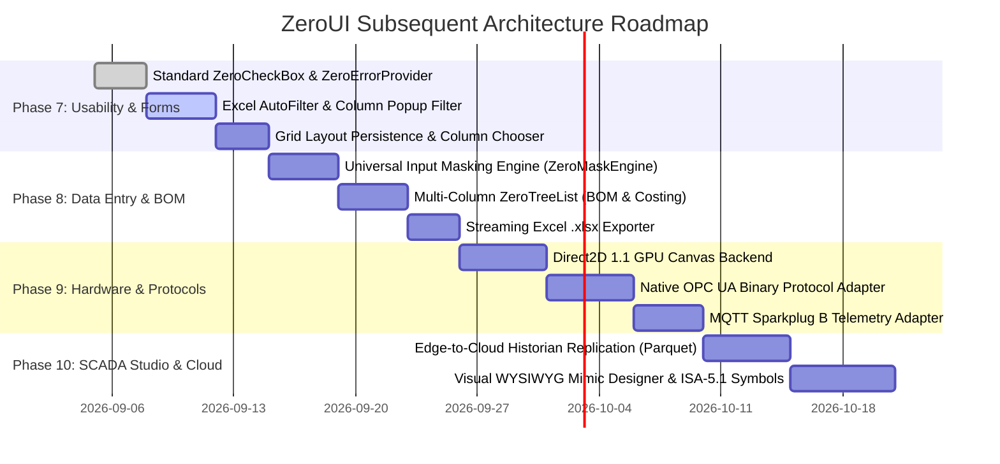

# ZeroUI Architectural Proposals & Future Initiatives Catalog

This document organizes all architectural proposals, feature initiatives, and usability recommendations for **ZeroUI**. It serves as the master backlog to systematically analyze, prioritize, and execute subsequent implementation phases.

---

## 1. Executive Summary & Status Overview

ZeroUI has completed **Directives 1 through 27**, establishing a rock-solid, zero-allocation industrial SCADA and UI foundation:
- **Core Virtualization & Single-HWND**: Unmanaged DIBSection GDI rasterizer, virtual viewport mapping, $O(1)$ virtual row scaling up to 100,000,000 rows.
- **SCADA Engine & Telemetry**: 16-byte unboxed `ScadaValue`, flat array `TagStorage`, lock-free `ZeroTripleBuffer` sustaining 46.9M updates/sec, 3-tier pipeline (10 kHz Fast $\to$ 1 kHz Medium $\to$ 60 Hz Slow).
- **Industrial Protocols & Historian**: Modbus v2 block coalescing with `ArrayPool<byte>`, SQLite daily rolling WAL historian with continuous multi-resolution rollups (100ms, 1s, 10s, 1m, 10m) and span-optimized LTTB decimation (340M pts/s).
- **Deterministic Scheduling & Central Animation**: 7-cycle `ZeroRuntime` scheduler and 60 Hz `ZeroAnimationClock` core primitive eliminating 100+ distributed timers.
- **Unified Architecture Benchmarks**: `ZeroUI.Benchmarks` suite covering Categories A through F.

The next evolutionary horizon addresses **Enterprise Usability (DevExpress Parity)**, **Hardware Acceleration (Direct2D)**, **Advanced Industrial Protocols (OPC UA / MQTT)**, and **Interactive SCADA Design Systems**.

---

## 2. Initiative Catalog (Detailed Breakdown)

### Initiative 1: Enterprise DataGrid & UX Parity (DevExpress Benchmark)

| ID | Feature / Component | Description | Impact | Target Component |
| :---: | :--- | :--- | :---: | :--- |
| **1.1** | **Excel-Style Column Popup Filter** | Clickable funnel icon on column headers opening a flyout popup with distinct value checkboxes, text search, and (Blanks) / (Non-Blanks) toggles. | High | `ZeroGridControl`, `ZeroGridFilterPopup` |
| **1.2** | **Interactive Grouping Panel & Group Summaries** | Drag-and-drop column header to Group Panel; collapses/expands visual row tree with custom aggregate summaries (Count, Sum, Avg) per group node. | High | `ZeroGridControl`, `RowIndexMap`, `GroupRowIndexMap` |
| **1.3** | **Column Best-Fit Double-Click** | Double-clicking column header boundary measures visible cells via `ExtTextOut` / DIB metrics and auto-resizes column width with 8px padding. | High | `ZeroGridControl`, `SpatialHitTester` |
| **1.4** | **Layout Serialization & Persistence** | `SaveLayoutToJson(Stream)` and `RestoreLayoutFromJson(Stream)` saving column order, widths, visibility, sort directions, and pinned states. | Critical | `ZeroGridControl`, `ZeroGridLayoutState` |
| **1.5** | **Streaming Excel `.xlsx` Exporter** | Direct OpenXML / ZIP streaming export writing cell values, types, header styling, and column widths with zero GUI thread blocking. | Medium | `ZeroGridExporter` |
| **1.6** | **Multi-Column Hierarchical TreeList** | Upgrading `ZeroTreeList` from single-column tree to multi-column virtualized tree for Bill of Materials (BOM), Work Breakdown, and Costing sheets. | High | `ZeroTreeList`, `ZeroTreeColumn` |

---

### Initiative 2: Form Controls & Data-Entry Ergonomics

| ID | Feature / Component | Description | Impact | Target Component |
| :---: | :--- | :--- | :---: | :--- |
| **2.1** | **Standard Compact CheckBox (`ZeroCheckBox`)** | Compact tri-state checkbox (Checked, Unchecked, Indeterminate) with standard beside-label typography, replacing wide toggle switches in dense forms. | Critical | `ZeroCheckBox` |
| **2.2** | **Universal Input Masking Engine (`ZeroMaskEngine`)** | Format mask processor supporting Numeric (`#,##0.00`), DateTime (`dd/MM/yyyy HH:mm:ss`), RegEx, and Simple Templates (Phone, Tax ID, MAC). | High | `ZeroMaskEngine`, `ZeroTextBox` |
| **2.3** | **Generic Binding & Multi-Column `ZeroLookup`** | Accepting `IEnumerable<T>` with `ValueMember`, `DisplayMember`, and multi-column dropdown search popup (`LookUpEdit` parity). | High | `ZeroLookup`, `ZeroLookupPopup` |
| **2.4** | **Keyboard Masked Date Entry in `ZeroDatePicker`** | Combining masked keyboard numeric input with popup calendar; auto-advances through day/month/year segments without mouse clicks. | High | `ZeroDatePicker` |
| **2.5** | **Validation Framework & Error Provider** | `ZeroErrorProvider` displaying unobtrusive warning/error glyphs and tooltips beside controls failing validation predicates. | High | `ZeroErrorProvider`, `IZeroValidatable` |

---

### Initiative 3: Graphics & Hardware Rendering Acceleration

| ID | Feature / Component | Description | Impact | Target Component |
| :---: | :--- | :--- | :---: | :--- |
| **3.1** | **Direct2D / DXGI GPU Render Backend** | Optional Direct2D 1.1 hardware-accelerated swapchain backend for `ZeroScene` and `ZeroCanvas`, maintaining fallback to Win32 DIBSection. | High | `ZeroD2DCanvas`, `ZeroSceneRenderer` |
| **3.2** | **Subpixel Glyph & Vector Antialiasing** | Hardware DirectWrite ClearType text rasterization with subpixel positioning and smooth anti-aliased Bézier curve pipe drawing. | Medium | `MemoryDIBSection`, `ZeroD2DRenderer` |
| **3.3** | **High-Speed Multi-Series Oscilloscope (144 Hz)** | GPU-buffered oscilloscope chart control rendering 100,000+ points across 8 simultaneous analog channels at 144 Hz with zero frame stutter. | High | `ZeroOscilloscope`, `ZeroTrendChart` |

---

### Initiative 4: SCADA Protocols & Industrial Interoperability

| ID | Feature / Component | Description | Impact | Target Component |
| :---: | :--- | :--- | :---: | :--- |
| **4.1** | **High-Speed OPC UA Binary Protocol Adapter** | Native client implementing OPC UA TCP Binary Protocol (`opc.tcp://`) with zero-alloc session handshake, NodeId subscriptions, and batch reads. | Critical | `OpcUaAdapter`, `OpcUaBinaryCodec` |
| **4.2** | **MQTT Sparkplug B Telemetry Adapter** | MQTT 3.1.1/5.0 client adhering to Eclipse Sparkplug B specification with Protobuf zero-copy payload decoding and birth/death certificate tracking. | High | `MqttSparkplugAdapter` |
| **4.3** | **Redundant Dual-Network Channel Bonding** | Seamless active/hot-standby failover across primary and backup industrial Ethernet links with sub-second switchover and zero data loss. | Medium | `RedundantProtocolCoordinator` |

---

### Initiative 5: Edge Historian Synchronization & Analytics

| ID | Feature / Component | Description | Impact | Target Component |
| :---: | :--- | :--- | :---: | :--- |
| **5.1** | **Edge-to-Cloud Store-and-Forward Sync** | Background replication daemon syncing local daily SQLite WAL rollups to enterprise time-series databases (InfluxDB, TimescaleDB, ClickHouse). | High | `HistorianReplicationService` |
| **5.2** | **Real-Time FFT & Vibration Spectrum Analysis** | In-memory 1,024/4,096-point Fast Fourier Transform (FFT) for continuous motor and pump vibration spectral peak analysis. | High | `FftProcessor`, `VibrationAnalyzer` |
| **5.3** | **Automated Maintenance & Archiving Engine** | Configurable SQLite maintenance pipeline executing incremental WAL truncation, daily database compaction, and cold-data archiving to Parquet. | Medium | `HistorianMaintenanceWorker` |

---

### Initiative 6: Visual SCADA Mimic Designer & Studio

| ID | Feature / Component | Description | Impact | Target Component |
| :---: | :--- | :--- | :---: | :--- |
| **6.1** | **Interactive WYSIWYG Scene Graph Designer** | Visual canvas for dragging, dropping, rotating, scaling, and interconnecting P&ID process nodes (`PumpNode`, `ValveNode`, `TankNode`, `PipeNode`). | High | `ZeroMimicDesigner`, `DesignerToolbox` |
| **6.2** | **ISA-5.1 Vector Symbol Library** | Complete standardized vector symbol suite conforming to ISA-5.1 (Pumps, Compressors, Valves, Vessels, Heat Exchangers, Actuators). | Medium | `ZeroSymbols`, `VectorSymbolNode` |
| **6.3** | **JSON / SVG Schema Serialization & Tag Binder** | Serializing complete mimic layouts into human-readable JSON / SVG schemas with visual property inspector for two-way tag binding. | High | `MimicSerializer`, `TagBindingDescriptor` |

---

## 3. Prioritized Implementation Roadmap

---

## 4. Workstream Prioritization Matrix

| Priority | Initiative | Strategic Value | Complexity | Risk | Recommendation |
| :---: | :--- | :---: | :---: | :---: | :--- |
| **P0** | **Initiative 1.4: Grid Layout Persistence** | Essential for ERP/SCADA apps | Low | Low | Execute first; immediately stops user frustration from lost grid layouts. |
| **P0** | **Initiative 2.1: Compact `ZeroCheckBox`** | Critical for dense business forms | Low | Low | Straightforward; replaces oversized toggle switches in forms. |
| **P0** | **Initiative 1.1: Excel Column Popup Filter** | Core usability parity with DevExpress | Medium | Low | Point-and-click column filtering is standard in all modern grids. |
| **P1** | **Initiative 2.2: Universal Masking Engine** | Essential for phone, tax ID, money | Medium | Low | Centralizes formatting across Grid and Form editors. |
| **P1** | **Initiative 1.6: Multi-Column `ZeroTreeList`** | Unlocks manufacturing BOM views | Medium | Medium | Extends existing `ZeroTreeList` with `ZeroColumn` capabilities. |
| **P1** | **Initiative 4.1: OPC UA Binary Adapter** | Critical for modern smart factories | High | Medium | Standard industrial protocol alongside Modbus TCP. |
| **P2** | **Initiative 3.1: Direct2D Hardware Backend** | High-end visual fidelity (144 Hz) | High | High | Adds GPU backend while preserving DIBSection fallback. |
| **P2** | **Initiative 6.1: WYSIWYG Mimic Designer** | Lowers SCADA screen development time| High | Medium | Visual canvas builder for industrial mimic scenes. |

---

## 5. Review & Execution Protocol

When selecting an initiative for implementation:
1. Conduct pre-implementation architectural review against Single-HWND and Zero-GC principles.
2. Formulate an `implementation_plan.md` artifact with user approval.
3. Validate against multi-target builds (`net462`, `netstandard2.0`, `net8.0`, `net8.0-windows`).
4. Benchmark performance in `ZeroUI.Benchmarks` to ensure zero regression.
5. Commit to Git and harvest domain knowledge via SemanticBrain.
