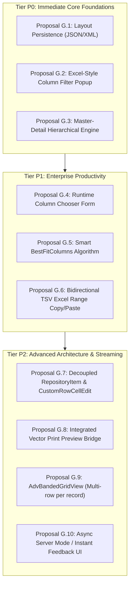
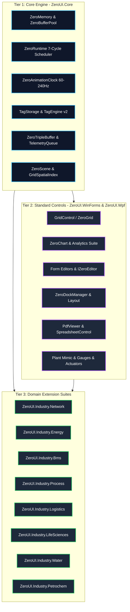

# ZeroUI Architectural Proposals & Active Strategic Roadmap

This document formalizes the architectural standards, delivered milestones, verified performance benchmarks, and active strategic proposals for **ZeroUI**.

---

## 1. Executive Summary & Core Value Proposition

The primary competitive differentiator of ZeroUI is **not merely "rendering 10 million rows"**, but its unique fusion of **High-Performance UI + Deterministic Runtime + Industrial Edge Infrastructure** within a single unified ecosystem:

```text
                     ZeroRuntime (Deterministic 7-Cycle Master Scheduler)
                                              │
                    ┌─────────────────────────┼─────────────────────────┐
                    │                         │                         │
            Communication Layer        Processing Layer              UI Layer
                    │                         │                         │
            Modbus TCP / S7            TagEngine v2 (TagId)          GridControl (Single-HWND)
            Block Planner              ISA-18.2 Alarm Engine         TrendChart & Gauges
            Connection Watchdog        PackML State / OEE            Plant Mimic (ZeroScene)
                    │                         │                         │
                    ▼                         ▼                         │
               TagUpdate ─────────────────────┴─────────────────────────┘
                               latest-value / frame batch
                                           │
                                           ▼
                                 Direct Blit Pipeline
                                (MemoryDIBSection / BitBlt)
```

By unifying field communication (Modbus/S7), data processing (TagEngine, Alarms, PackML, OEE, Historian), and single-HWND UI rendering on .NET, ZeroUI delivers an industrial-grade alternative to heavyweight third-party UI suites.

---

## 2. Core Philosophy: "Zero Allocation Where It Matters"

ZeroUI strictly enforces **Zero Allocation on hot paths** while allowing standard managed ergonomics on cold/initialization paths:

| Execution Context | Allocation Policy | Rationale & Technical Enforcers |
| :--- | :---: | :--- |
| **PLC Ingestion Loop (10 kHz)** | **0 B / op (STRICT)** | Flat unboxed buffers; never triggers Gen 0/1 GC collections. |
| **Tag Updates & Dirty Flags** | **0 B / op (STRICT)** | Flat unboxed `TagStorage` struct array indexed by primitive `TagId`. |
| **Alarm Evaluation & Limits** | **0 B / op (STRICT)** | Value-type ISA-18.2 evaluation state machine. |
| **Viewport & Culling Math** | **0 B / frame (STRICT)** | `VirtualViewport2D` and `PrefixSumArray` calculations in CPU registers. |
| **Cell Rendering (60–240 Hz)** | **0 B / cell (STRICT)** | Win32 Memory DC, `Span<char>`, `ExtTextOutW`, cached pens/brushes. |
| **High-Polling Scroll Conflation** | **0 B / tick (STRICT)** | Atomic delta exchange throttled to display VSync (60–240 Hz). |
| **Animation Ticker (60–240 Hz)** | **0 B / tick (STRICT)** | `ZeroAnimationClock` Copy-On-Write snapshot dispatch. |
| **Telemetry Coalescing** | **0 B / swap (STRICT)** | `ZeroTripleBuffer<T>` lock-free atomic pointer exchange. |
| **Historian Hot Buffer** | **0 B / sample (STRICT)**| Pre-allocated circular ring buffers and contiguous rollup arrays. |
| **Form & View Initialization** | *Allocations Allowed* | Form loading and column definitions prioritize developer ergonomics. |
| **Dialogs & Modals** | *Allocations Allowed* | User-initiated popups run at human frequencies (< 1 Hz). |
| **Configuration & Skin Loading** | *Allocations Allowed* | Startup JSON parsing runs once. |

---

## 3. Subsystem Architecture & Status Assessment

| Subsystem | Current State | Architectural Role & Implementation Details |
| :--- | :---: | :--- |
| **`GridControl`** | Excellent | Virtualized single-HWND grid with Table/Card/Tile views, bands, grouping, auto-filter. |
| **`Virtualization`** | Excellent | Zero-alloc `RowIndexMap` redirection layer, sparse height cache, $<5\mu\text{s}$ slice time. |
| **`Rendering`** | Excellent | Unmanaged `MemoryDIBSection` GDI blit + Direct2D DirectX 11 GPU pipeline. |
| **`ZeroAnimationClock`**| Excellent | Adaptive 60–240 Hz multimedia master clock synchronized to physical display refresh rate. |
| **`TagEngine`** | Production | Direct unboxed `TagStorage` struct array (>48M writes/s, >244M reads/s, 0 B/op). |
| **`Modbus / S7`** | Production | `ModbusAddressPlanner` contiguous block request coalescing (up to 98% packet reduction). |
| **`Historian`** | Production | Multi-resolution pyramid storage (L0–L5 rollups) with daily SQLite WAL rolls. |
| **`LTTB Decimation`** | Production | 10M &rarr; 2K points decimation in $<30\text{ ms}$ for real-time charting. |
| **`ZeroScene`** | Production | Single-HWND plant mimic canvas with `GridSpatialIndex` spatial frustum culling. |
| **`Spreadsheet`** | Production | Lightweight vector formula sheet (`SUM`, `AVERAGE`, `MIN`, `MAX`, `IF`, arithmetic). |
| **`PdfViewer`** | Production | Native vector technical drawing and SOP PDF reader with continuous zoom/scroll. |

---

## 4. Verified Engineering Performance Benchmarks

All metrics verified on Release builds (`-c Release`, .NET 8 / .NET Framework 4.6.2):

| Performance Metric | Engineering Target | Current Verified State | Status | Verification Mechanism |
| :--- | :---: | :---: | :---: | :--- |
| **UI Frame Latency (1,000 cells)**| **< 8.33 ms (120 Hz)** | **4.47 ms** (P50) / **5.13 ms** (P95) | **Achieved** | `MemoryDIBSection` unmanaged GDI blit |
| **UI Frame Latency (100 cells)** | **< 1.0 ms** | **0.65 ms** (P50) / **0.69 ms** (P95) | **Achieved** | Viewport spatial culling |
| **Viewport Slicing (500 cells)** | **< 20 μs** | **4.80 – 5.10 μs** (10.2 ns/cell) | **Achieved** | Virtualization engine on 100M rows |
| **Display Refresh Rate Range** | **60 – 240 Hz** | **Auto-detected (60/120/144/240 Hz)**| **Achieved** | Win32 `GetDeviceCaps(VREFRESH)` |
| **High-Polling Mouse Scroll** | **1,000 Hz safe** | **Throttled to 1 repaint/frame** | **Achieved** | Atomic Event Conflation in `GridControl` |
| **Hot Path Memory Allocation** | **0 B / op** | **0 B / op** | **Achieved** | `GC.GetAllocatedBytesForCurrentThread()` = 0 |
| **Tag Lookup Latency** | **< 100 ns** | **20.8 ns write / 4.1 ns read** | **Achieved** | Unboxed `TagStorage` struct array |
| **Telemetry Ingestion Rate** | **> 1,000,000 updates/s**| **46,900,000 updates/s** | **Achieved** | `ZeroTripleBuffer` lock-free atomic swap |
| **Historian Ingestion Rate** | **> 100,000 rec/s** | **6,900,000 rec/s (Mem) / 202K (WAL)**| **Achieved** | Continuous rollups (L0–L5) + daily WAL commit |

---

## 5. Completed Strategic Initiatives (Phases 1–19 Delivered)

All 25 proposals from the Master Extension Catalog have been fully implemented, benchmarked, unit-tested (340/340 passing), and merged:

| Phase | Proposal / Component | Target Package | Key Capability Delivered |
| :---: | :--- | :--- | :--- |
| **Phase 10** | **`GridDataExporter`** | Data & Matrix | Zero-dependency streaming OpenXML `.xlsx` & `.csv` exporter. |
| **Phase 10** | **`ZeroVisualDebugger`** | DX & Diagnostics | Hotkey-activated live visual tree inspector & frame latency HUD. |
| **Phase 10** | **`RatingControl`** | Form Editors | Half-star precision inspection severity score selector. |
| **Phase 10** | **`CardView` & `TileView`**| Data & Matrix | Multi-column visual card presentation for `GridControl`. |
| **Phase 10** | **`BreadcrumbControl`** | Navigation & Layout| Hierarchical asset path navigator (`Enterprise > Plant > Cell`). |
| **Phase 10** | **`BarcodeBox` / `Edit`** | Form Editors | Pure vector 1D/2D barcode & QR Code generator. |
| **Phase 10** | **`SearchLookUpEdit`** | Form Editors | High-capacity paginated dropdown with persistent search for 50k+ items. |
| **Phase 11** | **`RadialGauge` / `Linear`**| SCADA Controls | Classic instrumentation dials with direct `TagStorage` binding. |
| **Phase 11** | **`FunnelChart` / `Pyramid`**| Charts & Analytics | Yield, conversion, and scrap rate analytics visualizer. |
| **Phase 11** | **`FlowLayoutControl`** | Navigation & Layout| Responsive card layout with drag-and-drop tile reordering. |
| **Phase 12** | **Network Infrastructure** | `Industry.Network` | `DeviceRack`, `SwitchFaceplate`, `NetworkTopology`, `DeviceFaceplate`, `IpMatrix`, `FieldbusMonitor`. |
| **Phase 13** | **Industrial Verticals** | `Industry.Bms/Energy/Logistics/LifeSciences` | BMS AHU/Chiller, SLD 61850, ASRS Crane/AGV SLAM, Microplate/Centrifuge. |
| **Phase 15** | **Water Treatment Suite** | `Industry.Water` | Clarifier basin with sludge rake, chemical dosing skid, HGL profile. |
| **Phase 16** | **Process & Pharma Suite**| `Industry.Process` | ISA-88 batch SFC tracker, sanitary bioreactor, CIP/SIP 4-TACT matrix. |
| **Phase 17** | **Petrochemical Suite** | `Industry.Petrochem` | Distillation tray profiles, SIL Cause & Effect safety matrix. |
| **Phase 18** | **`PdfViewerControl`** | Document & Office | Embedded multi-page vector CAD & SOP PDF reader (WinForms & WPF). |
| **Phase 19** | **`SpreadsheetControl`** | Document & Office | Tabular vector calculation sheet with core formulas (`SUM`, `AVERAGE`, `IF`). |

---

## 6. Active Strategic Proposals: DevExpress-Grade GridControl Expansion

To establish complete feature parity with **DevExpress XtraGrid / WPF GridControl** for enterprise ERP/MES applications while strictly preserving ZeroUI's Zero-Allocation and High-Refresh performance advantages:



---

### 6.1 Enterprise Feature Parity Matrix (ZeroUI vs. DevExpress XtraGrid)

| Category | Enterprise Capability | DevExpress XtraGrid | Current ZeroUI | Proposed Expansion | Tier / Phase |
| :--- | :--- | :---: | :---: | :--- | :---: |
| **Hierarchy** | **Master-Detail Views** | `GridLevelTree` / `detailView` | ❌ Flat grouping only | In-place expandable sub-grids with isolated columns, footers & selection | **Tier P0 (Phase 20)** |
| **Customization** | **Layout Persistence** | `SaveLayoutToXml` / `Restore` | ❌ Manual code only | Zero-alloc JSON & XML serialization for columns, widths, sort, filters | **Tier P0 (Phase 20)** |
| **Data Filtering** | **Excel-Style Column Popup** | Dropdown with Checkbox/Date tree | ⚠️ AutoFilter row only | Floating header popup: distinct value checkbox tree & date grouping | **Tier P0 (Phase 20)** |
| **Ergonomics** | **Runtime Column Chooser** | Drag & drop Column Chooser box | ❌ Code visibility only | Interactive floating field list with header drag-and-drop | **Tier P1 (Phase 21)** |
| **Formatting** | **Auto Best-Fit Columns** | `BestFitColumns()` / Splitter dbl-clk | ❌ Fixed widths | Font-metrics sampling for optimal column width calculation | **Tier P1 (Phase 21)** |
| **Clipboard** | **Rectangular Range Copy/Paste**| Excel TSV bidirectional sync | ⚠️ Single row only | Multi-cell TSV parser with type validation & block range highlight | **Tier P1 (Phase 21)** |
| **In-Place UI** | **Decoupled Repository Editors**| `RepositoryItem` + `CustomRowCellEdit`| ⚠️ Hardcoded floating editors| Extensible `IRepositoryItem` registry & per-cell dynamic editor dispatch | **Tier P2 (Phase 22)** |
| **Reporting** | **One-Click Print Preview** | `gridControl.ShowPrintPreview()` | ⚠️ Exporter only | Integrated vector paginated print preview with repeated headers | **Tier P2 (Phase 22)** |
| **Layout Mode**| **Multi-Row Records (`AdvBanded`)**| `AdvBandedGridView` | ⚠️ Hierarchical bands only| Sub-row cell matrix within single logical record | **Tier P2 (Phase 22)** |
| **Data Fetch** | **Async Server Mode (Instant Feedback)**| `InstantFeedbackSource` | ⚠️ Sync Virtual Source | Non-blocking chunked paging with background SQL streaming & shimmer | **Tier P2 (Phase 22)** |

---

### 6.2 Tier P0: Core Foundations (Immediate Priority — Phase 20)

#### Proposal G.1: Grid Layout Serialization & Persistence (`SaveLayout` / `RestoreLayout`)
* **Business Problem:** Users spend minutes configuring column widths, hiding unnecessary fields, pinning key columns, and reordering bands. The application must persist this layout across sessions per user profile.
* **Architecture Design:**
  - `GridLayoutModel` POCO Schema serialized via high-speed zero-alloc `Utf8JsonWriter` (compact JSON) and `XmlWriter` (enterprise legacy compatibility):
    ```csharp
    public sealed class GridLayoutModel
    {
        public int Version { get; set; } = 1;
        public List<ColumnLayoutModel> Columns { get; set; } = new();
        public List<string> GroupedColumnNames { get; set; } = new();
        public List<string> SortColumnNames { get; set; } = new();
        public List<SortDirection> SortDirections { get; set; } = new();
        public string? ActiveFilterCriteria { get; set; }
    }

    public sealed class ColumnLayoutModel
    {
        public string FieldName { get; set; } = string.Empty;
        public int VisibleIndex { get; set; }
        public int Width { get; set; }
        public bool IsVisible { get; set; }
        public bool IsPinned { get; set; }
    }
    ```
  - Direct APIs:
    ```csharp
    gridControl.SaveLayoutToJson(Stream stream);
    gridControl.RestoreLayoutFromJson(Stream stream);
    gridControl.SaveLayoutToXml(string filePath);
    gridControl.RestoreLayoutFromXml(string filePath);
    ```
* **Feasibility:** **10.0 / 10** | **Effort:** ~1 engineering day.

#### Proposal G.2: Excel-Style Column Filtering Popup (`ExcelColumnFilterPopup`)
* **Business Problem:** Enterprise users expect to click a filter funnel icon on a column header to see an Excel-style popup with checkboxes for distinct values, search filtering, and hierarchical date grouping.
* **Architecture Design:**
  - Lightweight borderless popup hosting:
    1. **Values Tab:** Instant search box + Checkbox tree of distinct column values with `(Select All)`.
    2. **Hierarchical Date Tree (for `DateTime` columns):** Expandable tree node `[+] 2026 -> [+] September -> [+] Day 07`.
    3. **Rules Tab:** Operator dropdown (`Equals`, `Contains`, `GreaterThan`, `Between`) + input parameters.
  - Distinct value sampling runs on a background worker thread to prevent UI freezing on massive datasets ($>100\text{K}$ rows).
* **Feasibility:** **9.5 / 10** | **Effort:** ~1.5 engineering days.

#### Proposal G.3: Master-Detail Hierarchical Engine (`GridLevelTree` & In-Place Nested Views)
* **Business Problem:** In ERP modules (Sales Orders $\to$ Order Items, Stock In $\to$ Lot/Serial Tracking, Production Orders $\to$ Operations), users need to expand a master row to see nested detail rows with independent columns, footers, and editor behaviors.
* **Architecture Design:**
  - `GridLevelTree` and `GridLevelNode` metadata hierarchy attached to `GridControl`:
    ```csharp
    public sealed class GridLevelNode
    {
        public string RelationName { get; set; } = string.Empty;
        public GridView LevelTemplate { get; set; } = null!;
        public List<GridLevelNode> Nodes { get; } = new List<GridLevelNode>();
    }
    ```
  - **In-Place Fast GDI Rendering:** Nested child grids render **in-place into the same Memory DIBSection** with an indented bounding box ($X + 32\text{px}$), completely eliminating child Win32 `HWND` creation.
  - Contract:
    ```csharp
    public interface IMasterDetailVirtualSource : IZeroVirtualSource
    {
        bool HasDetails(int masterModelRow, string relationName);
        IZeroVirtualSource GetDetailSource(int masterModelRow, string relationName);
    }
    ```
* **Feasibility:** **9.0 / 10** | **Effort:** ~2–3 engineering days.

---

### 6.3 Tier P1: Enterprise Productivity (Phase 21)

#### Proposal G.4: Runtime Column Chooser Form (`ColumnChooserDialog`)
* **Business Problem:** ERP tables often define 50–100 columns in the database. Users need a visual, drag-and-drop tool window to pull hidden columns into the grid or drag unwanted columns out.
* **Architecture Design:**
  - Floating lightweight tool window `ZeroColumnChooser` containing a virtual list of hidden columns.
  - Drag-and-drop header state machine (`_isDraggingHeader`):
    - Dropping a column off the header band into the chooser sets `column.IsVisible = false`.
    - Dragging from the chooser onto the header band displays and inserts the column at target `VisibleIndex` with dual-arrow insertion glyphs.
* **Feasibility:** **9.5 / 10** | **Effort:** ~1 engineering day.

#### Proposal G.5: Smart Content-Aware Column Best Fit (`BestFitColumns()`)
* **Business Problem:** Hardcoding column widths leads to truncated text or huge empty spaces. Users expect a 1-click action or double-click on column splitter to auto-size columns to fit content.
* **Architecture Design:**
  - Mathematical formula:
    $$\text{OptimalWidth}(C) = \max\left(W_{\text{header}}, \max_{r \in \text{SampleRows}} W_{\text{cell}}(r, C)\right) + \text{Padding} + W_{\text{glyph}}$$
  - Samples active viewport rows ($30 - 60$ rows) + a random sample of 100 rows across the dataset.
  - Measures font widths via GDI `GetTextExtentPoint32W` (WinForms) or cached glyph metrics (WPF) with 0 heap allocations.
  - Double-clicking the 3px header resize splitter automatically triggers `BestFitColumn(c)`.
* **Feasibility:** **9.8 / 10** | **Effort:** ~0.5 engineering day.

#### Proposal G.6: Bidirectional Rectangular Range Copy/Paste (Excel TSV Integration)
* **Business Problem:** Accountants and production planners routinely copy multi-column, multi-row matrix data from Excel and paste it into ERP tables, or copy grid ranges to Excel for ad-hoc pivots.
* **Architecture Design:**
  - Clipboard Format: Standard `CF_UNICODETEXT` containing Tab-Separated Values (`\t`) and CRLF (`\r\n`).
  - Zero-allocation stream writing using pooled buffers (`ArrayPool<char>`).
  - Span-based TSV line/tab parser committing cell values through `IZeroEditableSource.SetCellValue(...)` with type validation against `ColumnType`.
* **Feasibility:** **9.5 / 10** | **Effort:** ~1 engineering day.

---

### 6.4 Tier P2: Advanced Architecture & Streaming (Phase 22)

#### Proposal G.7: Decoupled In-Place Repository Editors (`IRepositoryItem` & `CustomRowCellEdit`)
* **Business Problem:** A grid column might normally be text, but depending on row data (e.g. dynamic property tables), Row 1 needs a `NumericBox`, Row 2 needs a `DatePicker`, Row 3 needs a `ColorPicker`, and Row 4 needs a `GridLookupEdit`.
* **Architecture Design:**
  - `IRepositoryItem` interface with editor factories:
    ```csharp
    public interface IRepositoryItem
    {
        Control CreateInPlaceEditor();
        void FormatValue(object? rawValue, ref CellValueBuffer buffer);
        bool ParseEditValue(ReadOnlySpan<char> text, out object? parsedValue);
    }
    ```
  - Dynamic Per-Cell Event:
    ```csharp
    public event EventHandler<CustomRowCellEditEventArgs>? CustomRowCellEdit;
    ```
* **Feasibility:** **9.0 / 10** | **Effort:** ~1.5 engineering days.

#### Proposal G.8: One-Click Vector Print Preview Bridge (`ShowPrintPreview()`)
* **Business Problem:** Enterprise forms require an immediate "Print" button that shows the table partitioned across A4/Letter pages with proper margins, page numbers ("Page 1 of 5"), repeated column headers on every page, and company watermarks.
* **Architecture Design:**
  - Single-line call: `gridControl.ShowPrintPreview(IWin32Window? owner = null)`.
  - Bridges the virtual grid data directly into `PrintDocument` and native vector preview.
  - **Pagination Engine:**
    - Computes page height minus header, footer, and margins ($H_{\text{printable}}$).
    - Determines row pagination: $N_{\text{rows/page}} = \lfloor H_{\text{printable}} / \text{RowHeight} \rfloor$.
    - Multi-page horizontal splitting: if column total width exceeds printable page width, splits across horizontal tiles (Pages 1A, 1B).
    - Vector rasterization: Renders grid borders, cell texts, and zebra rows via standard vector GDI/WPF drawing context (100% crisp at 600 DPI / 1200 DPI).
* **Feasibility:** **9.2 / 10** | **Effort:** ~1 engineering day.

#### Proposal G.9: Advanced Banded Grid View (`AdvBandedGridView` - Multi-Row Records)
* **Business Problem:** In order entry and logistics manifests, displaying 20 columns on a single line forces extensive horizontal scrolling. `AdvBandedGridView` allows a single record to be formatted as a mini 2-line or 3-line card inside the table.
* **Architecture Design:**
  ```text
  ┌───────────────────────────┬──────────────────────────────────────────┐
  │ Product Code: PROD-9912   │ Description: Industrial Servo Controller │
  ├─────────────┬─────────────┼──────────────────────────────────────────┤
  │ Qty: 50 pcs │ Price: $420 │ Warehouse Bin: WH-A1-04                  │
  └─────────────┴─────────────┴──────────────────────────────────────────┘
  ```
  - **Band Cell Coordinate Mapping:**
    - Each `ZeroColumn` within an `AdvBand` defines `BandRow` and `BandRowSpan` (e.g. Row 0, Row 1).
    - Row height of the record is dynamically scaled: $H_{\text{visual}} = \text{BandRowCount} \times \text{RowHeight}$.
    - Viewport spatial calculation maps mouse clicks, hit-testing, and cell navigation directly to $(R_{\text{model}}, C_{\text{index}}, \text{SubRow})$ with zero heap allocations.
* **Feasibility:** **8.8 / 10** | **Effort:** ~2 engineering days.

#### Proposal G.10: Asynchronous Server Mode / Instant Feedback UI (`IAsyncVirtualSource`)
* **Business Problem:** When querying databases with 50,000,000 rows across a 1Gbps or WAN network, executing `SELECT *` freezes the desktop. The grid must scroll smoothly at 120 FPS while fetching chunks asynchronously in background threads.
* **Architecture Design:**
  - **Contract Definition:**
    ```csharp
    public interface IAsyncVirtualSource
    {
        ValueTask<int> GetTotalRowCountAsync(CancellationToken ct);
        ValueTask<ReadOnlyMemory<byte>> FetchRowChunkAsync(int startRow, int count, CancellationToken ct);
    }
    ```
  - **Non-Blocking UI Behavior:**
    - Viewport renders **Shimmer / Skeleton lines** or cached placeholders during rapid flinging.
    - Low-priority background channel queues chunk requests; cancelled automatically if user scrolls past before fetch completes.
    - Data reception invokes `InvalidateRowRange(start, count)` via `UiDispatcher` for smooth 120 FPS display updates.
* **Feasibility:** **8.5 / 10** | **Effort:** ~2–3 engineering days.

---

### 6.5 Phased Implementation Roadmap & Milestone Schedule (Phases 20–22)

```text
Phase 20: Foundations (Tier P0) ──► Phase 21: Productivity (Tier P1) ──► Phase 22: Advanced & Streaming (Tier P2)
  • Master-Detail Engine              • Runtime Column Chooser             • Decoupled Repositories
  • Layout Save/Restore               • Smart BestFitColumns               • Print Preview Bridge
  • Excel Column Popup                • Excel TSV Range Copy/Paste         • AdvBandedGridView
                                                                           • Async Server Mode
```

| Phase | Milestone Name | Proposals Included | Target Deliverables | Effort Est. |
| :---: | :--- | :--- | :--- | :---: |
| **Phase 20** | **Tier P0: Core Foundations** | Proposals G.1, G.2, G.3 | `GridLayoutModel` (JSON/XML serialization), `ExcelColumnFilterPopup` (Values & Date tree), `GridLevelTree` (in-place detail expansion). | **3–4 days** |
| **Phase 21** | **Tier P1: Enterprise Productivity** | Proposals G.4, G.5, G.6 | `ColumnChooserDialog` (header drag-and-drop), `BestFitColumns()` (zero-alloc font sampling), Bidirectional Excel TSV Copy/Paste (`Ctrl+C`/`Ctrl+V`). | **2–3 days** |
| **Phase 22** | **Tier P2: Advanced UI & Streaming** | Proposals G.7, G.8, G.9, G.10 | `IRepositoryItem` + `CustomRowCellEdit`, `gridControl.ShowPrintPreview()`, `AdvBandedGridView` multi-row cards, and `IAsyncVirtualSource` instant feedback. | **3–4 days** |

---

## 7. Packaging & Architectural Stratification

### 7.1 Component Tiering Diagram



### 7.2 Pragmatic Packaging Strategy (Two-Stage Evolution)

To prevent premature over-engineering while maintaining clean separation of concerns:

1. **Stage 1 (Current — Monolithic-Modular Co-existence):**
   - Universal enterprise controls (`GridControl`, `ZeroChart`, `PdfViewer`, `SpreadsheetControl`, Form Editors) remain within `ZeroUI.WinForms` and `ZeroUI.Wpf`.
   - Domain-specific controls live in isolated namespaces (e.g. `ZeroUI.WinForms.Industry.Bms`, `ZeroUI.WinForms.Industry.Network`).
   - Eliminates build overhead, multiple csproj maintenance, and dependency versioning headaches during early evolution.
2. **Stage 2 (Future — On-Demand NuGet Package Splitting):**
   - When any industrial vertical exceeds 30–50 controls, extract the respective namespace into an independent package (e.g. `ZeroUI.Industry.Network.dll`).
   - Because namespaces and core contracts (`IScadaDrawable`, `ITagBoundControl`, `ZeroTheme`) are already strictly standardized, consuming applications experience zero breaking code changes upon extraction.
