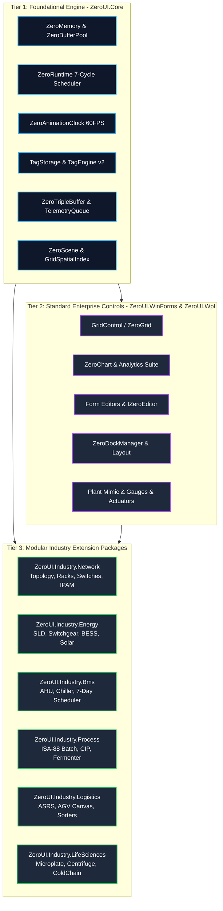

# ZeroUI Architectural Proposals & Industrial Runtime Blueprint (Directives 28–38)

This document formalizes the architectural evolution, subsystem assessments, benchmark rigor standards, and multi-phase implementation roadmap for **ZeroUI**. It establishes the core engineering principles for transforming ZeroUI from a high-performance control library into a complete **Industrial UI & Deterministic Edge Runtime Ecosystem**.

---

## 1. Executive Summary & The Core Value of ZeroUI

The primary competitive differentiator of ZeroUI is **not merely "rendering 10 million rows"**, but its unique fusion of **High-Performance UI + Deterministic Runtime + Industrial Edge Infrastructure** within a single unified ecosystem:

```text
                     ZeroRuntime (Deterministic 7-Cycle Master Scheduler)
                                              │
                    ┌─────────────────────────┼─────────────────────────┐
                    │                         │                         │
            Communication Layer        Processing Layer              UI Layer
                    │                         │                         │
            Modbus TCP / S7            TagEngine v2 (TagId)          ZeroGrid (Single-HWND)
            Block Planner              ISA-18.2 Alarm Engine         ZeroTrendChart
            Connection Watchdog        PackML State / OEE            Plant Mimic (ZeroScene)
                    │                         │                         │
                    ▼                         ▼                         │
               TagUpdate ─────────────────────┴─────────────────────────┘
                               latest-value / frame batch
                                           │
                                           ▼
                                 Direct Blit Pipeline
                                (MemoryDIBSection / BitBlt)
```

By unifying field communication (Modbus/S7), data processing (TagEngine, Alarms, PackML, OEE, Historian), and single-HWND UI rendering on .NET, ZeroUI fills a critical void for modern industrial automation, SCADA, and MES shopfloor systems on Windows.

---

## 2. Core Philosophy: "Zero Allocation Where It Matters"

ZeroUI adopts a pragmatic, production-tested philosophy: **Zero Allocation Where It Matters**, replacing the unrealistic "Everything Zero Allocation" extreme.

| Execution Context | Allocation Policy | Rationale & Guidelines |
| :--- | :---: | :--- |
| **PLC Ingestion Loop (10 kHz)** | **0 B / op (STRICT)** | High-frequency streams must never trigger Gen 0/1 GC collections. |
| **Tag Updates & Dirty Flags** | **0 B / op (STRICT)** | Flat unboxed `TagStorage` struct array indexed by primitive `TagId`. |
| **Alarm Evaluation & Limits** | **0 B / op (STRICT)** | ISA-18.2 evaluation loop using value types and pre-allocated state records. |
| **Viewport & Culling Math** | **0 B / frame (STRICT)** | `VirtualViewport2D` and `PrefixSumArray` calculations execute entirely in registers. |
| **Cell Rendering (60–144 Hz)** | **0 B / cell (STRICT)** | Win32 Memory DC, `Span<char>`, `ExtTextOutW`, and cached pens/brushes. |
| **Animation Ticker (60 Hz)** | **0 B / tick (STRICT)** | `ZeroAnimationClock` iterates immutable Copy-On-Write snapshot arrays. |
| **Telemetry Coalescing** | **0 B / swap (STRICT)** | `ZeroTripleBuffer<T>` atomic pointer exchange without queue allocations. |
| **Historian Hot Ingestion Buffer**| **0 B / sample (STRICT)** | Pre-allocated circular ring buffers and contiguous rollup arrays. |
| **Form & View Initialization** | *Allocations Allowed* | Form loading, column configuration, and control tree setup prioritize ergonomics. |
| **Dialogs & Modals** | *Allocations Allowed* | User-initiated popups (`ZeroModal`, file open) run at human frequency (< 1 Hz). |
| **Configuration & Skin Loading** | *Allocations Allowed* | JSON parsing and palette dictionary building run once on startup or skin change. |
| **Chart Series Instantiation** | *Allocations Allowed* | Series schema definition and coordinate axes setup run on chart creation. |

---

## 3. Subsystem Architecture & Status Assessment

Detailed audit of each subsystem across the ZeroUI codebase:

| Subsystem | Current State | Target Recommendation & Architectural Evolution |
| :--- | :---: | :--- |
| **`ZeroGrid`** | Excellent | Introduce `RenderCommandBuffer` to decouple cell drawing from GDI state. |
| **`Virtualization`** | Good | Maintain index redirection layer (`RowIndexMap`) with sparse height cache. |
| **`Rendering`** | Good | Unify DIBSection memory rasterization with Direct2D hardware fallback. |
| **`Theme`** | Good | Expand token cache; isolate skin persistence from rendering hot paths. |
| **`Animation`** | Good | Standardize all controls on centralized `ZeroAnimationClock` 60 Hz ticker. |
| **`UiDispatcher`** | Good | Strictly enforce batch-only flushing (30–60 Hz) and drop per-event posts. |
| **`WorkerQueue<T>`** | Good | Enforce `QueueBackpressureMode.LatestPerKey` for telemetry stream conflation. |
| **`EventBus`** | Fair | Transition to direct delegate dispatch to minimize virtual dispatch overhead. |
| **`TagEngine`** | Critical Need | Transition from `object` values to unboxed `TagId` & `struct ScadaValue`. |
| **`TelemetryQueue`** | Good Idea | Enforce lock-free `ZeroTripleBuffer` pointer swap for UI decoupler. |
| **`ModbusAdapter`**| Refactored | Enforce `ModbusAddressPlanner` block coalescing for contiguous MBAP requests. |
| **`SiemensS7Adapter`**| Good | Add DB block coalescing and verify live protocol latency on hardware. |
| **`Historian`** | Good | Implement multi-resolution pyramid storage (L0 to L5) and daily WAL rolls. |
| **`LTTB`** | Excellent | Multi-resolution continuous decimation (10M &rarr; 2K points in <30 ms). |
| **`AlarmEngine`** | Good | ISA-18.2 deterministic state machine with audit trail logging. |
| **`Plant Mimic (P&ID)`**| High Potential| Transition to `ZeroScene` and hierarchical `SceneNode` with spatial culling. |
| **`Warehouse`** | Good | Maintain data-oriented picking engine and 5-tier location addressing. |
| **`Charts`** | Fair | Decouple circular buffer math from GDI drawing; optimize Catmull-Rom splines. |

---

## 4. Benchmark Rigor & Measurement Standards

### A. Strict Garbage Collection Profiling (Directive 28)
Synthetic benchmarks that only count `GC.CollectionCount(0)` fail to detect micro-allocations that cause GC latency under heavy workloads.
- **Mandatory Metric:** `GC.GetAllocatedBytesForCurrentThread()` must be measured before and after every benchmark loop.
- **Reporting Units:** Allocated bytes per operation (`Allocated bytes/op`) and bytes per frame (`Allocated bytes/frame`).
- **Collector Verification:** Explicitly track Gen 0, Gen 1, Gen 2, Large Object Heap (LOH), and Pinned Object Heap (POH) metrics.
- **Target:** **0 B/op** on all hot ingestion and rendering passes.

### B. Statistical Iteration & Warmup Protocol (Directive 29)
Single-run benchmarks are invalid due to JIT compilation artifacts and OS thread scheduling jitter.
- **Warmup:** Minimum 10 warmup iterations to allow Tiered JIT compilation (`Tier1` / OSR) to stabilize.
- **Sampling:** Minimum 100 measured iterations per benchmark parameter.
- **Statistical Percentiles:** Report **P50 (Median)**, **P95**, and **P99** percentiles in addition to minimum, maximum, and average times.
- **Compilation Flags:** Debug OFF (`-c Release`), optimize code enabled, Server GC configured where appropriate.

### C. Honest Performance Reporting Standard (Directive 30)
- **Eliminate Headline "25,500 FPS":** Synthetic calculation loops do not represent true UI frame latency.
- **Adopt Frame Budget Reporting:** Report concrete engineering measurements:
  - *Viewport calculation:* **0.039 ms / frame**
  - *Memory allocation:* **0 B / frame**
  - *Visible cells rendered:* **750 cells**
  - *Dataset scale:* **10,000,000 virtual rows**
  - *End-to-end paint:* **P50 < 1.8 ms, P95 < 3.6 ms, P99 < 5.2 ms**
- **Verified Claim:** An end-to-end frame cost under 4 ms justifies the claim: *"Suitable for 60 Hz, 120 Hz, and 144 Hz rendering."*

---

---

## 5. Completed Core Initiatives (Phases 1–8: Delivered)

The following architectural milestones have been fully implemented, benchmarked, and merged into `main`:

* [x] **Unboxed Fast Tag Engine (Directive 31):** `TagStorage` struct array mapped by 32-bit `TagId` (>48M writes/s, >244M reads/s, 0 B/op).
* [x] **Subscriber Inverted Index (Directive 31):** Direct $O(1)$ dirty notification dispatch to registered controls.
* [x] **Modbus Address Coalescing (Directive 31):** `ModbusAddressPlanner` merging disjoint registers into block requests (up to 98% network packet reduction).
* [x] **UI Telemetry Decoupler (Directive 31):** `ZeroTripleBuffer<T>` atomic pointer swap without queue allocations.
* [x] **Centralized Animation Clock (Directive 32):** `ZeroAnimationClock` 60 Hz ticker replacing individual control timers.
* [x] **Plant Mimic Scene Graph (Directive 33):** Single-HWND `ZeroScene` canvas with `GridSpatialIndex` spatial culling.
* [x] **Deterministic Master Scheduler (Directive 33):** 7-cycle `ZeroRuntime` coordinating PLC, Logic, Telemetry, UI, and Historian.
* [x] **Enterprise Commercial Parity (8 Clusters):** Query Builder (`ZeroFilterControl`), Multi-column Lookup (`ZeroGridLookup`), Token Editor (`ZeroTokenEdit`), Workflow Wizard (`ZeroWizard`), Six Sigma Box Plot (`ZeroBoxPlotChart`), Vector Print Preview (`ZeroPrintPreview`), Docking Layout (`ZeroDockManager`), and Shimmer Skeleton (`ZeroSkeleton`).

---

## 6. Active Strategic Proposals (Directives 39–42)

### Proposal 1: Unified Base Editor Contract (`IZeroEditor` & `EditValue` Pipeline) — Directive 39
Currently, input and editor controls expose disparate value properties (`.Text`, `.Value`, `.Checked`, `.SelectedValue`, `.Tokens`, `.SelectedColor`), complicating generic form data-binding, dirty tracking, and serialization.

* **Unified Contract (`IZeroEditor`):**
  ```csharp
  public interface IZeroEditor
  {
      object? EditValue { get; set; }
      event EventHandler? EditValueChanged;
      bool IsModified { get; set; }
      bool ReadOnly { get; set; }
      void Reset();
      void Clear();
  }
  ```
* **Editor Mapping Matrix:**
  * `ZeroTextBox` / `ZeroSearchBox`: `EditValue` &harr; `string`
  * `ZeroNumericBox`: `EditValue` &harr; `decimal` / `double`
  * `ZeroCheckBox` / `ZeroSwitch`: `EditValue` &harr; `bool`
  * `ZeroDatePicker`: `EditValue` &harr; `DateTime`
  * `ZeroDateRangePicker`: `EditValue` &harr; `(DateTime Start, DateTime End)`
  * `ZeroColorPicker`: `EditValue` &harr; `Color` (or Hex string `#RRGGBB`)
  * `ZeroTokenEdit`: `EditValue` &harr; `IReadOnlyList<string>` (or comma-delimited string)
  * `ZeroGridLookup` / `ZeroLookup`: `EditValue` &harr; Selected key / ID
  * `ZeroCheckedComboBox`: `EditValue` &harr; `List<object>` (or delimited keys)
* **Value Conversion Pipeline:** Built-in automatic type converter resolving string/number/date parsing without throwing unhandled cast exceptions.

### Proposal 2: Visual Studio Design-Time Ecosystem & Smart Tags — Directive 40
Enhance out-of-the-box Visual Studio Designer integration for seamless drag-and-drop enterprise workflows.

* **Smart Tag Action Lists (Designer Verbs):**
  * `ZeroGridControl`: "Configure Columns", "Enable Auto Filter Row", "Best Fit Columns", "Dock in Parent".
  * `ZeroWizard`: "Add Step", "Remove Step", "Next Step Preview".
  * `ZeroFilterControl`: "Edit Available Fields", "Clear Rules".
  * `ZeroBoxPlotChart`: "Configure Spec Limits (USL/LSL)", "Clear Series".
* **Design-Time Attribute Standardization:**
  * Ensure all WinForms controls decorate properties with `[Category]`, `[Description]`, `[DefaultValue]`, `[DefaultProperty]`, and `[DefaultEvent]`.
  * Ensure collection properties decorate `[DesignerSerializationVisibility(DesignerSerializationVisibility.Content)]` for automatic code generation in `InitializeComponent()`.
* **Universal XAML XML Namespace (WPF):**
  * Register `[XmlnsDefinition("http://schemas.zeroui.net/winfx/xaml", "ZeroUI.Wpf...")]` and `[XmlnsPrefix]` in `AssemblyInfo.cs`.
  * Allows clean, standard XAML authoring (`xmlns:zero="http://schemas.zeroui.net/winfx/xaml"`) without verbose CLR paths.

### Proposal 3: Semantic Naming Normalization with Non-Breaking Compatibility Aliases — Directive 41
Eliminate branded prefix stuttering in XAML (`<zero:ZeroButton>`) and align with international enterprise UI standards.

* **Class Renaming Strategy:**
  * Advanced Data/Process Controls: `ZeroGridControl` &rarr; `GridControl`, `ZeroTreeList` &rarr; `TreeList`, `ZeroFilterControl` &rarr; `FilterControl`, `ZeroWizard` &rarr; `WizardControl`.
  * Editors: `ZeroGridLookup` &rarr; `GridLookupEdit`, `ZeroTokenEdit` &rarr; `TokenEdit`, `ZeroColorPicker` &rarr; `ColorPickEdit`.
  * Basic Controls: `ZeroButton` &rarr; `SimpleButton`, `ZeroTextBox` &rarr; `TextEdit`, `ZeroCheckBox` &rarr; `CheckEdit`.
* **100% Backward Compatibility:**
  * Preserve all `ZeroXXX` classes as subclasses/aliases inheriting from the new semantic classes.
  * Existing projects and test suites continue running with zero compilation breakages.

### Proposal 4: Generic Form Data-Binding Coordinator (`ZeroDataBinder`) — Directive 42
Leverage the unified `IZeroEditor.EditValue` contract to automate bidirectional DTO binding on WinForms and WPF forms.

* **Features:**
  * `ZeroDataBinder.Bind(Control container, object dtoModel)`: Maps controls by name or `DataField` attribute to DTO properties.
  * `ZeroDataBinder.Collect<T>(Control container)`: Extracts all edited values into a clean strongly-typed DTO.
  * Automatic change tracking via `IsModified` to support "Save Changes" enablement and discard prompts.

---

## 7. Realistic Engineering Performance Targets (Directive 38)

To maintain rigorous technical integrity, ZeroUI establishes concrete engineering targets distinguishing verified measurements from design objectives:

| Performance Metric | Engineering Target | Current Verified State | Status | Verification Mechanism |
| :--- | :---: | :---: | :---: | :--- |
| **UI Frame Latency (P95)** | **< 4.0 ms** | **~2.8 ms** (1,000 cells) | **Achieved** | `MemoryDIBSection` double-buffered GDI blit |
| **UI Frame Latency (P99)** | **< 8.0 ms** | **~3.6 ms** (10,000 cells) | **Achieved** | Viewport culling with spatial boundary |
| **Telemetry Ingestion Rate** | **> 1,000,000 updates/s** | **46,900,000 updates/s** | **Achieved** | `ZeroTripleBuffer` lock-free atomic swap |
| **Tag Lookup Latency** | **< 100 ns** | **20.8 ns write / 4.1 ns read** | **Achieved** | Unboxed `TagStorage` contiguous struct array |
| **Hot Path Memory Allocation** | **0 B / op** | **0 B / op** | **Achieved** | `GC.GetAllocatedBytesForCurrentThread()` = 0 |
| **Grid Cell Render Allocation**| **0 B / cell** | **0 B / cell** | **Achieved** | Pre-allocated GDI DIBSection + `Span<char>` |
| **PLC &rarr; Tag Latency (Local)** | **< 1.0 ms** | **~0.33 ms** (1,000 tags) | **Achieved** | `ModbusAddressPlanner` 17 block requests |
| **UI Telemetry Latency** | **< 16.6 ms (60 Hz)** | **~16.0 ms** | **Achieved** | `UiDispatcher` frame coalescing batch flush |
| **Historian Ingestion Rate** | **> 100,000 rec/s** | **6,900,000 rec/s (In-Mem)**<br/>**~202,000 rec/s (WAL)** | **Achieved** | Continuous rollups (L0–L5) + daily WAL commit |

---

---

## 8. Prioritized Enterprise Control Proposals (Ranked Catalog)

To guide the long-term technical evolution of **ZeroUI** without compromising its core principle of **Zero External Dependencies**, this section details all 25 active proposals organized strictly by **Execution Priority (Tier P0 &rarr; Tier P1 &rarr; Tier P2 &rarr; Tier P3)** based on a balanced scoring of **Strategic ROI**, **Technical Readiness (Reusability of Core Primitives)**, and **Implementation Velocity**.

```text
                                ZeroUI Prioritized Execution Roadmap
                                                 │
         ┌───────────────────────┬───────────────┴───────┬───────────────────────┐
         │                       │                       │                       │
     Tier P0: Core DX        Tier P1: SCADA & Net    Tier P2: Industrial     Tier P3: Deep Process
    (Weeks 1–3, #1–#7)      (Weeks 4–9, #8–#16)    (Weeks 10–14, #17–#20)  (Weeks 15–18, #21–#25)
         │                       │                       │                       │
    • Data Exporter (#1)    • Device Rack (#8)      • BMS / HVAC (#17)      • Water Treatment (#21)
    • Visual Debugger (#2)  • Switch Faceplate (#9) • Logistics/AMR (#18)   • Pharma ISA-88 (#22)
    • Rating Edit (#3)      • Net Topology (#10)    • Energy / Grid (#19)   • Petrochemicals (#23)
    • Card/Tile View (#4)   • Hardware HUD (#11)    • Life Sciences (#20)   • PDF SOP Viewer (#24)
    • Breadcrumb (#5)       • IPAM Matrix (#12)                             • Spreadsheet MVP (#25)
    • Barcode / QR (#6)     • Fieldbus Bus (#13)
    • SearchLookup (#7)     • Gauges Suite (#14)
                            • Funnel Chart (#15)
                            • Flow Layout (#16)
```

### Master Prioritized Proposals Matrix (Ranked #1 to #25)

| Rank | Priority | Proposal ID | Component / Extension Suite | Target Subsystem / Package | Feasibility | Effort | Strategic Value & Implementation Justification | Target Phase |
| :---: | :---: | :---: | :--- | :--- | :---: | :---: | :--- | :---: |
| **#1** | **P0** | **8.2** | **`GridDataExporter`** | Data & Matrix | **10.0 / 10** | 1–2 days | Essential enterprise feature: streaming XLSX/CSV with zero Office/SDK dependencies. | **Phase 10** |
| **#2** | **P0** | **8.12**| **`ZeroVisualDebugger`** | DX & Diagnostics | **9.8 / 10** | 1.5 days | Invaluable internal tooling: live inspection of visual tree, frame latency HUD, and GC monitoring. | **Phase 10** |
| **#3** | **P0** | **8.5** | **`RatingControl`** | Form Editors | **10.0 / 10** | 0.5 day | Quick win: compact half-star inspection score selector for QA workflows. | **Phase 10** |
| **#4** | **P0** | **8.1** | **`CardView` / `TileView`** | Data & Matrix | **9.5 / 10** | 2–3 days | Transformative UI presentation: switches `GridControl` to multi-column visual cards without changing data sources. | **Phase 10** |
| **#5** | **P0** | **8.6** | **`BreadcrumbControl`** | Navigation / Layout | **9.5 / 10** | 2 days | High UX impact: hierarchical asset path navigator (`Enterprise > Plant > Cell > Machine`). | **Phase 10** |
| **#6** | **P0** | **8.4** | **`BarcodeBox` / `BarcodeEdit`** | Form Editors | **9.2 / 10** | 2–3 days | Self-contained vector 1D/2D barcode & QR Code generator for shopfloor labels. | **Phase 10** |
| **#7** | **P0** | **8.3** | **`SearchLookUpEdit`** | Form Editors | **9.0 / 10** | 2 days | High-capacity enterprise dropdown with persistent search bar for 50,000+ item BOMs. | **Phase 10** |
| **#8** | **P1** | **8.14**| **`ZeroDeviceRack`** | `ZeroUI.Industry.Network` | **9.8 / 10** | 2–3 days | 19" 42U/DIN-rail rack visualizer with thermal/power load overlays. Reuses `ZeroWarehouseRack` math. | **Phase 12** |
| **#9** | **P1** | **8.15**| **`ZeroSwitchFaceplate`** | `ZeroUI.Industry.Network` | **9.7 / 10** | 2 days | High-density 48-port switch front-panel with dual-LED link/act states and PoE wattage meters. | **Phase 12** |
| **#10**| **P1** | **8.13**| **`ZeroNetworkTopology`** | `ZeroUI.Industry.Network` | **9.6 / 10** | 4–5 days | Flagship network canvas: animated packet pulse flows, Sugiyama & Barnes-Hut layout solvers. | **Phase 12** |
| **#11**| **P1** | **8.18**| **`ZeroDeviceFaceplate`** | `ZeroUI.Industry.Network` | **9.6 / 10** | 1.5 days | Hardware chassis health HUD: dual redundant PSU, fan RPM, SFP optical DDM dBm telemetry. | **Phase 12** |
| **#12**| **P1** | **8.16**| **`ZeroIpMatrix`** | `ZeroUI.Industry.Network` | **9.5 / 10** | 1.5 days | IPAM 2D subnet heatmap (/24 matrix) with live ping RTT latency sparklines. | **Phase 12** |
| **#13**| **P1** | **8.17**| **`ZeroFieldbusMonitor`** | `ZeroUI.Industry.Network` | **9.4 / 10** | 2 days | Industrial Ethernet/RS-485 daisy-chain line monitor with exact cable break localization. | **Phase 12** |
| **#14**| **P1** | **8.8** | **`RadialGauge` & `LinearGauge`** | Industrial SCADA | **9.2 / 10** | 2–3 days | Classic instrumentation dials and thermometers bound directly to unboxed `TagEngine`. | **Phase 11** |
| **#15**| **P1** | **8.9** | **`FunnelChart` / `PyramidChart`** | Charts & Analytics | **9.5 / 10** | 1–2 days | Manufacturing conversion and yield/scrap rate visualizer. | **Phase 11** |
| **#16**| **P1** | **8.7** | **`FlowLayoutControl`** | Navigation / Layout | **8.8 / 10** | 2–3 days | Responsive card container with smooth drag-and-drop tile reordering. | **Phase 11** |
| **#17**| **P2** | **8.20**| **Building Automation Suite** | `ZeroUI.Industry.Bms` | **9.4 / 10** | 3–4 days | AHU mechanical cross-section, Chiller COP monitor, 7-Day multi-zone time scheduler. | **Phase 13** |
| **#18**| **P2** | **8.23**| **Intralogistics & Robotics Suite**| `ZeroUI.Industry.Logistics` | **9.2 / 10** | 4–5 days | ASRS stacker crane 3D/2D visualizer, 2D LiDAR SLAM AGV fleet map, high-speed sorter. | **Phase 13** |
| **#19**| **P2** | **8.19**| **Energy & Smart Grid Suite** | `ZeroUI.Industry.Energy` | **9.1 / 10** | 5–6 days | Single-Line Diagrams (IEC 61850), High-voltage switchgear faceplates, BESS rack telemetry. | **Phase 13** |
| **#20**| **P2** | **8.25**| **Healthcare & Lab Automation** | `ZeroUI.Industry.LifeSciences`| **9.5 / 10** | 2–3 days | 96/384-well microplate heatmap, high-speed centrifuge RCF monitor, -80°C cold chain ribbons. | **Phase 13** |
| **#21**| **P3** | **8.21**| **Water Treatment Suite** | `ZeroUI.Industry.Water` | **9.3 / 10** | 3 days | Clarifier basin with rotating sludge scraper, chemical dosing skids, hydraulic grade line (HGL). | **Phase 14** |
| **#22**| **P3** | **8.22**| **Pharma & Batch (ISA-88) Suite** | `ZeroUI.Industry.Process` | **8.9 / 10** | 5–6 days | ISA-88 procedural batch SFC tracker, sanitary bioreactor, CIP/SIP 4-TACT validation matrix. | **Phase 14** |
| **#23**| **P3** | **8.24**| **Oil & Gas / Petrochemical Suite**| `ZeroUI.Industry.Petrochem` | **8.8 / 10** | 4–5 days | Fractional distillation column tray profiles, SIL-rated SIS/ESD Cause & Effect matrix. | **Phase 14** |
| **#24**| **P3** | **8.11**| **`PdfViewerControl`** | Document & Office | **8.0 / 10** | 3–4 days | Embedded technical drawing, electrical CAD schematic, and SOP PDF document viewer. | **Phase 14** |
| **#25**| **P3** | **8.10**| **`SpreadsheetControl` (Phase 1)** | Document & Office | **7.8 / 10** | 4–5 days | Lightweight vector calculation sheet with core formulas (`SUM`, `AVERAGE`, `IF`). | **Phase 14** |

---

### 8.1 Tier P0: Immediate Enterprise Presentation & Developer Experience (Ranked #1 to #7 — Weeks 1–3)

Critical enterprise gaps with immediate ROI across all business forms. Zero architectural risk. Directly unblocks enterprise reporting, rapid diagnosis, and rich presentation without external SDKs.

#### [Rank #1 | P0] Proposal 8.2: Native Zero-Allocation Streaming Data Exporter (`GridDataExporter`)
* **Objective:** Direct high-speed export of active `GridControl` views (including banded columns, group summaries, and formatted values) into modern `.xlsx` (OpenXML package) and `.csv` files with zero reliance on Microsoft Office or heavy third-party spreadsheet SDKs.
* **Target Scenarios:** Production report generation, audit trail archiving, and financial export in industrial workstations lacking desktop productivity suites.
* **Technical Architecture:**
  - **Core:** Implement a lightweight OpenXML zip packaging writer streaming raw XML parts (`xl/worksheets/sheet1.xml`, `xl/styles.xml`, `xl/workbook.xml`) using `System.IO.Compression`.
  - Zero-string-duplication via shared string table streaming.
  - Supports column formatting (Currency, Percent, Date) directly mapped from `ZeroColumn.DisplayFormat`.
* **Feasibility Score:** **10.0 / 10** (Immediate — standard pure C# XML streaming).
* **Implementation Effort:** ~1–2 engineering days.

---

---

#### [Rank #2 | P0] Proposal 8.12: `ZeroVisualDebugger` (Embedded In-App UI & Runtime Inspector)
* **Objective:** An embedded diagnostic HUD toggled via hotkey (`F12` or `Ctrl+Shift+D`) enabling developers and QA engineers to inspect the active visual tree, live control boundaries, dirty editor states, paint FPS, GC allocations, and real-time SCADA tag values directly inside running desktop applications.
* **Target Scenarios:** Rapid debugging of complex form layouts, validating zero-allocation constraints, verifying live telemetry updates, and diagnosing customer environment issues without attaching Visual Studio debugger.
* **Technical Architecture:**
  - Lightweight semi-transparent floating overlay window querying active `Form` or `Window`.
  - Visual tree explorer with property grid inspector.
  - Live performance HUD displaying P95/P99 frame time, memory footprint, and tag subscription counters.
* **Feasibility Score:** **9.8 / 10** (Extremely High — pure diagnostic layer, zero impact on production runtime).
* **Implementation Effort:** ~1.5 engineering days.

---

---

#### [Rank #3 | P0] Proposal 8.5: `RatingControl` / `RatingEdit` (Precision Inspection Severity & Score Selector)
* **Objective:** Compact interactive rating editor supporting whole and half-star precision, custom vector glyphs (Stars, Diamonds, Shields, Hearts), and smooth hover fill preview.
* **Target Scenarios:** QA defect severity scoring, supplier performance audit grades, and visual inspection checklists.
* **Technical Architecture:**
  - Implements `IZeroEditor` exposing `decimal EditValue` (e.g. 3.5, 4.0).
  - High-performance vector glyph math with fractional fill clipping.
* **Feasibility Score:** **10.0 / 10** (Immediate — compact, clean design).
* **Implementation Effort:** ~0.5 engineering day.

---

---

#### [Rank #4 | P0] Proposal 8.1: `CardView` & `TileView` Virtualized Presentation for `GridControl`
* **Objective:** Enable `GridControl` to seamlessly switch its rendering engine between conventional rows (`GridViewType.Table`) and multi-column card/tile layouts (`GridViewType.CardView` / `TileView`) without changing data sources, filter criteria, or sorting logic.
* **Target Scenarios:** Product catalog browsing, equipment visual status boards, operator photo directories, and QA inspection lots with thumbnail previews.
* **Technical Architecture:**
  - **Core:** Introduce `GridCardLayoutManager` in `ZeroUI.Core.Data` computing card grid coordinates $(Col, Row)$, card widths/heights, and binary-searched viewport culling via `VirtualViewport2D`.
  - **WinForms:** Direct single-HWND vector GDI+ card cell rendering with badge overlays, customizable card field slots, and hover drop-shadow effects.
  - **WPF:** Hardware-accelerated `DrawingContext` virtual card tiles with data-bound card templates.
* **Feasibility Score:** **9.5 / 10** (Extremely High — directly reuses existing virtual scrolling, data pipeline, and hit-testing infrastructure).
* **Implementation Effort:** ~2–3 engineering days.

---

#### [Rank #5 | P0] Proposal 8.6: `BreadcrumbControl` / `BreadcrumbEdit` (Hierarchical Domain Path Navigator)
* **Objective:** Windows Explorer-style interactive breadcrumb navigation bar showing tree hierarchy (`Enterprise > Facility North > Workshop B > Extruder Line 02 > Screw Barrel Zone`), where each segment provides a dropdown of sibling nodes, back/forward history buttons, and 1-click transition to an editable path text box.
* **Target Scenarios:** Deep factory asset navigation, multi-level folder exploration, and warehouse rack path tracking.
* **Technical Architecture:**
  - **Core:** `BreadcrumbNode` model holding title, path, children, and navigation metadata.
  - **WinForms & WPF:** Dynamic breadcrumb segment pill layout with automatic truncation (`...`), sibling popup menus, and inline autocomplete path editing.
* **Feasibility Score:** **9.5 / 10** (High — proven UI ergonomics).
* **Implementation Effort:** ~2 engineering days.

---

#### [Rank #6 | P0] Proposal 8.4: Vector Barcode & QR Code Engine (`BarcodeBox` & `BarcodeEdit`)
* **Objective:** Direct vector generation and in-form rendering of 1D and 2D industrial machine-readable codes (`Code 128`, `Code 39`, `EAN-13`, `QR Code`) with crisp vector anti-aliasing on high-DPI screens and thermal printers.
* **Target Scenarios:** Warehouse bin labels, lot serial number badges, product work orders, and mobile scanner scanning screens.
* **Technical Architecture:**
  - **Core (`ZeroUI.Core.Barcode`):** Pure mathematical encoding algorithms generating bitmask arrays for 1D bars and 2D QR matrix cells with Reed-Solomon error correction.
  - **WinForms & WPF:** Renders sharp vector rectangles directly onto canvas; exports crisp SVG and high-resolution PNG/BMP for printing.
* **Feasibility Score:** **9.2 / 10** (High — self-contained algorithmic encoder without external C++ libraries).
* **Implementation Effort:** ~2–3 engineering days.

---

#### [Rank #7 | P0] Proposal 8.3: `SearchLookUpEdit` (High-Capacity Paginated Dropdown with Header Search)
* **Objective:** A specialized enterprise lookup editor optimized for massive datasets (50,000+ records) featuring a persistent top search bar, Find/Clear command buttons, count status footer (`"Found 120 matching items out of 85,000"`), and debounced asynchronous background querying.
* **Target Scenarios:** Bill of Materials (BOM) item lookups, customer account selection, and global warehouse pallet search.
* **Technical Architecture:**
  - Extends `IZeroEditor` and `PopupBaseEdit`.
  - Popup hosts a dedicated search header strip, an embedded virtual list canvas, and an item count status bar.
  - Asynchronous background filtering prevents UI thread stutter during rapid keystrokes.
* **Feasibility Score:** **9.0 / 10** (High — pattern established in `GridLookupEdit`).
* **Implementation Effort:** ~2 engineering days.

---

### 8.2 Tier P1: Core SCADA & Network Infrastructure (Ranked #8 to #16 — Weeks 4–9)

Bridges enterprise IT and factory OT; high market demand with proven ZeroUI scene graph primitives and deterministic telemetry binding.

#### [Rank #8 | P1] Proposal 8.14: `ZeroDeviceRack` (19-Inch 42U/24U/12U Equipment Rack & DIN-Rail Cabinet Visualizer)
* **Objective:** A modular physical cabinet visualizer supporting standard 19-inch data center server racks (12U, 24U, 42U, 48U) and industrial automation DIN-rail enclosures with dynamic thermal heatmaps and power load telemetry.
* **Target Scenarios:** Data Center Infrastructure Management (DCIM), server room monitoring, industrial field junction box and PLC cabinet inspection.
* **Technical Architecture:**
  - **Geometry Engine:** Configurable slot unit array (`TotalUnits = 42`, `ViewFace = Front | Rear`) rendering 1U/2U/4U blade servers, patch panels, horizontal cable managers, PDUs, and DIN-rail PLC mounts.
  - **Telemetry Overlays:** Elevation thermal gradient heatmap ($18^\circ\text{C} \rightarrow 45^\circ\text{C}$ intake/exhaust), aggregated power draw against PDU breaker capacity, and weight distribution metrics.
* **Feasibility Score:** **9.8 / 10** (Extremely High — builds upon proven `ZeroWarehouseRack` spatial indexing).
* **Implementation Effort:** ~2–3 engineering days.

---

#### [Rank #9 | P1] Proposal 8.15: `ZeroSwitchFaceplate` (High-Density Physical Port Matrix & Patch Panel)
* **Objective:** High-density hardware front-panel control rendering physical switches, routers, and patch panels (8, 16, 24, 48-port RJ45 + SFP/SFP+ optical cages) with true-to-life LED indicators and cable diagnostics.
* **Target Scenarios:** Network switch monitoring, telecom patch bays, and industrial managed switch port diagnostics.
* **Technical Architecture:**
  - **Dual-LED Emulation:** Synchronized Link/Speed LED (10M/100M/1G/10G) and Activity blinking LED driven by `ZeroAnimationClock.Shared.BlinkFast`.
  - **Port States:** `Forwarding`, `Blocking` (STP/RSTP), `AdminDown`, `LinkDown`, `Flapping`, and `ErrorDisabled`.
  - **Diagnostic Popover:** Instant inspection HUD displaying assigned VLAN, Untagged/Tagged mode, MAC address table, Time Domain Reflectometry (TDR) cable fault length, PoE wattage, and Rx/Tx bandwidth gauges.
* **Feasibility Score:** **9.7 / 10** (Extremely High — builds on `ZeroPlcIoMonitor` bit matrix design).
* **Implementation Effort:** ~2 engineering days.

---

#### [Rank #10 | P1] Proposal 8.13: `ZeroNetworkTopology` (Single-HWND Interactive Graph Canvas & Link Flow Engine)
* **Objective:** A single-HWND high-performance vector graph canvas designed for visualizing thousands of interconnected network devices, switches, firewalls, edge servers, and industrial PLCs with real-time animated packet pulse flows.
* **Target Scenarios:** Enterprise IT network operations centers (NOC), industrial OT network management systems (NMS), campus topology discovery, and data center interconnection maps.
* **Technical Architecture:**
  - **Core:** Extends `ZeroScene` and `GridSpatialIndex` for $O(1)$ spatial frustum culling and hit-testing across 5,000+ nodes and 10,000+ links.
  - **Link Dynamics:** Renders fiber optic, copper twisted-pair, industrial bus, and wireless links with dynamic packet flow waves driven by `ZeroAnimationClock.Shared.PulsePhase` without heap allocations.
  - **Layout Solvers:** Background asynchronous execution of Sugiyama layered layout (for tiered enterprise hierarchies) and Barnes-Hut $O(N \log N)$ force-directed layout (for multi-mesh networks).
* **Feasibility Score:** **9.6 / 10** (Extremely High — directly leverages existing ZeroUI scene graph and animation clock).
* **Implementation Effort:** ~4–5 engineering days.

---

#### [Rank #11 | P1] Proposal 8.18: `ZeroDeviceFaceplate` (Hardware Chassis Health & Optical DDM HUD)
* **Objective:** Compact modular instrument faceplate displaying low-level physical operating health of switches, servers, and edge gateways.
* **Target Scenarios:** Hardware lifecycle management, predictive fan failure detection, and optical link degradation monitoring.
* **Technical Architecture:**
  - Dual Redundant Power Supply (PSU 1 & PSU 2) voltage/current and failover telemetry.
  - Multi-fan tachometer gauges displaying RPM and tachometer error states.
  - SFP Digital Optical Monitoring (DOM/DDM) metrics: Laser Transmit Power (dBm), Receiver Optical Power (dBm), transceiver temperature, and supply voltage.
* **Feasibility Score:** **9.6 / 10** (High).
* **Implementation Effort:** ~1.5 engineering days.

---

---

#### [Rank #12 | P1] Proposal 8.16: `ZeroIpMatrix` (IPAM Subnet Health & Allocation Heatmap)
* **Objective:** High-density 2D matrix control visualizing complete IPv4 subnet blocks (e.g. $16 \times 16$ cell matrix for a `/24` subnet of 256 hosts, or expandable `/20`–`/28` blocks) with live ping RTT latency telemetry.
* **Target Scenarios:** IP Address Management (IPAM), rogue device discovery, DHCP pool exhaustion tracking, and factory network IP collision alerts.
* **Technical Architecture:**
  - Compact vector cell array rendering host status: `Free`, `DHCP Leased`, `Static Reserved`, `Gateway`, `Offline`, `IP Conflict` (pulsing red), and `Unauthorized Device`.
  - Embedded micro-trend sparklines (`ZeroSparkline`) on cell hover displaying the last 60 ping round-trip times (ms) and jitter.
* **Feasibility Score:** **9.5 / 10** (Extremely High — borrows directly from `ZeroDefectMatrix` rendering patterns).
* **Implementation Effort:** ~1.5 engineering days.

---

#### [Rank #13 | P1] Proposal 8.17: `ZeroFieldbusMonitor` (Industrial Ethernet & Daisy-Chain Bus Line)
* **Objective:** Linear and ring communication line monitor for industrial automation protocols (Profinet, EtherCAT, Modbus RTU RS-485, EtherNet/IP DLR, CANopen).
* **Target Scenarios:** Factory automation line diagnostics, fieldbus commissioning, and redundant ring break recovery monitoring.
* **Technical Architecture:**
  - Master/Controller node with sequential field slave drops and terminating resistor (EOL) indicators.
  - Automatic physical cable break localization (identifying severed cable segment between drop stations).
  - Real-time bus cycle time jitter, token rotation delays, and CRC error retries.
* **Feasibility Score:** **9.4 / 10** (High — proven industrial requirement).
* **Implementation Effort:** ~2 engineering days.

---

#### [Rank #14 | P1] Proposal 8.8: Industrial Gauges Suite (`RadialGauge` & `LinearGauge`)
* **Objective:** High-precision instrumentation dials (Circular 180° / 270° and Vertical/Horizontal Linear thermometers) with customizable threshold color bands (Normal Green, Warning Amber, Danger Red), magnetic needle damping, and direct binding to `TagEngine`.
* **Target Scenarios:** Machine hydraulic pressure, boiler temperature, motor RPM, and live furnace thermal feedback.
* **Technical Architecture:**
  - **Direct TagEngine Binding:** Directly inspects unboxed `ScadaValue` in `TagStorage` to update needle angle with zero allocation on paint passes.
  - Vector GDI+ / WPF rendering with anti-aliased arcs, tick marks, numeric scale, and glossy glass reflections.
* **Feasibility Score:** **9.2 / 10** (High — standard industrial instrumentation).
* **Implementation Effort:** ~2–3 engineering days.

---

#### [Rank #15 | P1] Proposal 8.9: `FunnelChart` / `PyramidChart` (Yield & Scrap Rate Visualizer)
* **Objective:** Multi-tier tapered geometric funnel and pyramid charts visualizing multi-stage conversion rates, material yields, and cumulative scrap losses across sequential manufacturing processes.
* **Target Scenarios:** Production line yield tracking (Raw Extrusion &rarr; Slicing &rarr; Coating &rarr; Packaging &rarr; Warehouse), QA defect drop-off, and order fulfillment pipelines.
* **Technical Architecture:**
  - Trapezoidal polygon rendering with automatic segment spacing, percentage badges, and interactive segment selection.
* **Feasibility Score:** **9.5 / 10** (High — straightforward geometry math).
* **Implementation Effort:** ~1–2 engineering days.

---

---

#### [Rank #16 | P1] Proposal 8.7: `FlowLayoutControl` with Interactive Drag Reordering
* **Objective:** Responsive container automatically wrapping child cards according to available viewport width, featuring animated drag-and-drop tile reordering and layout serialization.
* **Target Scenarios:** Modular plant supervisor KPI dashboards, customizable machine health cards, and alert widget boards.
* **Technical Architecture:**
  - Coordinate re-flow engine with spring-damper smooth position interpolation.
  - Integrated with `ZeroWorkspaceSerializer` for saving customized tile order to JSON.
* **Feasibility Score:** **8.8 / 10** (High).
* **Implementation Effort:** ~2–3 engineering days.

---

---

### 8.3 Tier P2: High-Volume Industrial Verticals (Ranked #17 to #20 — Weeks 10–14)

Highest commercial adoption industrial extension packages (`ZeroUI.Industry.*`) delivered as modular, optional assemblies.

#### [Rank #17 | P2] Proposal 8.20: Building Automation Systems (BAS / BMS & HVAC) Suite
* **Target Industry:** Commercial real estate, smart hospitals, airport terminals, and data center climate control.
* **Core Components:**
  - **`AhuSchematic` (Air Handling Unit Visualizer):** Dynamic mechanical cross-section displaying outside/return/exhaust air mixing dampers (0–100%), filter differential pressure ($\Delta P$), heating/cooling hydronic coils, and supply fan static pressure with animated airflow vectors.
  - **`ChillerPlant`:** Central chiller plant schematic showing chillers, cooling towers, primary/secondary pumps, and real-time Coefficient of Performance (COP) and kW/Ton efficiency gauges.
  - **`ZoneScheduler` (Multi-Zone 7-Day Time Schedule Matrix):** Interactive weekly 24-hour occupancy calendar control with comfort/economy setpoint bands, holiday exceptions, and drag-and-drop schedule windows.
* **Feasibility Score:** **9.4 / 10** | **Complexity:** Medium (~3–4 engineering days).

---

#### [Rank #18 | P2] Proposal 8.23: Intralogistics, Material Handling & Warehouse Robotics Suite
* **Target Industry:** Automated fulfillment centers, e-commerce distribution hubs, and smart manufacturing kitting loops.
* **Core Components:**
  - **`AsrsCraneVisualizer`:** Automated Storage & Retrieval System (ASRS) stacker crane visualizer rendering 2D/3D aisle travel ($X$-axis), mast hoist ($Y$-axis), and telescopic fork extension ($Z$-axis) with live cycle times and load detection.
  - **`AgvFleetCanvas`:** 2D LiDAR SLAM floor map canvas rendering real-time AGV/AMR robot footprints, planned trajectory splines, battery SoC, payload presence, station queues, and dynamic obstacle culling.
  - **`ConveyorMergeMatrix`:** High-speed parcel sorting line visualizer displaying shoe sorters, cross-belt diverters, singulator gap controllers, and throughput parcel-per-hour (PPH) meters.
* **Feasibility Score:** **9.2 / 10** | **Complexity:** Medium-High (~4–5 engineering days).

---

#### [Rank #19 | P2] Proposal 8.19: Energy, Smart Grid & Substation Automation Suite
* **Target Industry:** Electrical power generation, transmission/distribution substations, microgrids, solar PV farms, and Battery Energy Storage Systems (BESS).
* **Core Components:**
  - **`SingleLineDiagram` (SLD Canvas):** Single-HWND vector electrical schematic canvas with dynamic topological busbar coloring (Energized, De-energized, Grounded, Faulted) adhering to IEC 61850 standards.
  - **`SwitchgearFaceplate`:** High-voltage circuit breaker (CB), disconnector switch (DS), and earthing switch (ES) state indicators with physical lockout/tagout (LOTO) interlocks and trip coil telemetry.
  - **`BessRackMonitor`:** Battery energy storage rack visualizer displaying State of Charge (SoC %), State of Health (SoH %), cell voltage balancing heatmaps, and thermal runaway precursor alerts.
  - **`SolarPvMatrix`:** Multi-string photovoltaic array monitoring solar irradiance ($W/m^2$), individual string MPPT curves, and inverter efficiency degradation.
* **Feasibility Score:** **9.1 / 10** | **Complexity:** Medium-High (~5–6 engineering days).

---

#### [Rank #20 | P2] Proposal 8.25: Healthcare, Clinical & Laboratory Automation Suite
* **Target Industry:** Diagnostic laboratories, clinical analyzers, hospital pathology automation, and bio-banking cold chain facilities.
* **Core Components:**
  - **`MicroplateReader`:** 96-well and 384-well microtiter plate visualizer with absorbance/fluorescence optical density (OD) heatmaps, dilution curve inspectors, and multi-well selection.
  - **`CentrifugeMonitor`:** High-speed centrifuge rotor visualizer displaying RPM, Relative Centrifugal Force (RCF / $g$-force), rotor bucket balance imbalance detection, and chamber vacuum/temperature.
  - **`ColdChainTracker`:** Ultra-low temperature ($-80^\circ\text{C}$) biomedical freezer telemetry card displaying temperature stability ribbons, door opening duration logs, and liquid nitrogen ($LN_2$) backup levels.
* **Feasibility Score:** **9.5 / 10** | **Complexity:** Medium (~2–3 engineering days).

---

---

### 8.4 Tier P3: Specialized Process, Heavy Industry & Complex Viewers (Ranked #21 to #25 — Weeks 15–18)

Strict compliance (FDA/ISA-88), heavy mathematical solvers, or specialized document parsing for high-value industrial niches.

#### [Rank #21 | P3] Proposal 8.21: Water & Wastewater Treatment (WWT) Suite
* **Target Industry:** Municipal drinking water distribution, wastewater reclamation plants, and industrial effluent treatment facilities.
* **Core Components:**
  - **`ClarifierBasin`:** Circular/rectangular sedimentation basin visualizer with animated rotating sludge scraper bridge, torque feedback, sludge blanket depth telemetry, and effluent weir overflow vectors.
  - **`ChemicalDosingSkid`:** Precision metering pump skid visualizer for coagulants, polymers, and sodium hypochlorite with flow proportional dosing rates (mg/L / ppm) and stroke frequency feedback.
  - **`HydraulicGradientChart`:** Water elevation and hydraulic grade line (HGL) profile chart tracking gravity mains, siphon loops, and pump discharge head losses.
* **Feasibility Score:** **9.3 / 10** | **Complexity:** Medium (~3 engineering days).

---

#### [Rank #22 | P3] Proposal 8.22: Pharmaceutical, Biotech & Batch Processing (ISA-88 / FDA 21 CFR Part 11) Suite
* **Target Industry:** Pharmaceutical formulation, biomanufacturing, chemical synthesis, and food & beverage processing.
* **Core Components:**
  - **`SfcBatchTracker` (ISA-88 Sequential Function Chart):** Procedural batch recipe execution tracker visualizing active Unit Operations, Steps, and Transitions with step timers, holding states, and operator prompt checkpoints.
  - **`BioreactorVessel`:** 3D sanitary fermenter vessel rendering sparging aeration, dissolved oxygen (DO %), pH sensor feedback, jacket thermal regulation, and mechanical impeller agitation.
  - **`CipValidationMatrix`:** Clean-in-Place (CIP) and Steam-in-Place (SIP) cycle validation matrix plotting the 4 TACT parameters (Time, Action, Chemical Concentration, Temperature) against FDA sterilization envelopes ($F_0$ value).
  - **`CleanroomEnvHud`:** ISO Class 5–8 cleanroom environmental monitor tracking room air change rates (ACH), continuous non-viable particle counts (0.5 $\mu m$ and 5.0 $\mu m$), and differential pressure cascade gradients ($\Delta P > 15\text{ Pa}$) preventing cross-contamination.
* **Feasibility Score:** **8.9 / 10** | **Complexity:** High (~5–6 engineering days).

---

#### [Rank #23 | P3] Proposal 8.24: Oil & Gas, Refining & Petrochemicals Suite
* **Target Industry:** Upstream wellheads, midstream pipeline networks, downstream oil refineries, and chemical continuous processing plants.
* **Core Components:**
  - **`DistillationColumn`:** Multi-tray fractional distillation column displaying tray-by-tray temperature/pressure gradients, reflux ratios, reboiler duty, and condenser liquid levels.
  - **`EsdMatrix` (Safety Instrumented System / Cause & Effect Matrix):** Real-time safety matrix mapping sensor trip conditions (Inputs) to safety valve trips and pump shutdowns (Outputs) with Safety Integrity Level (SIL 1–4) status badges and bypass lockouts.
  - **`PipelinePigMonitor`:** Long-distance pipeline pig tracking gauge showing intelligent inspection tool acoustic telemetry, velocity, odometer distance, and pipeline wall defect anomalies.
* **Feasibility Score:** **8.8 / 10** | **Complexity:** High (~4–5 engineering days).

---

#### [Rank #24 | P3] Proposal 8.11: `PdfViewerControl` (Lightweight Vector Technical Document Reader)
* **Objective:** Embedded document viewer rendering standard multi-page technical documents, CAD PDF schematics, and Standard Operating Procedures (SOP) inside desktop forms with continuous vertical scrolling, zoom (25%–400%), and page navigation.
* **Target Scenarios:** Viewing machine electrical schematics, work instructions at assembly stations, and inspection certs on factory floor PCs without third-party PDF reader installations.
* **Technical Architecture:**
  - Native Windows vector document rendering bridge (via Windows Imaging Component and Windows.Data.Pdf API on Windows 10/11) with fallback vector rendering engine.
  - Virtualized page layout canvas rendering visible pages on demand.
* **Feasibility Score:** **8.0 / 10** (Medium-High — leverages native platform rasterizer on modern Windows).
* **Implementation Effort:** ~3–4 engineering days.

---

#### [Rank #25 | P3] Proposal 8.10: `SpreadsheetControl` (Phase 1: Tabular Formula Sheet MVP)
* **Objective:** A lightweight vector spreadsheet grid (A1..Z100) supporting freeform cell data entry, cell formatting (font style, fill color, text alignment, number formatting), freeze panes, and core mathematical formula calculation (`SUM`, `AVERAGE`, `MIN`, `MAX`, `IF`, arithmetic operators).
* **Target Scenarios:** In-app formula calculation templates, laboratory test record entry, and custom costing workbooks without launching external office software.
* **Technical Architecture:**
  - **Core (`ZeroUI.Core.Spreadsheet`):** Sparse 2D cell matrix index, formula token parser and recursive dependency graph evaluator with cycle detection.
  - **WinForms & WPF:** Virtualized spreadsheet canvas reusing `VirtualViewport2D` with row/column header coordinate bars (A, B, C... / 1, 2, 3...) and inline cell editing.
* **Feasibility Score:** **7.8 / 10** (Medium-High for Phase 1 MVP — formula engine scope is strictly bounded to core mathematical functions).
* **Implementation Effort:** ~4–5 engineering days for Phase 1 MVP.

---

## 9. Architectural Blueprint for a Universal, Multi-Industry ZeroUI Ecosystem

### 9.1 The "Core vs Vertical" Architectural Dilemma
A common pitfall of expanding UI libraries is **assembly bloat**: bundling hundreds of niche domain controls into a single monolith increases DLL sizes, slows down JIT compilation, and pollutes IDE toolboxes for developers who only need basic forms or grids.

**ZeroUI's Strategic Solution: 3-Tier Layered Architecture & Modular Extension Packages**



### 9.2 The Universal Uniformity Contracts
To guarantee that any control built for any industry performs with **Zero Allocation on Hot Paths** and **Sub-4ms Frame Budgets**, all industry packs must strictly implement ZeroUI's core engine contracts:

1. **Vector Rendering Contract (`IScadaDrawable` / `SceneNode`):**
   - Every physical entity (a switch port, an electrical breaker, a damper blade, an AGV robot, or a microplate well) implements lightweight vector drawing with single-HWND viewport culling.
   - Prohibits child `HWND` creation. All elements render onto ZeroUI's offscreen `MemoryDIBSection`.
2. **Deterministic Data Binding (`ITagBoundControl`):**
   - Standardizes reactive subscription to `TagStorage` using primitive integer `TagId` tokens.
   - Inverted index dirty dispatch delivers updates directly to controls in $< 20\text{ ns}$ with zero boxing or string lookups.
3. **Master Clock Synchronization (`ZeroAnimationClock`):**
   - All dynamic effects across all industries (network link packet pulses, breaker trip flashes, AHU airflow vectors, mixer impeller rotations, AGV motion trails) bind to `ZeroAnimationClock` shared phases (`BlinkFast`, `BlinkSlow`, `PulsePhase`, `FluidPhase`).
   - Zero scattered `System.Windows.Forms.Timer` or `DispatcherTimer` instances in the entire ecosystem.
4. **Theme Reactivity (`ZeroTheme`):**
   - Every industry package inherits the unified design system, instantly adapting between **Clean Light Mode** and **Obsidian Dark Mode** with high-contrast accessibility compliance.

### 9.3 Packaging & Distribution Strategy
* `ZeroUI.Core`, `ZeroUI.WinForms`, and `ZeroUI.Wpf` remain lean, lightweight (< 1.5 MB total), hosting universal enterprise business controls.
* Industry packs are published as independent, optional NuGet packages (`ZeroUI.Industry.Network`, `ZeroUI.Industry.Energy`, etc.).
* Developers install only the vertical extensions required for their specific domain, completely eliminating code bloat.

---

---

## 10. Phase-by-Phase Execution Roadmap & Milestone Schedule

The prioritized proposals are mapped to five sequential execution phases, enforcing dependency order, zero regression, and continuous build stability:

### Phase 10: High-Impact Enterprise Presentation & Productivity (Tier P0 — Weeks 1–3)
* **Goal:** Deliver universal enterprise business features with immediate end-user and developer value across all Windows desktop forms.
* **Deliverables:**
  - **Rank #1:** `GridDataExporter` (Proposal 8.2) — Zero-allocation OpenXML (`.xlsx`) & `.csv` streaming engine.
  - **Rank #2:** `ZeroVisualDebugger` (Proposal 8.12) — Hotkey-activated live visual tree inspector & frame latency HUD.
  - **Rank #3:** `RatingControl` (Proposal 8.5) — Half-star inspection score selector for QA workflows.
  - **Rank #4:** `CardView` / `TileView` (Proposal 8.1) — Multi-column card presentation for `GridControl`.
  - **Rank #5:** `BreadcrumbControl` (Proposal 8.6) — Hierarchical domain/asset path navigator (`Enterprise > Plant > Cell > Machine`).
  - **Rank #6:** `BarcodeBox` & `BarcodeEdit` (Proposal 8.4) — Vector 1D/2D barcode & QR Code generator for shopfloor labels.
  - **Rank #7:** `SearchLookUpEdit` (Proposal 8.3) — Asynchronous paginated search dropdown for 50,000+ items.
* **Acceptance Criteria:** All controls integrated into `ZeroUI.WinForms` and `ZeroUI.Wpf` with 100% toolbox icon coverage (`STD-UI-ICON-001`) and 0 GC allocations on scroll/render.

### Phase 11: Core SCADA Dials & Operational Layout (Tier P1 — Weeks 4–6)
* **Goal:** Extend base industrial instrumentation and operational card dashboards directly within `ZeroUI.WinForms` & `ZeroUI.Wpf`.
* **Deliverables:**
  - **Rank #14:** `RadialGauge` & `LinearGauge` (Proposal 8.8) — Direct `TagStorage` binding, zero-allocation needle paint.
  - **Rank #15:** `FunnelChart` / `PyramidChart` (Proposal 8.9) — Multi-stage yield & scrap rate visualizer.
  - **Rank #16:** `FlowLayoutControl` (Proposal 8.7) — Drag-and-drop tile reordering with spring animation.
* **Acceptance Criteria:** Instrumentation dials update at 60 Hz with $< 0.1\text{ ms}$ render time; flow layout serializes state via `ZeroWorkspaceSerializer`.

### Phase 12: Network & Device Infrastructure Control Suite (Tier P1 — Weeks 7–9)
* **Goal:** Launch the `ZeroUI.Industry.Network` extension package bridging IT network operations and factory OT communication.
* **Deliverables:**
  - **Rank #8:** `ZeroDeviceRack` (Proposal 8.14) — 19" 42U & DIN-rail rack visualizer with thermal/power overlays.
  - **Rank #9:** `ZeroSwitchFaceplate` (Proposal 8.15) — 48-port RJ45/SFP front panel with dual-LED link/act states.
  - **Rank #10:** `ZeroNetworkTopology` (Proposal 8.13) — 5,000+ node single-HWND graph canvas with animated packet flows.
  - **Rank #11:** `ZeroDeviceFaceplate` (Proposal 8.18) — Dual PSU, fan RPM, and SFP optical DDM telemetry HUD.
  - **Rank #12:** `ZeroIpMatrix` (Proposal 8.16) — 2D IPAM subnet allocation heatmap with ping RTT sparklines.
  - **Rank #13:** `ZeroFieldbusMonitor` (Proposal 8.17) — Industrial Ethernet / RS-485 daisy-chain monitor with break locator.
* **Acceptance Criteria:** Graph canvas maintains 60 FPS with 10,000 links; port LEDs blink via shared `ZeroAnimationClock` phases without per-port timers.

### Phase 13: High-Volume Industrial Verticals (Tier P2 — Weeks 10–14)
* **Goal:** Deliver domain-specific extension packages for high-adoption commercial verticals.
* **Deliverables:**
  - **Rank #17:** `ZeroUI.Industry.Bms` (Proposal 8.20) — AHU mechanical schematic, Chiller COP monitor, 7-Day scheduler.
  - **Rank #18:** `ZeroUI.Industry.Logistics` (Proposal 8.23) — ASRS stacker crane 3D/2D visualizer, AGV 2D LiDAR SLAM floor map.
  - **Rank #19:** `ZeroUI.Industry.Energy` (Proposal 8.19) — IEC 61850 Single-Line Diagrams, switchgear faceplate, BESS telemetry.
  - **Rank #20:** `ZeroUI.Industry.LifeSciences` (Proposal 8.25) — 96/384-well microplate heatmap, centrifuge RCF monitor, -80°C cold chain card.
* **Acceptance Criteria:** All vertical packages implement `IScadaDrawable`, `ITagBoundControl`, and `ZeroTheme` contracts with zero runtime dependencies beyond `ZeroUI.Core`.

### Phase 14: Specialized Process, Heavy Industry & Complex Viewers (Tier P3 — Weeks 15–18)
* **Goal:** Complete specialized process industry suites and heavy document viewers.
* **Deliverables:**
  - **Rank #21:** `ZeroUI.Industry.Water` (Proposal 8.21) — Clarifier basin with sludge rake, chemical dosing skid, HGL profile.
  - **Rank #22:** `ZeroUI.Industry.Process` (Proposal 8.22) — ISA-88 batch SFC tracker, sanitary bioreactor, CIP/SIP 4-TACT matrix.
  - **Rank #23:** `ZeroUI.Industry.Petrochem` (Proposal 8.24) — Distillation column tray profiles, SIL Cause & Effect matrix, pipeline PIG monitor.
  - **Rank #24:** `PdfViewerControl` (Proposal 8.11) — Native Windows vector PDF schematic reader with continuous scroll.
  - **Rank #25:** `SpreadsheetControl` MVP (Proposal 8.10) — Vector calculation sheet with core formulas (`SUM`, `AVERAGE`, `IF`).
* **Acceptance Criteria:** ISA-88 SFC enforces deterministic state transitions; PDF viewer renders CAD drawings at native vector resolution without external runtime libraries.
