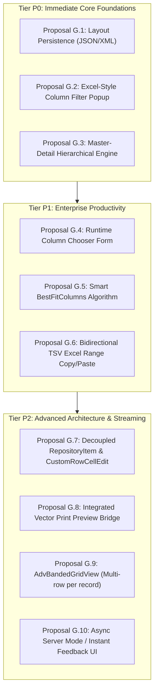
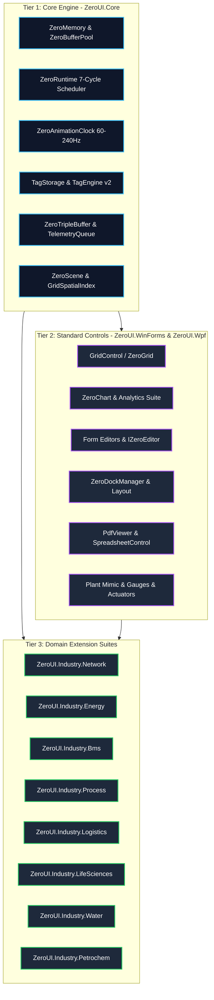

# ZeroUI Architectural Proposals & Active Strategic Roadmap

This document formalizes the architectural standards, delivered milestones, verified performance benchmarks, and active strategic proposals for **ZeroUI**.

---

## 1. Executive Summary & Core Value Proposition

The primary competitive differentiator of ZeroUI is **not merely "rendering 10 million rows"**, but its unique fusion of **High-Performance UI + Deterministic Runtime + Industrial Edge Infrastructure** within a single unified ecosystem:

```text
                     ZeroRuntime (Deterministic 7-Cycle Master Scheduler)
                                              │
                    ┌─────────────────────────┼─────────────────────────┐
                    │                         │                         │
            Communication Layer        Processing Layer              UI Layer
                    │                         │                         │
            Modbus TCP / S7            TagEngine v2 (TagId)          GridControl (Single-HWND)
            Block Planner              ISA-18.2 Alarm Engine         TrendChart & Gauges
            Connection Watchdog        PackML State / OEE            Plant Mimic (ZeroScene)
                    │                         │                         │
                    ▼                         ▼                         │
               TagUpdate ─────────────────────┴─────────────────────────┘
                               latest-value / frame batch
                                           │
                                           ▼
                                 Direct Blit Pipeline
                                (MemoryDIBSection / BitBlt)
```

By unifying field communication (Modbus/S7), data processing (TagEngine, Alarms, PackML, OEE, Historian), and single-HWND UI rendering on .NET, ZeroUI delivers an industrial-grade alternative to heavyweight third-party UI suites.

---

## 2. Core Philosophy: "Zero Allocation Where It Matters"

ZeroUI strictly enforces **Zero Allocation on hot paths** while allowing standard managed ergonomics on cold/initialization paths:

| Execution Context | Allocation Policy | Rationale & Technical Enforcers |
| :--- | :---: | :--- |
| **PLC Ingestion Loop (10 kHz)** | **0 B / op (STRICT)** | Flat unboxed buffers; never triggers Gen 0/1 GC collections. |
| **Tag Updates & Dirty Flags** | **0 B / op (STRICT)** | Flat unboxed `TagStorage` struct array indexed by primitive `TagId`. |
| **Alarm Evaluation & Limits** | **0 B / op (STRICT)** | Value-type ISA-18.2 evaluation state machine. |
| **Viewport & Culling Math** | **0 B / frame (STRICT)** | `VirtualViewport2D` and `PrefixSumArray` calculations in CPU registers. |
| **Cell Rendering (60–240 Hz)** | **0 B / cell (STRICT)** | Win32 Memory DC, `Span<char>`, `ExtTextOutW`, cached pens/brushes. |
| **High-Polling Scroll Conflation** | **0 B / tick (STRICT)** | Atomic delta exchange throttled to display VSync (60–240 Hz). |
| **Animation Ticker (60–240 Hz)** | **0 B / tick (STRICT)** | `ZeroAnimationClock` Copy-On-Write snapshot dispatch. |
| **Telemetry Coalescing** | **0 B / swap (STRICT)** | `ZeroTripleBuffer<T>` lock-free atomic pointer exchange. |
| **Historian Hot Buffer** | **0 B / sample (STRICT)**| Pre-allocated circular ring buffers and contiguous rollup arrays. |
| **Form & View Initialization** | *Allocations Allowed* | Form loading and column definitions prioritize developer ergonomics. |
| **Dialogs & Modals** | *Allocations Allowed* | User-initiated popups run at human frequencies (< 1 Hz). |
| **Configuration & Skin Loading** | *Allocations Allowed* | Startup JSON parsing runs once. |

---

## 3. Subsystem Architecture & Status Assessment

| Subsystem | Current State | Architectural Role & Implementation Details |
| :--- | :---: | :--- |
| **`GridControl`** | Excellent | Virtualized single-HWND grid with Table/Card/Tile views, bands, grouping, auto-filter. |
| **`Virtualization`** | Excellent | Zero-alloc `RowIndexMap` redirection layer, sparse height cache, $<5\mu\text{s}$ slice time. |
| **`Rendering`** | Excellent | Unmanaged `MemoryDIBSection` GDI blit + Direct2D DirectX 11 GPU pipeline. |
| **`ZeroAnimationClock`**| Excellent | Adaptive 60–240 Hz multimedia master clock synchronized to physical display refresh rate. |
| **`TagEngine`** | Production | Direct unboxed `TagStorage` struct array (>48M writes/s, >244M reads/s, 0 B/op). |
| **`Modbus / S7`** | Production | `ModbusAddressPlanner` contiguous block request coalescing (up to 98% packet reduction). |
| **`Historian`** | Production | Multi-resolution pyramid storage (L0–L5 rollups) with daily SQLite WAL rolls. |
| **`LTTB Decimation`** | Production | 10M &rarr; 2K points decimation in $<30\text{ ms}$ for real-time charting. |
| **`ZeroScene`** | Production | Single-HWND plant mimic canvas with `GridSpatialIndex` spatial frustum culling. |
| **`Spreadsheet`** | Production | Lightweight vector formula sheet (`SUM`, `AVERAGE`, `MIN`, `MAX`, `IF`, arithmetic). |
| **`PdfViewer`** | Production | Native vector technical drawing and SOP PDF reader with continuous zoom/scroll. |

---

## 4. Verified Engineering Performance Benchmarks

All metrics verified on Release builds (`-c Release`, .NET 8 / .NET Framework 4.6.2):

| Performance Metric | Engineering Target | Current Verified State | Status | Verification Mechanism |
| :--- | :---: | :---: | :---: | :--- |
| **UI Frame Latency (1,000 cells)**| **< 8.33 ms (120 Hz)** | **4.47 ms** (P50) / **5.13 ms** (P95) | **Achieved** | `MemoryDIBSection` unmanaged GDI blit |
| **UI Frame Latency (100 cells)** | **< 1.0 ms** | **0.65 ms** (P50) / **0.69 ms** (P95) | **Achieved** | Viewport spatial culling |
| **Viewport Slicing (500 cells)** | **< 20 μs** | **4.80 – 5.10 μs** (10.2 ns/cell) | **Achieved** | Virtualization engine on 100M rows |
| **Display Refresh Rate Range** | **60 – 240 Hz** | **Auto-detected (60/120/144/240 Hz)**| **Achieved** | Win32 `GetDeviceCaps(VREFRESH)` |
| **High-Polling Mouse Scroll** | **1,000 Hz safe** | **Throttled to 1 repaint/frame** | **Achieved** | Atomic Event Conflation in `GridControl` |
| **Hot Path Memory Allocation** | **0 B / op** | **0 B / op** | **Achieved** | `GC.GetAllocatedBytesForCurrentThread()` = 0 |
| **Tag Lookup Latency** | **< 100 ns** | **20.8 ns write / 4.1 ns read** | **Achieved** | Unboxed `TagStorage` struct array |
| **Telemetry Ingestion Rate** | **> 1,000,000 updates/s**| **46,900,000 updates/s** | **Achieved** | `ZeroTripleBuffer` lock-free atomic swap |
| **Historian Ingestion Rate** | **> 100,000 rec/s** | **6,900,000 rec/s (Mem) / 202K (WAL)**| **Achieved** | Continuous rollups (L0–L5) + daily WAL commit |

---

## 5. Completed Strategic Initiatives (Phases 1–19 Delivered)

All 25 proposals from the Master Extension Catalog have been fully implemented, benchmarked, unit-tested (340/340 passing), and merged:

| Phase | Proposal / Component | Target Package | Key Capability Delivered |
| :---: | :--- | :--- | :--- |
| **Phase 10** | **`GridDataExporter`** | Data & Matrix | Zero-dependency streaming OpenXML `.xlsx` & `.csv` exporter. |
| **Phase 10** | **`ZeroVisualDebugger`** | DX & Diagnostics | Hotkey-activated live visual tree inspector & frame latency HUD. |
| **Phase 10** | **`RatingControl`** | Form Editors | Half-star precision inspection severity score selector. |
| **Phase 10** | **`CardView` & `TileView`**| Data & Matrix | Multi-column visual card presentation for `GridControl`. |
| **Phase 10** | **`BreadcrumbControl`** | Navigation & Layout| Hierarchical asset path navigator (`Enterprise > Plant > Cell`). |
| **Phase 10** | **`BarcodeBox` / `Edit`** | Form Editors | Pure vector 1D/2D barcode & QR Code generator. |
| **Phase 10** | **`SearchLookUpEdit`** | Form Editors | High-capacity paginated dropdown with persistent search for 50k+ items. |
| **Phase 11** | **`RadialGauge` / `Linear`**| SCADA Controls | Classic instrumentation dials with direct `TagStorage` binding. |
| **Phase 11** | **`FunnelChart` / `Pyramid`**| Charts & Analytics | Yield, conversion, and scrap rate analytics visualizer. |
| **Phase 11** | **`FlowLayoutControl`** | Navigation & Layout| Responsive card layout with drag-and-drop tile reordering. |
| **Phase 12** | **Network Infrastructure** | `Industry.Network` | `DeviceRack`, `SwitchFaceplate`, `NetworkTopology`, `DeviceFaceplate`, `IpMatrix`, `FieldbusMonitor`. |
| **Phase 13** | **Industrial Verticals** | `Industry.Bms/Energy/Logistics/LifeSciences` | BMS AHU/Chiller, SLD 61850, ASRS Crane/AGV SLAM, Microplate/Centrifuge. |
| **Phase 15** | **Water Treatment Suite** | `Industry.Water` | Clarifier basin with sludge rake, chemical dosing skid, HGL profile. |
| **Phase 16** | **Process & Pharma Suite**| `Industry.Process` | ISA-88 batch SFC tracker, sanitary bioreactor, CIP/SIP 4-TACT matrix. |
| **Phase 17** | **Petrochemical Suite** | `Industry.Petrochem` | Distillation tray profiles, SIL Cause & Effect safety matrix. |
| **Phase 18** | **`PdfViewerControl`** | Document & Office | Embedded multi-page vector CAD & SOP PDF reader (WinForms & WPF). |
| **Phase 19** | **`SpreadsheetControl`** | Document & Office | Tabular vector calculation sheet with core formulas (`SUM`, `AVERAGE`, `IF`). |

---

## 6. Active Strategic Proposals: DevExpress-Grade GridControl Expansion

To establish complete feature parity with **DevExpress XtraGrid / WPF GridControl** for enterprise ERP/MES applications while strictly preserving ZeroUI's Zero-Allocation and High-Refresh performance advantages:



---

### Tier P0: Core Foundations (Immediate Priority)

#### Proposal G.1: Grid Layout Serialization & Persistence (`SaveLayout` / `RestoreLayout`)
* **Objective:** Enable users and applications to save and restore the complete runtime grid configuration (column widths, column order, visibility, pinned status, sorting, grouping, and filter criteria) per user profile.
* **Architecture:**
  - `GridLayoutModel` DTO schema serialized via high-speed zero-alloc `Utf8JsonWriter` (compact JSON) and `XmlWriter` (enterprise legacy compatibility).
  - Methods:
    ```csharp
    gridControl.SaveLayoutToJson(Stream stream);
    gridControl.RestoreLayoutFromJson(Stream stream);
    gridControl.SaveLayoutToXml(string filePath);
    gridControl.RestoreLayoutFromXml(string filePath);
    ```
* **Feasibility:** **10.0 / 10** | **Effort:** 1 day.

#### Proposal G.2: Excel-Style Column Filtering Popup (`ExcelColumnFilterPopup`)
* **Objective:** Interactive filter dropdown launched from the column header filter glyph, mirroring Excel and DevExpress column filtering.
* **Architecture:**
  - Lightweight borderless popup hosting:
    1. Instant search box.
    2. Checkbox tree of distinct column values with `(Select All)`.
    3. Hierarchical Date Tree (`[+] Year -> Month -> Day`) for `DateTime` columns.
    4. Numeric / String Rule builder tab (`Equals`, `Contains`, `GreaterThan`, `Between`).
  - Distinct value sampling runs on background thread to prevent UI freezing on massive datasets.
* **Feasibility:** **9.5 / 10** | **Effort:** 1.5 days.

#### Proposal G.3: Master-Detail Hierarchical Engine (`GridLevelTree` & In-Place Nested Views)
* **Objective:** Expandable master rows displaying nested sub-grids with independent columns, footers, and selection (e.g. Sales Order &rarr; Order Items, Stock In &rarr; Lot/Serial Tracking).
* **Architecture:**
  - `GridLevelTree` and `GridLevelNode` metadata hierarchy attached to `GridControl`.
  - Nested child grid renders **in-place into the same Memory DIBSection** with an indented bounding box, avoiding the resource overhead of nested Win32 `HWND` controls.
  - Contract: `IMasterDetailVirtualSource` providing child data sources per expanded row.
* **Feasibility:** **9.0 / 10** | **Effort:** 2–3 days.

---

### Tier P1: Enterprise Productivity (High Priority)

#### Proposal G.4: Runtime Column Chooser Form (`ColumnChooserDialog`)
* **Objective:** Floating drag-and-drop tool window allowing end-users to customize column visibility at runtime by dragging headers between the grid and the chooser.
* **Architecture:** Header drag state machine (`_isDraggingHeader`) with dual-arrow drop insertion indicators. Dropping out of the header band into the chooser hides the column; dragging from the chooser onto the header band displays and positions the column.
* **Feasibility:** **9.5 / 10** | **Effort:** 1 day.

#### Proposal G.5: Smart Content-Aware Column Best Fit (`BestFitColumns()`)
* **Objective:** Auto-sizes column widths based on cell text length, column header text, and sort glyphs.
* **Architecture:**
  - Optimal width calculated via sampling: $\text{OptimalWidth} = \max(W_{\text{header}}, \max_{r \in \text{SampleRows}} W_{\text{cell}}) + \text{Padding}$.
  - Samples active viewport rows + top 100 rows using GDI `GetTextExtentPoint32W` (WinForms) or cached glyph metrics (WPF) with zero heap allocations.
  - Double-clicking the 3px header resize splitter automatically triggers `BestFitColumn(c)`.
* **Feasibility:** **9.8 / 10** | **Effort:** 0.5 day.

#### Proposal G.6: Bidirectional Rectangular Range Copy/Paste (Excel TSV Integration)
* **Objective:** Full rectangular range copy (`Ctrl+C`) to Windows Clipboard in Tab-Separated Values (`\t` and `\r\n`) and paste (`Ctrl+V`) directly from Excel into editable grid cells with type validation.
* **Architecture:** Zero-allocation stream writing using pooled buffers; span-based TSV line/tab parser committing cell values through `IZeroEditableSource`.
* **Feasibility:** **9.5 / 10** | **Effort:** 1 day.

---

### Tier P2: Advanced Architecture & Streaming

#### Proposal G.7: Decoupled In-Place Repository Editors (`IRepositoryItem` & `CustomRowCellEdit`)
* **Objective:** Decouple editors from hardcoded column types; enable dynamic per-cell editor resolution via event (e.g. Row 1: `NumericBox`, Row 2: `DatePicker`, Row 3: `GridLookupEdit`).
* **Architecture:** Extensible `IRepositoryItem` factory contract and `CustomRowCellEdit(object sender, CustomRowCellEditEventArgs e)` event.
* **Feasibility:** **9.0 / 10** | **Effort:** 1.5 days.

#### Proposal G.8: One-Click Vector Print Preview Bridge (`ShowPrintPreview()`)
* **Objective:** Single-line call `gridControl.ShowPrintPreview()` bridging grid data to `ZeroPrintPreview` with A4/Letter pagination, repeated headers on every page, page numbers, and vector output.
* **Feasibility:** **9.2 / 10** | **Effort:** 1 day.

#### Proposal G.9: Advanced Banded Grid View (`AdvBandedGridView` - Multi-Row Records)
* **Objective:** Format a single logical record as a multi-row visual card inside the table grid, eliminating wide horizontal scrolling in complex order entry forms.
* **Feasibility:** **8.8 / 10** | **Effort:** 2 days.

#### Proposal G.10: Asynchronous Server Mode / Instant Feedback UI (`IAsyncVirtualSource`)
* **Objective:** Seamless 120 FPS scrolling across remote SQL/WebAPI datasets with millions of records; background chunk fetching with skeleton/shimmer placeholders while awaiting query completion.
* **Feasibility:** **8.5 / 10** | **Effort:** 2–3 days.

---

## 7. Packaging & Architectural Stratification



- **Core & Universal Controls:** `ZeroUI.Core`, `ZeroUI.WinForms`, and `ZeroUI.Wpf` host universal enterprise controls (Grid, Editors, Layout, Charts, Document Viewers).
- **Zero Assembly Bloat:** Domain-specific suites remain cleanly segregated, ensuring minimal footprint and high developer velocity.
