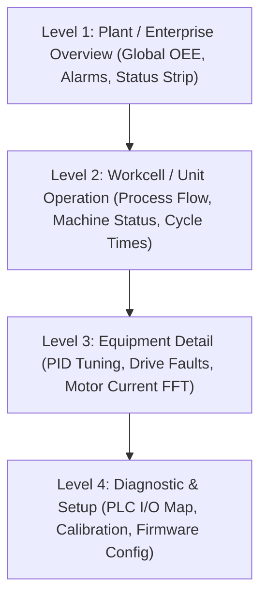

# Industrial HMI Design System Handbook (ISA-101 Standard)

> **Document ID:** STD-HMI-001  
> **Status:** Approved / Active Standard  
> **Target Subsystems:** ZeroUI, ZeroPlatform HMI Applications, SCADA & Machine Control  
> **Author:** Phong Võ (`kzxl`)

---

## 1. Executive Summary & ISA-101 Philosophy

The **ZeroPlatform Industrial HMI Design System** establishes a unified, ergonomic, and high-performance visual standard for industrial operator interfaces, machine control stations, and SCADA control rooms. It strictly complies with the **ANSI/ISA-101.01-2015 (Human-Machine Interfaces for Process Automation Systems)** standard.

### Core Principles
1. **High-Performance Situational Awareness**: The interface must convey operational status instantly at a glance. Normal states are rendered in calm, low-contrast neutral tones so that abnormal conditions (alarms, warnings, deviations) command immediate operator attention.
2. **24/7 Visual Ergonomics**: Factory floors and control rooms operate around the clock. The default **Obsidian Dark** theme (`#11131F` / `#12151C`) reduces pupil strain, eliminates backlight glare, and prevents display burn-in on industrial OLED/LED panels.
3. **Touchscreen & Glove-Friendly Interaction**: Physical buttons and touch zones adhere to strict minimum dimension limits (48px+) to prevent miss-clicks in vibrating industrial environments or with gloved hands.
4. **Deterministic Update Rendering**: High-frequency telemetry (100Hz+ PLC streams) must never induce layout jitter or GUI thread freezing.

---

## 2. Color Palette & Semantic Roles

Colors in an ISA-101 compliant HMI carry strict operational meaning. Arbitrary decorative colors are strictly prohibited.

### 2.1 The Obsidian Dark Industrial Palette

| Semantic Token | Hex Code | Visual Preview | Role & Application |
| :--- | :--- | :---: | :--- |
| `BgPrimary` | `#11131F` |  | Primary viewport canvas and backdrop |
| `BgSurface` | `#181A28` |  | Cards, telemetry tiles, modal containers |
| `BgInput` | `#141724` |  | Text inputs, numeric steppers, parameter fields |
| `BgHover` | `#262A44` |  | Mouse-over / touch-down feedback surface |
| `BgActive` | `#2E3354` |  | Selected tab, active row, toggled toggle button |
| `BorderDefault` | `#2E344E` |  | Card perimeters, structural divider lines |
| `BorderSubtle` | `#22273D` |  | Grid lines, table rows, minor separators |
| `TextPrimary` | `#F1F5F9` |  | Critical readings, active headings, key values |
| `TextSecondary` | `#94A3B8` |  | Field labels, captions, metadata |
| `TextMuted` | `#64748B` |  | Engineering units (`bar`, `°C`), inactive items |

### 2.2 Operational Alarm & State Colors

Colors with high saturation are reserved exclusively for abnormal process conditions:

```text
[Normal Operation]  --> Muted Neutral / Slate Gray (#94A3B8)
[Healthy / Running] --> Calm Emerald (#10B981 / #A6E3A1)
[Warning / Caution] --> Vivid Amber (#F59E0B / #F9E2AF)
[Critical / Alarm]  --> High-Intensity Coral Crimson (#EF4444 / #F38BA8)
[Manual Override]   --> Vibrant Purple (#A855F7)
```

- **Red (`Danger`)**: Emergency stop triggered, interlock broken, motor thermal fault, critical pressure threshold breached.
- **Amber (`Warning`)**: Tank level approaching high limit, maintenance countdown < 24h, communication packet retry warning.
- **Green (`Success`)**: Routine production running, conveyor verified in motion, barcode scan passed.
- **Indigo/Cyan (`Accent`)**: Operator focus selection, breadcrumb navigation, interactive toggles.

---

## 3. Touch Target & Ergonomics Specifications

Industrial environments involve physical vibration, protective gloves, and limited operator focus. Touch ergonomics are safety requirements.

### 3.1 Touch Target Sizing Matrix

| Component Type | Min Width | Min Height | Min Gutter | Safety Level | Example |
| :--- | :---: | :---: | :---: | :---: | :--- |
| **Emergency / Halt** | 80 px | 80 px | 24 px | SIL-3 Safety | E-Stop Software Interlock, Rapid Stop |
| **Major Control Action** | 56 px | 56 px | 12 px | High Impact | Start Cycle, Home Axis, Jog Forward |
| **Standard Touch Button** | 48 px | 48 px | 8 px | Routine | Recipe Select, Screen Navigation, Reset |
| **Numeric Stepper / Key** | 48 px | 48 px | 6 px | Parameter Input | Virtual Numpad Keys, Setpoint Increment |
| **Toggle Switch / Checkbox** | 44 px | 44 px | 8 px | State Toggle | Vacuum Pump Auto/Manual, Light On/Off |

> [!IMPORTANT]
> The absolute physical minimum target area for any touchable HMI element is **$48 \times 48\text{ px}$** (or $10 \times 10\text{ mm}$ on physical 15"–21" 1080p industrial panels).

### 3.2 Dual-Touch & Confirmation Guards
- **Two-Step Actuation**: Safety-critical commands (e.g. "Zero Scale Calibration", "Purge Line", "Manual Valve Open") must require a 2-step confirmation dialog or a hold-to-activate interaction (500ms minimum press duration with visual progress ring).
- **Physical Exclusion Zone**: Emergency abort buttons must maintain at least 24px of clear margins to avoid accidental triggering during routine navigation.

---

## 4. Display Hierarchy & Screen Levels (ISA-101)

ZeroPlatform HMI architectures are organized into four standardized hierarchical view levels:



### 4.1 Level 1: Plant & System Overview
- **Header Telemetry Strip**: Fixed 48px top banner displaying:
  - Current Operating Mode (`AUTO` / `MANUAL` / `FAULT` / `MAINTENANCE`)
  - Active Alarm Count badge (`Critical`, `Warning`, `Advisory`)
  - Production Metrics (`Target`, `Actual`, `Scrap Rate`, `OEE`)
  - Authenticated Operator Badge & Safety Interlock Status.
- **System Navigation Bar**: Top or left persistent navigation allowing 1-touch jump to any cell.

### 4.2 Level 2: Workcell / Machine Operation
- The primary operator view. Contains the main machine state diagram, active station statuses, live camera inspection feeds, and waveform oscilloscopes.

### 4.3 Level 3: Subsystem / Equipment Detail
- Detailed drill-down for maintenance and engineers: pneumatic valve bank status, individual servo drive torque/velocity graphs, temperature PID control curves.

### 4.4 Level 4: Diagnostic & Maintenance
- Raw Modbus/OPC-UA register inspector, I/O terminal mapping, calibration offset entry, and event log historian.

---

## 5. Telemetry Strip & Numeric Readout Standards

### 5.1 Tabular Monospace Readouts
High-frequency numeric values (e.g. motor RPM, laser distance, hydraulic pressure) must use tabular monospace digit metrics to prevent visual vibration/jitter as characters change width:
- **Font Stack**: Segoe UI Variable, Consolas, or Cascadia Mono with `Typography.NumeralStyle = "Tabular"`.
- **Value Separation**: The value must be formatted with fixed decimal places and immediately followed by the unit in `TextMuted` (e.g. `1,250.40 bar`, `84.2 °C`).

### 5.2 Telemetry Card Layout Standard
```text
┌──────────────────────────────────────────────┐
│  HYDRAULIC PRESSURE                   [NORM] │  <-- TextSecondary (11px uppercase) + State Tag
│  142.8 bar                                   │  <-- TextPrimary (22px bold monospace)
│  Range: 120.0 - 160.0 | Setpoint: 140.0      │  <-- TextMuted (10px)
│  [========|========----------------] 71%     │  <-- Mini Sparkline / Linear Gauge Bar
└──────────────────────────────────────────────┘
```

---

## 6. Implementation in ZeroUI (WPF & WinForms)

### 6.1 Unified Skin Engine
ZeroUI provides `ZeroSkinManager` in `ZeroUI.Core` to ensure exact parity across technologies:
- **WPF**: Consumes dynamic resources via `{DynamicResource ZeroUI.BgPrimary}` and frozen brushes in `ZeroWpfTheme`.
- **WinForms**: Consumes static color structures via `ZeroTheme.Colors.Background` with double-buffered GDI+ rendering.

```csharp
// Runtime skin toggle across entire application
ZeroSkinManager.SetSkin(ZeroSkinDefaults.ObsidianDark);
```

---

## 7. Compliance Checklist

Prior to publishing any industrial HMI screen or custom control in ZeroPlatform, verify:
- [ ] Base background utilizes `#11131F` (Obsidian Dark) or approved plant profile.
- [ ] No red/amber colors are used for decorative purposes.
- [ ] All interactive touch targets are $\ge 48 \times 48\text{ px}$.
- [ ] Numeric values utilize tabular figures with explicit engineering units.
- [ ] Telemetry strip is pinned to the Level 1 viewport header.
- [ ] Safety-critical actions incorporate two-step confirmation.
