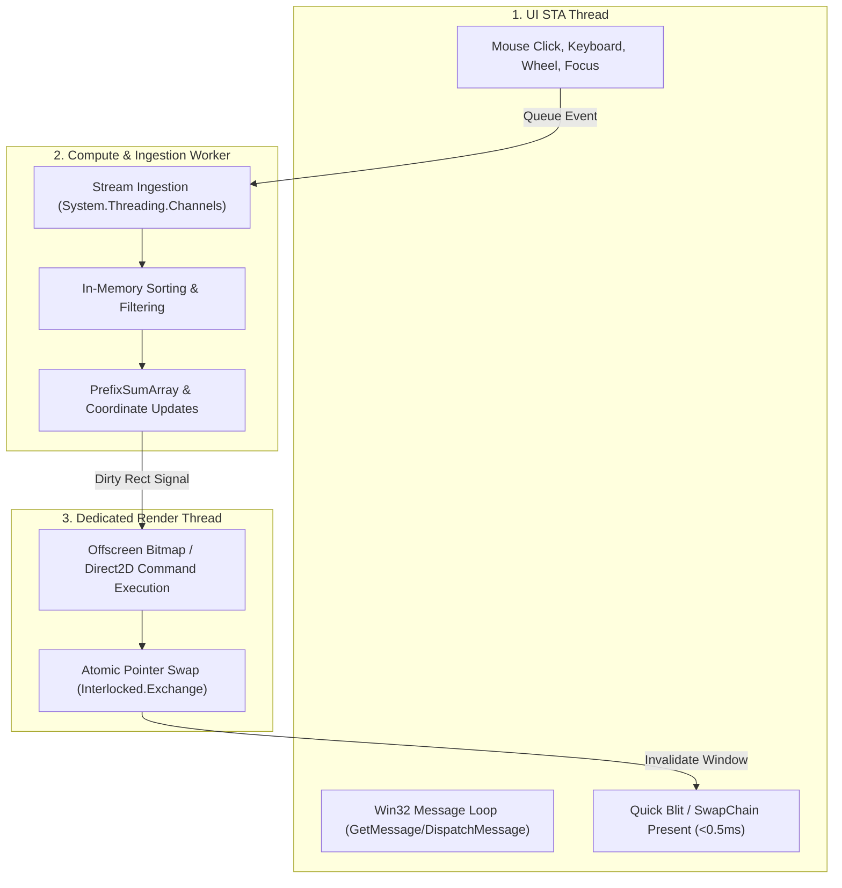
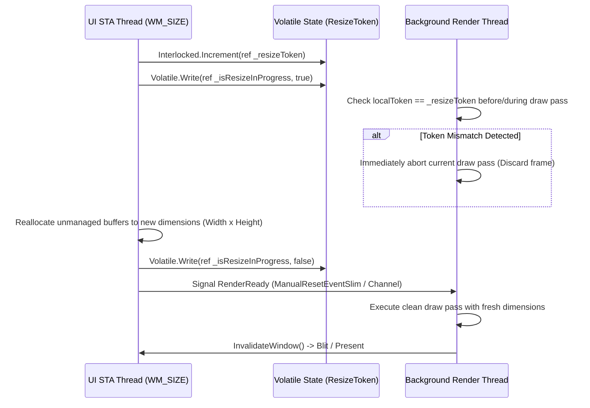
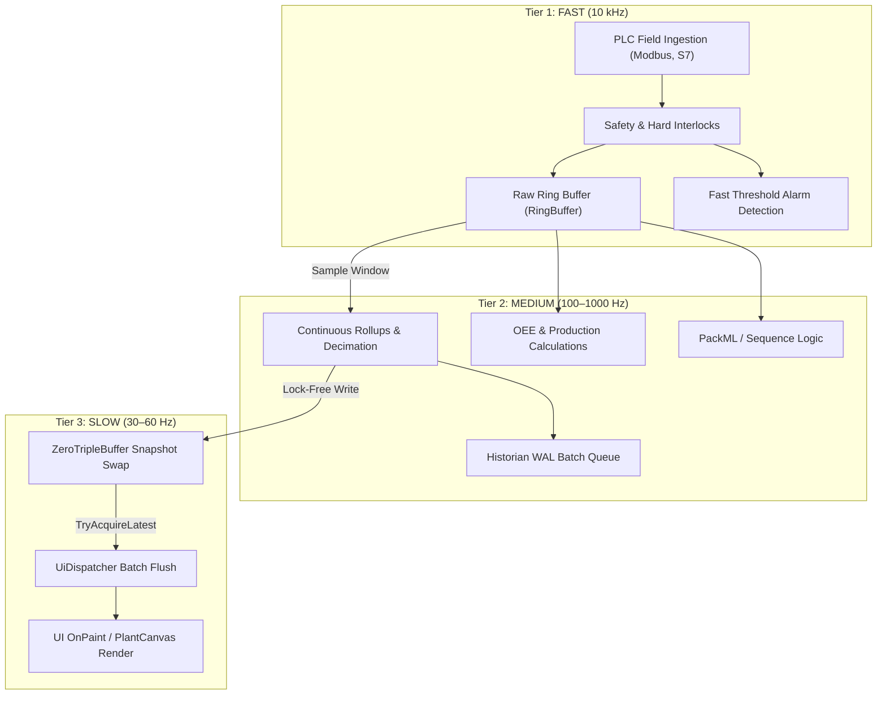

# ZeroUI Threading & Concurrency Model

## 1. The Windows STA Constraint

Both WinForms and WPF are bound by the Win32 **Single-Threaded Apartment (STA)** rule:
* A window handle (`HWND`) or `DispatcherObject` is owned strictly by the thread that created it.
* Calling UI APIs across threads throws `InvalidOperationException`.

To achieve extreme performance without violating STA constraints, ZeroUI employs the **Decoupled 3-Thread Architecture**:



---

## 2. Lock-Free Surface Swapping

To prevent thread contention and deadlock between the UI thread and the background render worker, ZeroUI uses **Double Buffering with Atomic Pointer Swap**:

```csharp
public sealed class DoubleBufferedSurface : IDisposable
{
    private IntPtr _frontBuffer; // Displayed by UI thread
    private IntPtr _backBuffer;  // Rendered by Worker thread
    private readonly int _bufferSizeBytes;

    public void SwapBuffers()
    {
        // Atomic pointer exchange without locking
        IntPtr currentBack = _backBuffer;
        IntPtr oldFront = Interlocked.Exchange(ref _frontBuffer, currentBack);
        _backBuffer = oldFront;
    }

    public IntPtr GetFrontBufferForBlit() => Volatile.Read(ref _frontBuffer);
    public IntPtr GetBackBufferForDrawing() => _backBuffer;
}
```

---

## 3. High-Frequency Event Coalescing (Throttling)

When user scrolls with a high-resolution mouse wheel or touchpad, Windows fires hundreds of `WM_MOUSEWHEEL` events per second. Rendering on every single event will overwhelm the system.

ZeroUI implements **Event Coalescing (Frame-Rate Quantization)**:
* Scroll offset updates are accumulated into an atomic integer `_pendingScrollDeltaY`.
* A render pass is scheduled at most once per display refresh interval (16.6ms for 60Hz, 8.3ms for 120Hz) synchronized with `CompositionTarget.Rendering` (WPF) or a multimedia high-resolution timer (WinForms).

---

## 4. Buffer Resize Handshake Protocol

When a user resizes a window by dragging borders, the OS fires dozens of `WM_SIZE` messages per second. If the UI thread frees and reallocates the back-buffer while the background render worker is midway through drawing a frame, an `AccessViolationException` or visual memory corruption occurs.

ZeroUI enforces the **Lock-Free Resize Handshake**:



### Safety Guarantees:
* **Zero Deadlocks:** The UI thread never blocks waiting for the render thread to finish.
* **Instant Cancellation:** The worker thread checks the `ResizeToken` at row-chunk boundaries (`Parallel.For`) and exits immediately if stale.
* **Memory Isolation:** Old unmanaged pointers are only released after the worker has acknowledged cancellation.

---

## 5. 3-Tier SCADA Ingestion & Dispatch Pipeline

Industrial edge applications must ingest thousands of tag updates per second from field buses while keeping the UI responsive. Pushing high-frequency field updates directly to UI controls causes severe message pump starvation.

ZeroUI decomposes the workload into a **3-Tier Pipeline** managed by `ScadaPipelineCoordinator`:



### Tier Execution Characteristics:
1. **Tier 1 (Fast - 10,000 Hz):**
   - Executed on dedicated I/O threads or high-priority worker threads.
   - Strictly zero allocations and $O(1)$ operations: unboxed `TagStorage` writes, atomic bitmask flags, boundary limit checks.
2. **Tier 2 (Medium - 100–1,000 Hz):**
   - Executed on background thread pool tasks.
   - Computes multi-channel statistical rollups (Min, Max, Avg), evaluates PackML transitions, and pushes WAL batches to `SqliteHistorianEngine`.
3. **Tier 3 (Slow - 30–60 Hz):**
   - Executed on the WinForms/WPF UI STA thread.
   - Uses `ZeroTripleBuffer<T>` to fetch the latest state snapshot without acquiring locks or causing latency spikes on Tier 1 or Tier 2.

---

## 6. Deterministic Multi-Cycle Master Scheduler (`ZeroRuntime`)

Instead of allowing components to spawn independent `Task.Run` loops or `System.Threading.Timer` instances, `ZeroRuntime` acts as the deterministic heartbeat of the application:

```csharp
public sealed class ZeroRuntime : IDisposable
{
    public static readonly TimeSpan DefaultPlcCadence = TimeSpan.FromMilliseconds(10);       // 100 Hz
    public static readonly TimeSpan DefaultLogicCadence = TimeSpan.FromMilliseconds(10);     // 100 Hz
    public static readonly TimeSpan DefaultTelemetryCadence = TimeSpan.FromMilliseconds(16); // ~60 Hz
    public static readonly TimeSpan DefaultUiCadence = TimeSpan.FromMilliseconds(16);        // ~60 Hz
    public static readonly TimeSpan DefaultHistorianCadence = TimeSpan.FromMilliseconds(100);// 10 Hz
    public static readonly TimeSpan DefaultCleanupCadence = TimeSpan.FromMilliseconds(1000); // 1 Hz
    public static readonly TimeSpan DefaultHealthCadence = TimeSpan.FromMilliseconds(5000);  // 0.2 Hz
}
```

### Deterministic Scheduling Principles:
* **Drift Compensation:** Next execution timestamp is calculated as $T_{\text{next}} = T_{\text{target}} + \Delta_{\text{cadence}}$ rather than $T_{\text{actual}} + \Delta_{\text{cadence}}$, preventing interval creep.
* **Thread Pool Offloading:** Worker cycles execute via non-allocating callbacks on the .NET thread pool, while the UI cycle schedules via `UiDispatcher`.
* **State Isolation:** Subsystems register callbacks (`RegisterPlcCycle`, `RegisterLogicCycle`, `RegisterHistorianCycle`) avoiding tightly coupled dependencies.

---

## 7. Centralized Animation Dispatcher (`ZeroAnimationClock`)

To render smooth 60 FPS animations across dozens of industrial components (e.g. pumps, rotating fans, wave tanks, pipe flows, glowing alarm annunciators) without burning CPU:

1. **Elimination of Distributed Timers:** Replaces hundreds of independent WinForms `Timer` handles with a single unified 60Hz multimedia clock.
2. **Lock-Free Copy-On-Write (COW) Array:**
   - Registration and deregistration produce a cloned immutable array `IAnimatable[]`.
   - The 60Hz tick iterates the current snapshot using raw index loops with zero lock contention.
3. **Synchronized Visual Phases:**
   - Exposes globally synchronized phases (`BlinkFast`, `BlinkSlow`, `PulsePhase`, `FluidPhase`) ensuring all UI elements pulse and blink in unison.


