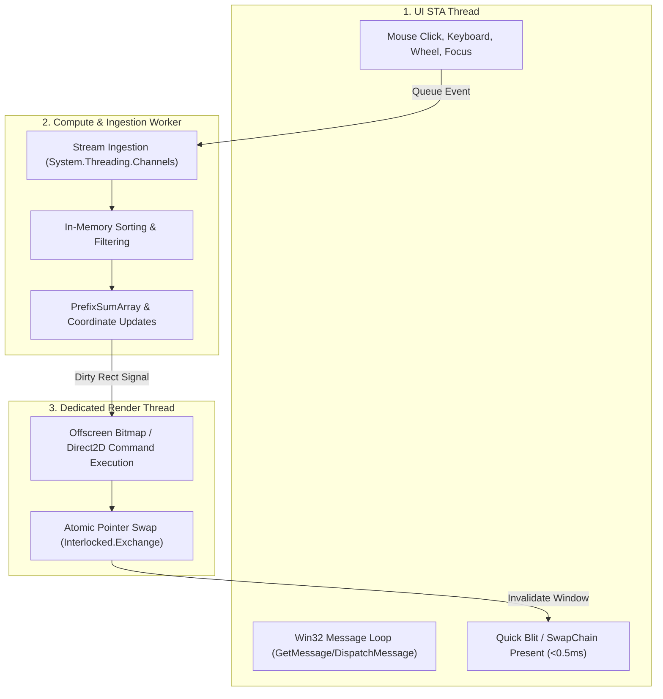
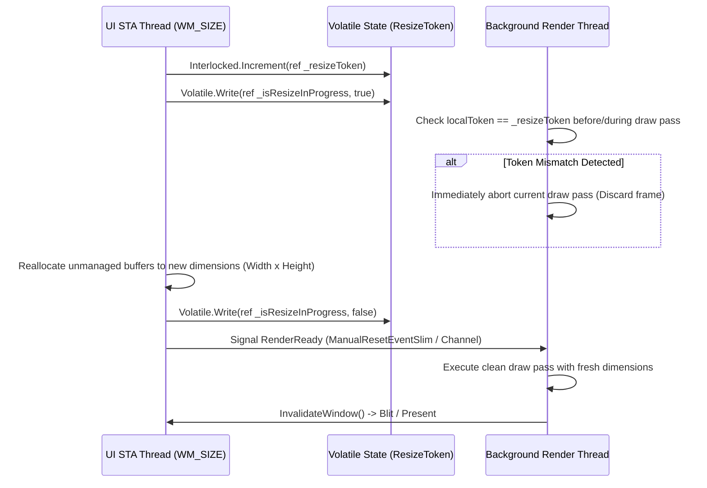

# ZeroUI Threading & Concurrency Model

## 1. The Windows STA Constraint

Both WinForms and WPF are bound by the Win32 **Single-Threaded Apartment (STA)** rule:
* A window handle (`HWND`) or `DispatcherObject` is owned strictly by the thread that created it.
* Calling UI APIs across threads throws `InvalidOperationException`.

To achieve extreme performance without violating STA constraints, ZeroUI employs the **Decoupled 3-Thread Architecture**:



---

## 2. Lock-Free Surface Swapping

To prevent thread contention and deadlock between the UI thread and the background render worker, ZeroUI uses **Double Buffering with Atomic Pointer Swap**:

```csharp
public sealed class DoubleBufferedSurface : IDisposable
{
    private IntPtr _frontBuffer; // Displayed by UI thread
    private IntPtr _backBuffer;  // Rendered by Worker thread
    private readonly int _bufferSizeBytes;

    public void SwapBuffers()
    {
        // Atomic pointer exchange without locking
        IntPtr currentBack = _backBuffer;
        IntPtr oldFront = Interlocked.Exchange(ref _frontBuffer, currentBack);
        _backBuffer = oldFront;
    }

    public IntPtr GetFrontBufferForBlit() => Volatile.Read(ref _frontBuffer);
    public IntPtr GetBackBufferForDrawing() => _backBuffer;
}
```

---

## 3. High-Frequency Event Coalescing (Throttling)

When user scrolls with a high-resolution mouse wheel or touchpad, Windows fires hundreds of `WM_MOUSEWHEEL` events per second. Rendering on every single event will overwhelm the system.

ZeroUI implements **Event Coalescing (Frame-Rate Quantization)**:
* Scroll offset updates are accumulated into an atomic integer `_pendingScrollDeltaY`.
* A render pass is scheduled at most once per display refresh interval (16.6ms for 60Hz, 8.3ms for 120Hz) synchronized with `CompositionTarget.Rendering` (WPF) or a multimedia high-resolution timer (WinForms).

---

## 4. Buffer Resize Handshake Protocol

When a user resizes a window by dragging borders, the OS fires dozens of `WM_SIZE` messages per second. If the UI thread frees and reallocates the back-buffer while the background render worker is midway through drawing a frame, an `AccessViolationException` or visual memory corruption occurs.

ZeroUI enforces the **Lock-Free Resize Handshake**:



### Safety Guarantees:
* **Zero Deadlocks:** The UI thread never blocks waiting for the render thread to finish.
* **Instant Cancellation:** The worker thread checks the `ResizeToken` at row-chunk boundaries (`Parallel.For`) and exits immediately if stale.
* **Memory Isolation:** Old unmanaged pointers are only released after the worker has acknowledged cancellation.

